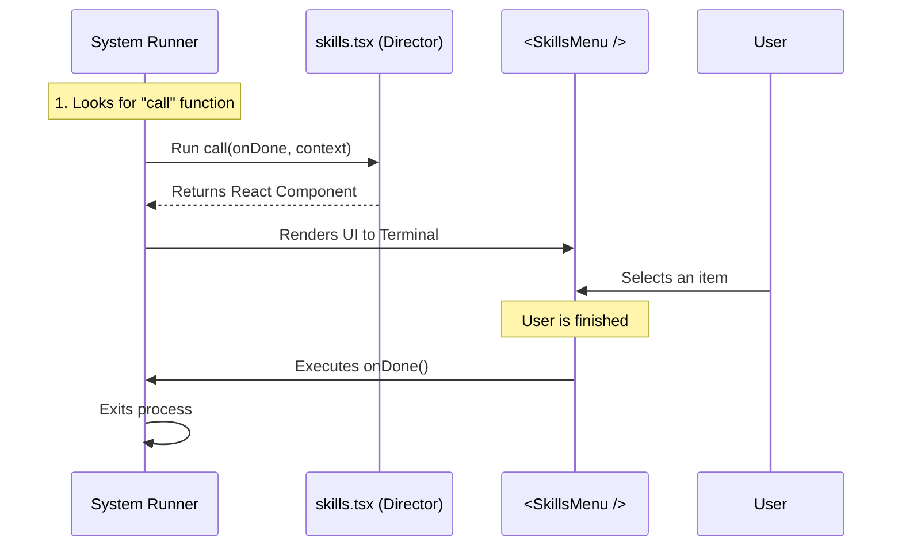

# Chapter 3: Local JSX Execution Interface

Welcome back! In the previous chapter, [Lazy Module Loading](02_lazy_module_loading.md), we learned how to efficiently fetch the code for our `skills` command only when needed.

We have successfully opened the "book" from the library. Now, we need to read it. Specifically, we are looking at the file `skills.tsx`.

In this chapter, we will explore the **Local JSX Execution Interface**. This is the standard way our system runs commands that display a user interface (UI).

## The Motivation: The Stage Director

Imagine a theater.
*   **The System (CLI Runner):** This is the theater owner. They decide *when* the show starts, but they don't know how to act.
*   **The Component (`<SkillsMenu />`):** This is the actor. They know how to perform, but they don't know when to start or stop.

We need a middleman. We need a **Stage Director**.

In our project, the **`call` function** acts as this Stage Director. It is the bridge between the technical command-line runner and the visual React components.

## The Use Case: Launching the Menu

Our goal is simple: When the system runs the `skills` command, we want to display the `<SkillsMenu />` component on the screen.

The system looks for a specific function named `call` inside our file to make this happen.

### Step 1: Setting the Stage (Imports)

First, let's look at the top of `skills.tsx`. We need to bring in our actors (the components) and some rules (types).

```typescript
// skills.tsx
import * as React from 'react';
// We import the component we want to show
import { SkillsMenu } from '../../components/skills/SkillsMenu.js';
// We import types to make sure we follow the rules
import type { LocalJSXCommandContext } from '../../commands.js';
import type { LocalJSXCommandOnDone } from '../../types/command.js';
```
*Explanation:* We are importing React (to build UI), the `SkillsMenu` (the visual part user sees), and some TypeScript definitions to help us write bug-free code.

### Step 2: The Director Enters (The `call` function)

This is the most important part of this chapter. The system expects a function explicitly named `call`.

```typescript
// The system calls this function automatically
export async function call(
  onDone: LocalJSXCommandOnDone, 
  context: LocalJSXCommandContext
): Promise<React.ReactNode> {
  // Logic goes here...
}
```

*Explanation:*
*   `export`: We make this function public so the system can find it.
*   `async`: This function might need to wait for data (like fetching from an API) before showing the UI.
*   `Promise<React.ReactNode>`: This is a promise to return a UI element (like a `<div>` or a `<Text>`) eventually.

### Step 3: Handling the Inputs

The `call` function receives two very important tools (arguments):

1.  **`onDone`**: This is the "Close Curtain" button. Since this is a Command Line Interface (CLI), the program must eventually exit. We pass this tool to our component so it knows how to quit.
2.  **`context`**: This is the "Script" or "Props." It contains data the command needs, like configuration options or arguments typed by the user.

### Step 4: Action! (Returning the UI)

Finally, the director decides what to put on stage. We take the `onDone` tool and the data from `context` and hand them to our component.

```typescript
// Inside the call function:
return (
  <SkillsMenu 
    onExit={onDone} 
    commands={context.options.commands} 
  />
);
```

*Explanation:*
*   We render `<SkillsMenu />`.
*   We connect `onDone` to the component's `onExit` prop. When the menu is finished, it calls this function to tell the system "We are finished."
*   We pass data from `context.options` into the component.

## Putting it all together

Here is the complete, minimal code for `skills.tsx`:

```typescript
import * as React from 'react';
import { SkillsMenu } from '../../components/skills/SkillsMenu.js';
// ... imports for types ...

export async function call(onDone, context) {
  // The Director sets the stage
  return <SkillsMenu onExit={onDone} commands={context.options.commands} />;
}
```

## Under the Hood: The Execution Flow

How does the system actually run this? It doesn't magically know about React. It follows a strict process.

### Sequence Diagram

Here is what happens the moment the file is loaded (from Chapter 2).



1.  **Discovery:** The Runner looks for `export async function call`.
2.  **Invocation:** It executes that function, injecting the `onDone` callback and the `context` object.
3.  **Rendering:** The function returns a React Node. The Runner takes this node and uses a special library (like Ink) to draw it as text in the terminal.
4.  **Completion:** When the user is done interacting with the menu, the component calls `onDone`, signaling the Runner to stop the process.

### Internal Implementation Logic

To understand this better, here is a simplified example of the code *running* your command. You don't write this, but the system uses logic like this:

```typescript
// Simplified System Runner
async function runCommand(module: any, globalConfig: any) {
  
  // 1. Create the "Curtain Down" function
  const onDone = () => {
    console.log("Exiting command...");
    process.exit(0);
  };

  // 2. Prepare the context (See Chapter 4)
  const context = { options: globalConfig };

  // 3. Run the Director (Your code!)
  const uiElement = await module.call(onDone, context);

  // 4. Render the result to the screen
  render(uiElement);
}
```

*Explanation:*
*   The system creates `onDone` for you.
*   It calls `module.call`, passing that function in.
*   It handles the actual rendering of the returned JSX.

## Summary

In this chapter, we learned about the **Local JSX Execution Interface**.

*   **The Concept:** The `call` function is the entry point (the "Stage Director") for UI commands.
*   **The Arguments:**
    *   `onDone`: A callback to tell the system when the command is finished.
    *   `context`: Data and options passed into the command.
*   **The Output:** It returns a React component that the system renders to the terminal.

We saw that we passed `context.options.commands` to our menu:

```typescript
commands={context.options.commands}
```

But wait... where did `context` come from? How did the system know what `options` to put inside it? This is a powerful feature called **Dependency Injection**.

We will explore how data flows into this context in the next chapter.

[Next Chapter: Context Dependency Injection](04_context_dependency_injection.md)

---

Generated by [Code IQ](https://github.com/adityasoni99/Code-IQ)