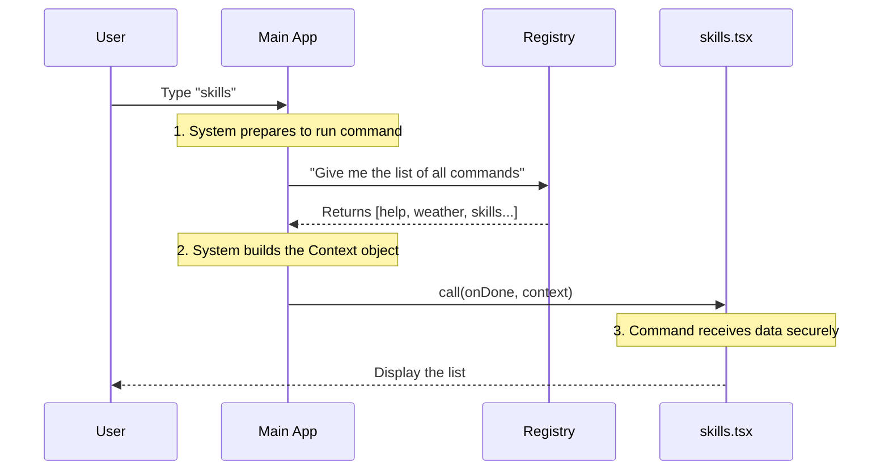

# Chapter 4: Context Dependency Injection

Welcome back! In the previous chapter, [Local JSX Execution Interface](03_local_jsx_execution_interface.md), we built the "Stage Director" (the `call` function) for our `skills` command. We saw that our component needed a list of commands to display, and we passed them like this:

```typescript
commands={context.options.commands}
```

But we never explained **where** `context` came from or how the `commands` got inside it.

In this chapter, we will explore **Context Dependency Injection**. This is the mechanism that delivers data to your command safely and cleanly.

## The Motivation: The Contractor's Toolbox

Imagine you are a contractor hired to fix a specific machine at a large construction site.

*   **The "Global" Way (Bad):** You arrive at the site, but you have to run around searching the entire warehouse (global variables) to find a hammer, then search the office for the blueprints. It's messy, and you might grab the wrong tools.
*   **The "Context" Way (Good):** You arrive at the site. The Site Manager meets you at the gate and hands you a specific red toolbox. "Here," they say. "This box contains exactly the blueprints and tools you need for this specific job."

In `skills.tsx`, the `context` parameter is that red toolbox.

### Why not use global variables?
We could just make a global list called `ALL_COMMANDS` and import it. But what if we want to test the `skills` command with a fake list? What if the list changes based on user permissions?

By **injecting** the data via `context`, our command becomes:
1.  **Independent:** It doesn't care where the data comes from.
2.  **Testable:** We can easily pass a fake list during testing.
3.  **Clean:** No messy imports from distant parts of the application.

## The Use Case: Passing the Command List

Our `skills` command has one job: **List all other available skills.**

However, the `skills.tsx` file doesn't know about the other commands (like `weather` or `help`). That information lives in the **Command Registry** (which we discussed in [Command Registration Pattern](01_command_registration_pattern.md)).

We need to get that list from the Registry into `skills.tsx` without connecting them directly.

### Step 1: Defining the Type

First, we use TypeScript to define what our "toolbox" looks like. This ensures we don't try to grab a tool that isn't there.

```typescript
// From ../../commands.js (simplified)
export type LocalJSXCommandContext = {
  options: {
    // The list of all registered commands
    commands: Command[]; 
    // Other settings (like verbose mode, etc)
    [key: string]: any;
  };
}
```

*Explanation:* This definition tells us that `context` will always have an `options` property, and inside that, there will be a list of `commands`.

### Step 2: Receiving the Context

Now, let's look at our `call` function in `skills.tsx` again. Notice the second parameter.

```typescript
// skills.tsx
export async function call(
  onDone: LocalJSXCommandOnDone, 
  context: LocalJSXCommandContext // <--- Here is the toolbox!
) {
  // ...
}
```

*Explanation:*
*   The system automatically calls this function.
*   It creates the `context` object for us.
*   It **injects** (passes) it as the second argument.

### Step 3: Using the Data

Now that we have the box, we simply open it and use the data.

```typescript
// Inside the call function
const commandList = context.options.commands;

// Pass it to the visual component
return <SkillsMenu commands={commandList} onExit={onDone} />;
```

*Explanation:* We access `context.options.commands`. We don't need to import the Registry. We don't need to fetch anything from a database. The data is just *there*, ready to use.

## Under the Hood: How Injection Works

How does the data get into the box? The main application acts as the "Site Manager." Before it tells your command to run, it gathers everything you might need.

### The Sequence of Events



1.  **Preparation:** The user wants to run `skills`. The System knows this command needs a list of other commands.
2.  **Gathering:** The System asks the Registry for the full list.
3.  **Packing:** The System puts that list into an object: `{ options: { commands: [...] } }`.
4.  **Injection:** The System calls `module.call(...)` and hands over that object.

### Implementation Logic

Here is a simplified view of the code running inside the main application (not in your command file) that performs this magic.

```typescript
// Simplified System Runner (Pseudo-code)
async function runCommand(commandName: string) {
  
  // 1. Gather dependencies
  const allCommands = commandRegistry.getCommands();
  
  // 2. Build the toolbox (Context)
  const context = {
    options: {
      commands: allCommands,
      verbose: true // Example of other options
    }
  };

  // 3. Load the module (Lazy Loading from Chapter 2)
  const module = await loadCommand(commandName);

  // 4. Inject dependencies!
  // We pass 'context' into the function here.
  await module.call(onDoneCallback, context);
}
```

*Explanation:*
*   You don't write this code, but understanding it clarifies that `context` isn't magic. It's just a variable created by the runner and passed to your function.
*   This pattern is called **Dependency Injection** because the dependencies (the data) are "injected" from the outside, rather than the command fetching them from the inside.

## Summary

In this chapter, we learned about **Context Dependency Injection**.

*   **The Problem:** Commands need access to system data (like the list of other commands) without using messy global variables.
*   **The Solution:** The `context` parameter.
*   **The Analogy:** A Site Manager handing a Contractor a toolbox containing exactly what they need.
*   **The Mechanism:** The system gathers the data *before* running your command and passes it as an argument to the `call` function.

Now we have the **Code** (Chapter 2), the **UI** (Chapter 3), and the **Data** (Chapter 4).

But what happens when the user actually interacts with our menu? If they select a command, how do we shut down the current `skills` command and start the new one? We need to manage the life and death of our command.

We will explore this in the final chapter.

[Next Chapter: Lifecycle Flow Control](05_lifecycle_flow_control.md)

---

Generated by [Code IQ](https://github.com/adityasoni99/Code-IQ)