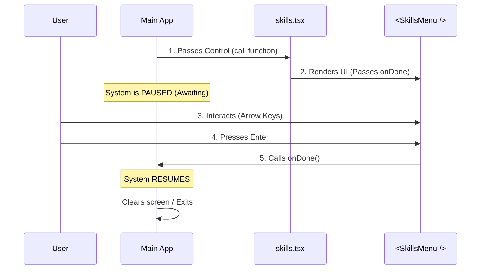

# Chapter 5: Lifecycle Flow Control

Welcome to the final chapter of our tutorial series!

In the previous chapter, [Context Dependency Injection](04_context_dependency_injection.md), we learned how the system acts like a "Site Manager," handing our command a toolbox (the `context`) filled with the data it needs.

We now have everything we need:
1.  We know the command exists ([Command Registration Pattern](01_command_registration_pattern.md)).
2.  We loaded the code efficiently ([Lazy Module Loading](02_lazy_module_loading.md)).
3.  We set up the stage ([Local JSX Execution Interface](03_local_jsx_execution_interface.md)).
4.  We have the data ([Context Dependency Injection](04_context_dependency_injection.md)).

There is just one piece missing: **How does the command end?**

In this chapter, we explore **Lifecycle Flow Control**. This is how a command tells the system, "I am finished, you can take over now."

## The Motivation: The Relay Race

Think of your application as a **Relay Race**.

1.  **The System** is the first runner. It starts the program.
2.  When the user runs `skills`, the System passes the **Baton** (control) to your command.
3.  While your command is running (showing the menu), the System waits on the sidelines.
4.  When the user selects an option, your command must **pass the Baton back** to the System so it can execute that option or exit.

If your command drops the baton or never passes it back, the race stops. The terminal hangs, and the user gets stuck.

## The Use Case: Closing the Menu

In `skills.tsx`, we launch a visual menu (`<SkillsMenu />`).
*   **Start:** The menu appears.
*   **Wait:** The user presses the arrow keys to navigate.
*   **End:** The user presses "Enter" on a choice.

At that exact moment—when "Enter" is pressed—we need to trigger the **Lifecycle Flow Control** to close the interactive mode.

## The Solution: The `onDone` Callback

The "Baton" in our code is a specific function called `onDone`. The system gives it to us, and we must call it when we are finished.

### Step 1: Receiving the Baton

Let's look at the `call` function in `skills.tsx` one last time.

```typescript
// skills.tsx
export async function call(
  onDone: LocalJSXCommandOnDone, // <--- The Baton!
  context: LocalJSXCommandContext
) {
   // ...
}
```

*Explanation:* The first argument, `onDone`, is a function. We didn't write this function; the System wrote it and handed it to us.

### Step 2: Delegating to the Component

Our `call` function is just the "Director." It doesn't handle keyboard presses. The `<SkillsMenu />` component does that. So, we need to pass the baton down to the actor on stage.

```typescript
// Inside the call function
return (
  <SkillsMenu 
    onExit={onDone} // We pass the baton to the component
    commands={context.options.commands} 
  />
);
```

*Explanation:*
*   The `SkillsMenu` component has a prop called `onExit`.
*   We connect our system-provided `onDone` function to this prop.
*   Now the component holds the baton.

### Step 3: Crossing the Finish Line

We don't see the code for `SkillsMenu` here, but inside that component, there is logic that listens for the "Enter" key. When that happens, it conceptually does this:

```typescript
// Conceptual code inside SkillsMenu component
handleEnterKey() {
    // User selected an item!
    // Time to close the menu.
    props.onExit(); // <--- Calling the function we passed down
}
```

*Explanation:* calling `props.onExit()` triggers `onDone()`. This signals the System that the interactive part is over.

## Under the Hood: The Promise Lifecycle

How does the system actually "wait" for the user? It uses JavaScript **Promises**.

When the System calls your function, it pauses execution until your function resolves (completes).

### Sequence Diagram



1.  **Passes Control:** The System calls `await module.call(...)`. The `await` keyword freezes the System's logic.
2.  **Renders:** The UI appears.
3.  **Interacts:** The user takes their time. The System is still frozen.
4.  **Action:** The user finishes.
5.  **Resume:** Calling `onDone` essentially tells the System "The promise is resolved." The `await` finishes, and the code moves to the next line.

### Internal Implementation Logic

Here is the simplified "Runner" code again to show where the pause happens.

```typescript
// Simplified System Runner
async function runCommand() {
  
  // 1. Create a promise that waits for a signal
  let signalFinished;
  
  const waitForUser = new Promise((resolve) => {
    // We save the 'resolve' function. 
    // Calling this unpauses the Promise.
    signalFinished = resolve; 
  });

  // 2. Run your command, giving it the signal trigger
  // Note: We don't await this line immediately, we await the signal.
  module.call(signalFinished, context);

  console.log("System is waiting for user...");

  // 3. PAUSE HERE until onDone (signalFinished) is called
  await waitForUser;

  console.log("User is done! Shutting down.");
}
```

*Explanation:*
*   The system creates a "lock" (the Promise).
*   It gives you the "key" (`signalFinished` which becomes `onDone`).
*   It waits at `await waitForUser`.
*   It cannot proceed until you use the key.

## Summary

In this final chapter, we mastered **Lifecycle Flow Control**.

*   **The Concept:** Managing the start and end of an interactive command.
*   **The Analogy:** A Relay Race baton pass.
*   **The Mechanism:** The `onDone` callback.
*   **The Flow:** System -> `call` function -> Component (`onExit`) -> User Action -> `onDone()` -> System Resumes.

### Conclusion

Congratulations! You have completed the **`skills` Project Tutorial**. You now understand the core architecture of a scalable CLI plugin system:

1.  **[Command Registration Pattern](01_command_registration_pattern.md):** How to create a menu of features.
2.  **[Lazy Module Loading](02_lazy_module_loading.md):** How to keep the app fast by loading code only when needed.
3.  **[Local JSX Execution Interface](03_local_jsx_execution_interface.md):** How to connect logic to a visual UI.
4.  **[Context Dependency Injection](04_context_dependency_injection.md):** How to safely provide data to commands.
5.  **Lifecycle Flow Control:** How to manage the interactive loop.

With these five patterns, you can build complex, interactive, and high-performance tools that are easy to maintain and expand. Happy coding!

---

Generated by [Code IQ](https://github.com/adityasoni99/Code-IQ)