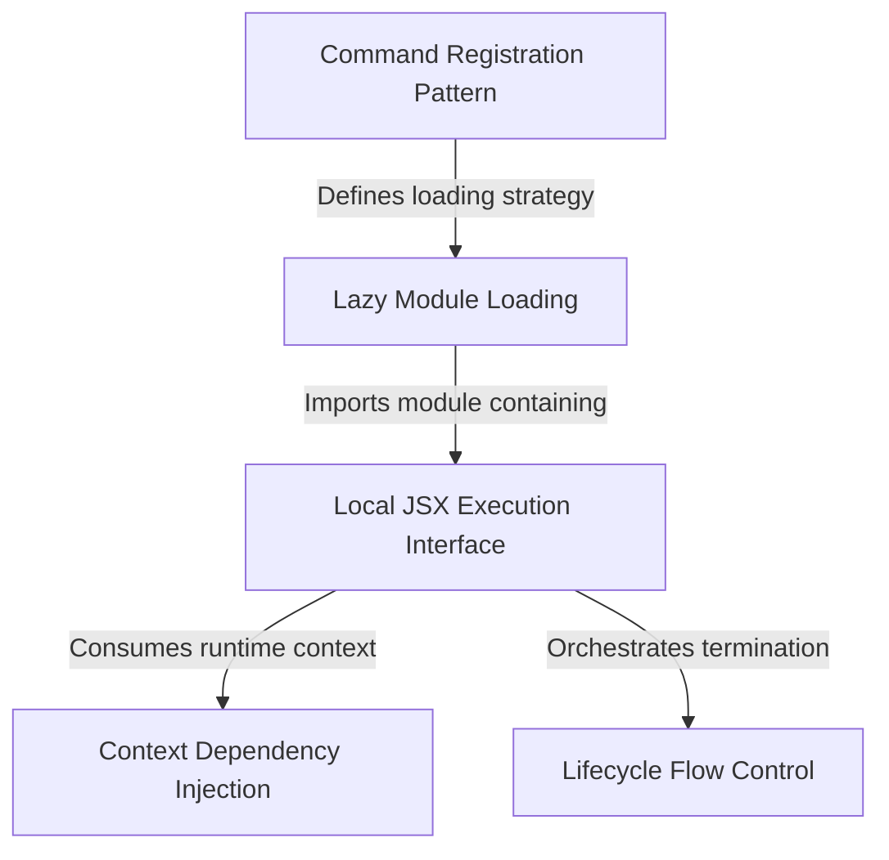

# Tutorial: skills

This project defines a **modular command** called "skills" for a command-line interface. It uses a *lazy loading* strategy to only fetch the necessary code when the user actually requests it, keeping the application fast. Once loaded, it launches an interactive **React-based menu** in the terminal, managing data flow and proper cleanup when the user exits.

## Chapters

1. [Command Registration Pattern](01_command_registration_pattern.md)
2. [Lazy Module Loading](02_lazy_module_loading.md)
3. [Local JSX Execution Interface](03_local_jsx_execution_interface.md)
4. [Context Dependency Injection](04_context_dependency_injection.md)
5. [Lifecycle Flow Control](05_lifecycle_flow_control.md)

---

Generated by [Code IQ](https://github.com/adityasoni99/Code-IQ)