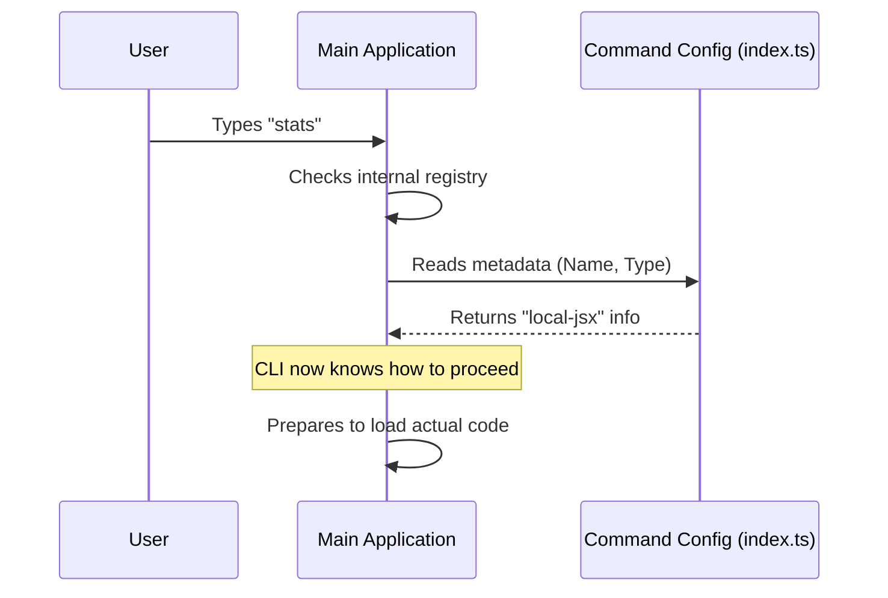

# Chapter 1: Command Configuration

Welcome to the **stats** project tutorial! In this series, we will build a feature that shows usage statistics for Claude Code.

## Why do we need this?

Imagine walking into a restaurant. Before you can order a specific meal, that item must be listed on the **menu**. If it's not on the menu, the kitchen doesn't know it exists, and the waiter won't understand your order.

In our CLI (Command Line Interface) application, the **Command Configuration** is exactly like that menu entry.

### The Problem
You have written some cool code to calculate statistics, but the main application doesn't know it exists. If a user types `stats` in the terminal, the application will say: *"Unknown command."*

### The Solution
We need to register our feature. We create a configuration file that acts as an ID card. It tells the application:
1.  **Name:** What keyword triggers this command (e.g., `stats`).
2.  **Description:** What this command does (for the help screen).
3.  **Type:** What kind of interface it uses.

### The Goal
By the end of this chapter, you will understand how to set up the entry point so the application recognizes the `stats` command.

---

## Defining the Configuration

Let's look at `index.ts`. This is the "face" of our command. We keep this file very small so the application can read it quickly without loading the heavy logic yet.

### Step 1: The Configuration Object

We define a simple JavaScript object. Think of this as filling out a form.

```typescript
const stats = {
  type: 'local-jsx',
  name: 'stats',
  description: 'Show your Claude Code usage statistics and activity',
  // We will explain 'load' in a moment!
  load: () => import('./stats.js'),
}
```
*Explanation:*
*   `name`: This is the magic word. When the user types `stats`, this command runs.
*   `description`: This text appears when the user runs the `--help` command.
*   `type`: We set this to `'local-jsx'`. This tells the system that we want to render a UI using React-like components (we will cover this in [Local JSX Command Handler](03_local_jsx_command_handler.md)).

### Step 2: Enforcing the Rules

To make sure we didn't make any spelling mistakes or forget required fields, we use TypeScript.

```typescript
import type { Command } from '../../commands.js'

// ... (the object we created above) ...

} satisfies Command
```
*Explanation:*
*   `satisfies Command`: This checks our work. If we forget the `name`, TypeScript will yell at us before we even run the code.

### Step 3: Exporting the Command

Finally, we hand this object over to the main application.

```typescript
export default stats
```
*Explanation:*
*   `export default`: This makes the object available to the rest of the system.

---

## Under the Hood: How it Works

What happens when the application starts? It doesn't load all the heavy code immediately. Instead, it just peeks at these configuration files.

### The Registration Flow

1.  **App Start:** The CLI wakes up.
2.  **Scanning:** It looks for `index.ts` files in the command folders.
3.  **Registration:** It reads the `name` and `description` from our config and adds them to its internal list.
4.  **Waiting:** It does **not** run the actual statistics logic yet. It just remembers: *"If someone types 'stats', I need to look here."*

Here is a simplified view of the process:



---

## Important Implementation Detail: The `load` function

You might have noticed the `load` property in our code snippet:

```typescript
  load: () => import('./stats.js'),
```

This is a crucial part of the configuration. It points to the file where the *actual* heavy lifting happens.

However, notice it is a **function** (`() => ...`). We are not importing the file at the top of the script. We are telling the CLI: *"Here is a map to the code, but don't go there until the user actually asks for it."*

This concept is called **Lazy Loading**. It ensures our CLI remains fast and snappy. We will dive deep into how this mechanism works in the next chapter, [Lazy Loading Mechanism](02_lazy_loading_mechanism.md).

---

## Summary

In this chapter, we learned:
1.  **Command Configuration** acts like a menu item, introducing our feature to the main application.
2.  We define metadata like `name` and `description` so the CLI knows how to invoke it.
3.  We keep this file lightweight to ensure the application starts quickly.

Now that the application knows *about* our command, we need to understand how it efficiently retrieves the actual logic code only when needed.

[Next Chapter: Lazy Loading Mechanism](02_lazy_loading_mechanism.md)

---

Generated by [Code IQ](https://github.com/adityasoni99/Code-IQ)