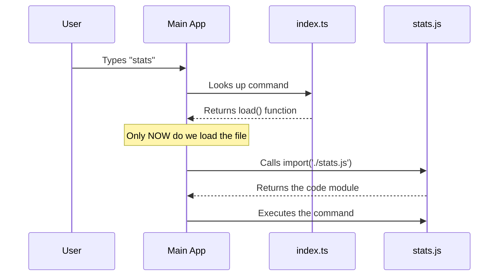

# Chapter 2: Lazy Loading Mechanism

In the previous [Command Configuration](01_command_configuration.md) chapter, we created the "ID card" for our command. We registered the name `stats` so the application knows it exists.

However, we briefly glossed over one specific line in that configuration: the `load` function. In this chapter, we will explain exactly why we wrote it that way and how it makes our application incredibly fast.

## The "Heavy Backpack" Problem

To understand **Lazy Loading**, let's use a hiking analogy.

Imagine you are going on a hike (starting the application). You have a backpack.
*   **Eager Loading (The "Bad" Way):** You pack a tent, a sleeping bag, a cooking stove, a heavy jacket, and a hammer *before* you even leave your house. Your bag is heavy. It takes you a long time to start walking. You might not even use the hammer!
*   **Lazy Loading (The "Good" Way):** You start walking with an empty, light backpack. When you decide to set up camp, you snap your fingers, and the tent magically appears.

In programming:
*   **Eager Loading:** The application reads and loads *every single command's code* when it starts up. This makes the start-up time slow.
*   **Lazy Loading:** The application starts immediately. It only loads the specific code for `stats` when the user actually types `stats`.

## The Solution: Dynamic Imports

We implement this "magic finger snap" using a JavaScript feature called **Dynamic Import**.

### The "Eager" Way (Avoid this)

If we write our code like this, the file `stats.js` is loaded immediately when the app starts:

```typescript
// ❌ This runs immediately!
import heavyLogic from './stats.js'

const config = {
  name: 'stats',
  // ...
}
```
*Why this is bad:* If you have 50 commands, the app has to load 50 files just to start, even if the user only wants to use one.

### The "Lazy" Way (Do this)

Instead, we wrap the import inside a function. This acts like a gate.

```typescript
// ✅ The file is NOT loaded yet
const config = {
  name: 'stats',
  // We define a function, but we don't call it
  load: () => import('./stats.js'),
}
```

*Why this works:*
1.  We define an arrow function: `() => ...`
2.  Inside it, we use `import(...)`.
3.  JavaScript sees this function and says: *"Okay, I'll remember this instruction, but I won't run it until you tell me to."*

---

## Under the Hood: The Loading Flow

How does the main application use this mechanism? It waits for the user to trigger the command.

Here is the sequence of events:

1.  **Start:** The CLI starts up lightly (only reading configs).
2.  **Trigger:** User types `stats`.
3.  **Lookup:** The CLI finds our config object.
4.  **Action:** The CLI calls our `load()` function.
5.  **Fetch:** The system goes and reads `stats.js` from the disk.
6.  **Run:** The command executes.



---

## Internal Implementation Details

Let's peek at how the main application (the "runner") handles this. While you don't need to write this part, understanding it helps you write better commands.

The runner uses the keywords `async` and `await`. Because loading a file takes a few milliseconds (or longer), the application pauses execution of that specific task until the file arrives.

### Simulating the Runner

Here is a simplified version of what the core system does when a user presses Enter:

```typescript
async function runCommand(commandConfig) {
  console.log("User requested: " + commandConfig.name)

  // 1. Call the lazy loader
  // 'await' means: "Pause here until the file is ready"
  const module = await commandConfig.load()

  // 2. The file is loaded! Now we run the default export
  // We will learn about this export in the next chapter
  module.default() 
}
```

**Explanation:**
1.  **`await commandConfig.load()`**: This triggers the arrow function we wrote in `index.ts`.
2.  **`const module`**: This variable now holds the contents of `stats.js`.
3.  **`module.default()`**: This runs the main function inside that file.

---

## Summary

In this chapter, we learned:
1.  **Lazy Loading** keeps the application startup fast by deferring work.
2.  We use **Dynamic Imports** (`import()`) wrapped in a function to achieve this.
3.  The main application **waits** for the code to load only when the command is invoked.

Now that we have successfully loaded our command file (`stats.js`), what goes inside it? We configured our command as `type: 'local-jsx'`, which means we are building a user interface.

Let's move on to writing that interface.

[Next Chapter: Local JSX Command Handler](03_local_jsx_command_handler.md)

---

Generated by [Code IQ](https://github.com/adityasoni99/Code-IQ)