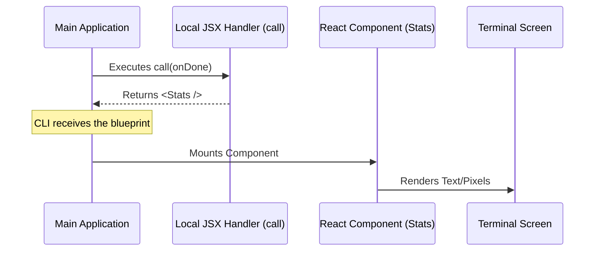

# Chapter 3: Local JSX Command Handler

Welcome to Chapter 3! In the previous [Lazy Loading Mechanism](02_lazy_loading_mechanism.md) chapter, we learned how to efficiently load our code only when needed. We left off at the moment the CLI actually imports our file (`stats.js` or `stats.tsx`).

Now, we are inside that file. It's time to define exactly **what happens** when the command runs.

## The Motivation: Bridging Two Worlds

Here is the challenge:
1.  **The CLI** runs logic (reading files, calculating numbers).
2.  **The UI** uses React (components, styling, visual elements).

Usually, command-line tools just `console.log` text. But we want a rich, interactive interface. We need a bridge that allows the logical command to return a visual interface.

**The Solution:** The **Local JSX Command Handler**. Think of this handler as the "Director" of a movie. The CLI says "Action!", and the Director (handler) tells the actors (React components) to get on stage.

---

## Step 1: Setting up the File

Since we are writing a User Interface using React syntax (JSX), we need to name our file with the `.tsx` extension: `stats.tsx`.

First, let's bring in the necessary tools.

```typescript
import * as React from 'react';
// We will build this component in the next chapter!
import { Stats } from '../../components/Stats.js';
// This is our "Contract" or "ID Card"
import type { LocalJSXCommandCall } from '../../types/command.js';
```

**Explanation:**
*   `React`: Required to use JSX tags (like `<div />`).
*   `Stats`: The actual visual component we want to show.
*   `LocalJSXCommandCall`: A TypeScript type that helps us write the function correctly.

---

## Step 2: The Handler Function

Now we define the main function. In our configuration (Chapter 1), we pointed to this file. The system expects to find a specific function exported here named `call`.

```typescript
// We export 'call' so the CLI can use it
export const call: LocalJSXCommandCall = async (onDone) => {
  
  // The function logic goes here...
  
};
```

**Explanation:**
*   `export const call`: This is the standard entry point.
*   `: LocalJSXCommandCall`: This ensures our function follows the rules (takes specific arguments and returns specific data).
*   `async`: We allow the function to be asynchronous, in case we need to fetch data before showing the UI.

---

## Step 3: Returning the UI

This is the most important part. The handler's job is to **return a React Element**. It doesn't draw pixels itself; it just hands the blueprint to the system.

```typescript
export const call: LocalJSXCommandCall = async (onDone) => {
  
  // We return the Component we want to render
  // We pass 'onDone' to it (more on this later)
  return <Stats onClose={onDone} />;
  
};
```

**Explanation:**
*   `return <Stats ... />`: This looks like HTML, but it's JSX. It tells the CLI: *"Please render the Stats component."*
*   `onClose={onDone}`: We are passing a special control function down to the component.

### Wait, what is `onDone`?

You will notice the argument `onDone`. Think of this as a **Remote Control**.
The CLI gives this remote to the handler. The handler passes it down to the component. When the component finishes its job (e.g., the user presses "Exit"), the component presses the button on the remote to shut down the command cleanly.

We will cover the details of this in [Lifecycle Control (onDone)](05_lifecycle_control__ondone_.md).

---

## Under the Hood: The Execution Flow

How does the CLI take that return value and make it appear on your screen?

1.  **Invoked:** The CLI calls your `call()` function.
2.  **Result:** Your function returns the `<Stats />` element.
3.  **Rendering:** The CLI hands this element to a library called **Ink** (React for CLIs).
4.  **Display:** Ink calculates the layout and prints text to the terminal.



---

## Internal Implementation Details

*Note: You don't need to write this code, but it helps to understand how the system treats your handler.*

When the application runs your command, it wraps your handler in a rendering engine. Here is a simplified version of that logic:

```typescript
// Inside the core CLI logic
async function executeCommand(handler, args) {
  
  // 1. Create the 'onDone' controller
  const onDone = () => exitProgram();

  // 2. Run your handler to get the UI
  const uiElement = await handler(onDone);

  // 3. Render that UI to the terminal using Ink
  render(uiElement);
}
```

**Why is this cool?**
By separating the **Handler** (logic) from the **Rendering** (Ink), your code stays clean. You just return "what" you want to show, and the system figures out "how" to show it.

---

## Summary

In this chapter, we built the bridge between the command line and the visual interface.

1.  We created a `call` function in `stats.tsx`.
2.  We used the `LocalJSXCommandCall` type to ensure we follow the rules.
3.  We returned a JSX element (`<Stats />`) that represents our UI.
4.  We passed the `onDone` controller to the component (to be used later).

However, our code is currently trying to render `<Stats />`, but we haven't actually built that component yet! The application will crash if we try to run it now.

Let's fix that by building our actual User Interface.

[Next Chapter: Component Integration](04_component_integration.md)

---

Generated by [Code IQ](https://github.com/adityasoni99/Code-IQ)