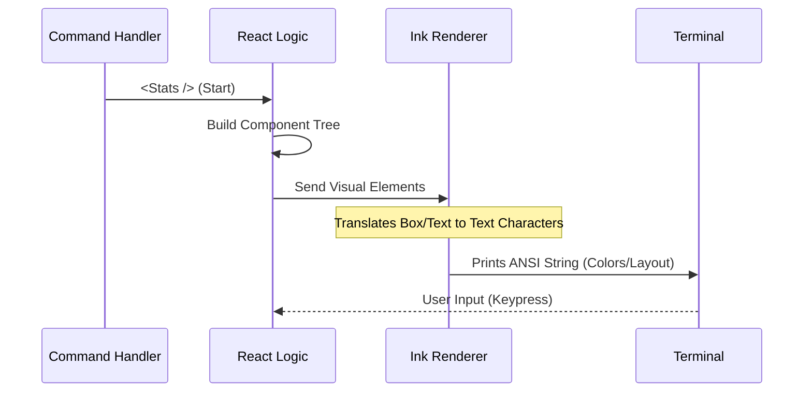

# Chapter 4: Component Integration

Welcome to Chapter 4! In the previous chapter, [Local JSX Command Handler](03_local_jsx_command_handler.md), we wrote the "Director" code. We told the CLI that when the user types `stats`, it should render a component called `<Stats />`.

However, if you try to run the code now, it will crash. Why? **Because we haven't built the `<Stats />` component yet!**

In this chapter, we will build the actual visual interface for our command.

## The "Waiter and Chef" Analogy

To understand **Component Integration**, think of a restaurant:

*   **The Command Handler (Chapter 3):** This is the **Waiter**. They greet the customer and take the order. They don't cook the food. Their only job is to tell the kitchen what to make.
*   **The Component (This Chapter):** This is the **Chef**. They don't talk to the customer directly at the door. They focus entirely on ingredients, cooking, and presentation.

### Why separate them?
If the Waiter tried to cook the food at the table while greeting the customer, it would be a mess. By separating them:
1.  **Clarity:** The logic file (`stats.tsx`) stays clean.
2.  **Focus:** The UI file (`Stats.js`) only worries about visuals (colors, layout, text).

---

## Building the Component

We are building a **React Component**. If you have used React for websites, this will look very familiar. The main difference is that instead of HTML tags like `<div>` or `<span>`, we use special tags for the terminal.

Let's create the file `src/components/Stats.tsx`.

### Step 1: Importing the Tools

We need React to understand the syntax, and we need a library called **Ink**. Ink is "React for the Command Line."

```typescript
import React, { useState, useEffect } from 'react';
import { Text, Box } from 'ink';
```

**Explanation:**
*   `Text`: Used for displaying strings (like `<span>` or `<p>`).
*   `Box`: Used for layout (flexbox) and structure (like `<div>`).

### Step 2: Defining the "Remote Control"

Remember the `onDone` function we passed in the previous chapter? Here, we receive it as a property called `onClose`.

```typescript
type Props = {
  // This function allows the component to close itself
  onClose: () => void;
};
```

**Explanation:**
*   We define a TypeScript type so our component knows it must receive an `onClose` function. This is the "off switch" for our application.

### Step 3: The Component Function

Now we write the actual function that defines what the user sees.

```typescript
export const Stats = ({ onClose }: Props) => {
  
  // This is where our UI logic lives
  return (
    <Box borderStyle="round" borderColor="cyan" padding={1}>
      <Text>
        Welcome to your <Text color="green">Stats</Text> Dashboard!
      </Text>
    </Box>
  );
};
```

**Explanation:**
*   **`export const Stats`**: We export this so the Command Handler can import it.
*   **`<Box>`**: We wrap everything in a box. We gave it a rounded border and a cyan color.
*   **`<Text>`**: We write our message. Notice we can nest `<Text>` inside `<Text>` to change the color of just one word!

---

## Under the Hood: Rendering to the Terminal

How does this actually work? Browsers have a "DOM" (Document Object Model) that React manipulates. Terminals don't have a DOM; they just process streams of text characters.

When we integrate our component, a translation process happens.

1.  **Instantiation:** The Handler creates `<Stats />`.
2.  **Virtual DOM:** React builds a tree of what the UI *should* look like.
3.  **Ink Engine:** Ink takes that tree and translates it into ANSI escape codes (special hidden characters that tell the terminal "Make this text green" or "Move cursor here").
4.  **Output:** The terminal prints the result.



---

## Adding Interactivity

A static message is nice, but we want our component to *do* something. Let's make it so the command closes after 3 seconds. This demonstrates how the Component uses the **Integration** with the Command Handler via `onClose`.

We will use a standard React hook: `useEffect`.

```typescript
export const Stats = ({ onClose }: Props) => {
  
  useEffect(() => {
    // Set a timer for 3000 milliseconds (3 seconds)
    const timer = setTimeout(() => {
      onClose(); // Press the "Off Button"
    }, 3000);

    return () => clearTimeout(timer);
  }, []);

  return <Text>Closing in 3 seconds...</Text>;
};
```

**What is happening here?**
1.  The component mounts (appears on screen).
2.  `useEffect` starts a timer.
3.  The text "Closing in 3 seconds..." appears.
4.  After 3 seconds, `onClose()` is called.
5.  This signal travels back up to the CLI runner, which shuts down the process.

---

## Internal Implementation Details

*Note: This section explains the library internals. You don't need to write this.*

When you write `<Box>` or `<Text>`, Ink is doing heavy lifting behind the scenes to calculate layout. The terminal is a grid of character cells. Ink uses the **Yoga Layout Engine** (the same engine used by React Native) to calculate exactly which cell each letter should occupy.

For example, if you write this:

```typescript
<Box flexDirection="column">
  <Text>A</Text>
  <Text>B</Text>
</Box>
```

Ink calculates:
1.  `A` goes on Line 1.
2.  `B` goes on Line 2 (because `flexDirection` is "column").

If you changed it to `flexDirection="row"`, Ink would calculate:
1.  `A` goes on Line 1, Position 1.
2.  `B` goes on Line 1, Position 2.

This allows us to build complex, responsive layouts in a black-and-white terminal window just like we build websites!

---

## Summary

In this chapter, we learned:
1.  **Component Integration** separates the command logic (The Waiter) from the visual presentation (The Chef).
2.  We use the **Ink** library to write React components that render to the terminal.
3.  We use standard React hooks (like `useEffect`) to manage logic inside the component.
4.  The component communicates back to the main app using the `onClose` prop.

Speaking of `onClose`, managing the lifecycle of a command—knowing exactly when to start and when to stop—is critical for a good user experience. We don't want the app to hang forever or close too early.

[Next Chapter: Lifecycle Control (onDone)](05_lifecycle_control__ondone_.md)

---

Generated by [Code IQ](https://github.com/adityasoni99/Code-IQ)