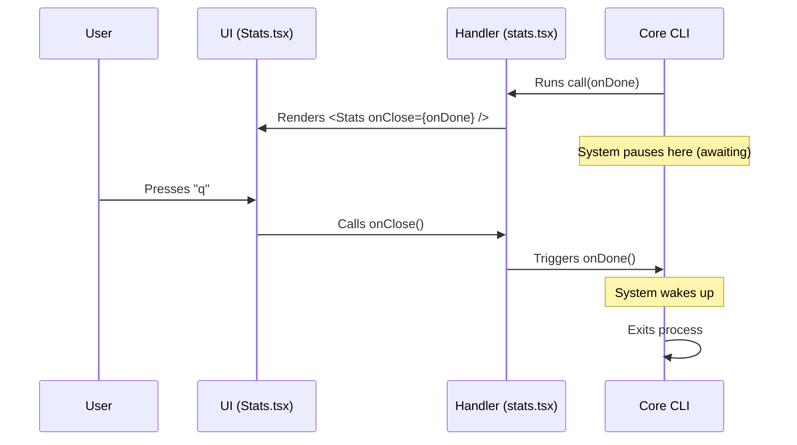

# Chapter 5: Lifecycle Control (onDone)

Welcome to the final chapter of our series! In the previous chapter, [Component Integration](04_component_integration.md), we built a beautiful visual component using React and Ink. We learned how to display it, but we haven't fully explained how to **stop** it.

If you ran the code from the previous chapters, you might have noticed something important: once the command starts, the terminal is "busy." The prompt doesn't come back immediately. We need a way to tell the application, "I am finished now."

## The "Eject Button" Problem

Imagine you are watching a movie in a cinema. The movie ends, the screen goes black, but the doors are locked. You are stuck there forever!

In CLI programming, when we take control of the screen to show a UI (like our Stats dashboard), we are locking the doors. The parent process (your terminal shell) is waiting politely for us to finish.

**Lifecycle Control** is the mechanism we use to unlock the doors and let the user return to their command prompt.

### The Solution: The `onDone` Callback

We solve this using a pattern called a **Callback**.

Think of `onDone` as a physical key passed down a relay race:
1.  **The System** creates the key.
2.  **The System** hands the key to your **Command Handler**.
3.  **The Handler** hands the key to your **Component**.
4.  **The Component** uses the key to unlock the door when the user presses "Exit".

---

## Passing the Signal

Let's trace the journey of this "key" through our files.

### Step 1: Receiving the Control (The Handler)

Open `src/commands/stats/stats.tsx`. Look at the function arguments.

```typescript
// stats.tsx
export const call: LocalJSXCommandCall = async (onDone) => {
  
  // onDone is a function: () => void
  // calling it signals that we are finished.
  
  // We pass it down to the UI component as a prop named 'onClose'
  return <Stats onClose={onDone} />;
};
```

**Explanation:**
*   The system injects `onDone` automatically when it calls your function.
*   We don't call `onDone()` here immediately. If we did, the app would open and close instantly!
*   Instead, we pass it to `<Stats />` so the *user* can decide when to close it.

### Step 2: Using the Control (The Component)

Now look at `src/components/Stats.tsx`. This is where the user interaction happens.

In a real CLI tool, we usually wait for a specific key press (like 'q' or 'Esc') to close the app. We use a hook from Ink called `useInput`.

```typescript
import { useInput } from 'ink';

export const Stats = ({ onClose }: { onClose: () => void }) => {
  
  // This hook listens for keyboard events
  useInput((input, key) => {
    if (input === 'q' || key.escape) {
      // The user wants to exit!
      // We call the function passed from the parent.
      onClose(); 
    }
  });

  return <Text>Press 'q' to exit.</Text>;
};
```

**Explanation:**
*   **`useInput`**: This behaves like an event listener. It watches every keystroke.
*   **`onClose()`**: When this runs, it triggers the `onDone` function back in the handler, which signals the CLI to stop.

---

## Under the Hood: How the CLI Waits

Why does the application pause while our component is visible? It uses **Promises**.

A Promise in JavaScript is like a buzzer at a restaurant. It represents a future event. The CLI is programmed to "await" that buzzer.

### The Sequence of Events

1.  **Start:** The CLI runs your command.
2.  **Render:** The UI appears.
3.  **Wait:** The CLI sits there, doing nothing, waiting for the `onDone` signal.
4.  **Signal:** You call `onDone()`.
5.  **Cleanup:** The CLI clears the screen (if configured) and returns you to the prompt.



---

## Internal Implementation Details

*Note: You do not need to write this code. This is a simplified view of the framework code running your command.*

The core framework wraps your command in a Promise wrapper to manage this lifecycle.

### The Wrapper Code

```typescript
// Framework internal logic
function runCommandWrapper(userCommand) {
  
  return new Promise((resolve) => {
    // We create the onDone function
    // When called, it resolves the promise
    const onDone = () => {
      resolve("Success");
    };

    // We run YOUR code, passing the resolver
    userCommand.call(onDone);
  });
}
```

**Walkthrough:**
1.  **`new Promise`**: This tells JavaScript "Don't finish this function until `resolve` is called."
2.  **`const onDone`**: We create a small function that simply calls `resolve`.
3.  **`userCommand.call(onDone)`**: We hand that trigger to your code.
4.  The framework effectively "hangs" on line 2 until your UI component decides to pull the trigger.

---

## Common Pitfalls

### 1. Forgetting to pass `onDone`
If you write `return <Stats />` without passing the prop, your component will render, but the "Exit" button won't be connected to anything. The user will press 'q', and nothing will happen.

### 2. Calling `onDone` too early
If you write:
```typescript
export const call = async (onDone) => {
  onDone(); // ❌ Called immediately!
  return <Stats ... />;
}
```
The application will flash on the screen for 1 millisecond and then exit immediately.

---

## Conclusion

Congratulations! You have completed the **stats** project tutorial.

Let's recap what we built:
1.  **Configuration:** We registered the `stats` command in [Command Configuration](01_command_configuration.md).
2.  **Lazy Loading:** We ensured it loads efficiently in [Lazy Loading Mechanism](02_lazy_loading_mechanism.md).
3.  **Handler:** We created the bridge between logic and UI in [Local JSX Command Handler](03_local_jsx_command_handler.md).
4.  **UI:** We built the visual interface in [Component Integration](04_component_integration.md).
5.  **Control:** We learned how to exit gracefully in this chapter.

You now possess the foundational knowledge to build interactive, performant, and user-friendly CLI tools. You understand not just *how* to write the code, but *why* the architecture is designed this way.

Happy coding!

---

Generated by [Code IQ](https://github.com/adityasoni99/Code-IQ)