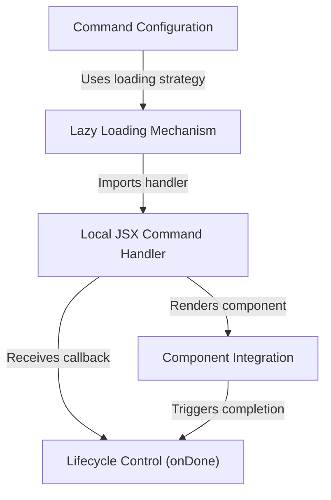

# Tutorial: stats

This project defines a **CLI command** called "stats" designed to show the user's *usage statistics* and activity. It utilizes a **lazy loading** strategy to optimize performance by only importing the logic when the command is run, at which point it renders a specific **React component** to handle the visual display and program lifecycle.

## Chapters

1. [Command Configuration](01_command_configuration.md)
2. [Lazy Loading Mechanism](02_lazy_loading_mechanism.md)
3. [Local JSX Command Handler](03_local_jsx_command_handler.md)
4. [Component Integration](04_component_integration.md)
5. [Lifecycle Control (onDone)](05_lifecycle_control__ondone_.md)

---

Generated by [Code IQ](https://github.com/adityasoni99/Code-IQ)