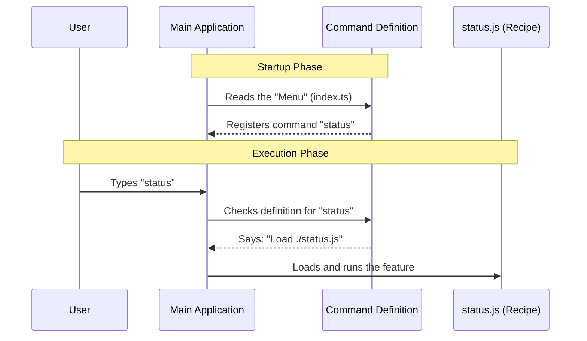

# Chapter 1: Command Definition

Welcome to the **Status** project! 

In this first chapter, we are going to learn how to teach our application a new trick. 

Imagine you are running a restaurant. You have a talented kitchen staff (the code) capable of cooking anything. But if a customer walks in, how do they know what to order? You need a **Menu**. 

In our application, a **Command Definition** is exactly like an item on that menu. It tells the system:
1.  **What** the feature is called (Metadata).
2.  **How** to start making it (Implementation).

## The Motivation: Adding the "Status" Feature

Let's say we want to add a feature that lets users check the health of the system (version, account info, API connection). We'll call this command `status`.

Without a definition, our application is a blank slate. Even if we write the code to check the system status, the main application won't know:
*   That this code exists.
*   What keyword triggers it.
*   When to load it.

We solve this by creating a **Command Definition** file.

## Creating the Blueprint

We define our command using a simple JavaScript object. Let's look at how we define the `status` command in `index.ts`.

### Step 1: Defining Identity (The Metadata)
First, we give the command a name and a description. This is what the user sees when they ask for "help".

```typescript
// Define the basic metadata
const statusMetadata = {
  name: 'status',
  description: 'Show Claude Code status, version, and account info',
  immediate: true, 
  // ... more properties later
}
```
**Explanation:**
*   `name`: The keyword the user types (e.g., `> status`).
*   `description`: A helpful hint explaining what this does.
*   `immediate`: A flag telling the app to run this right away.

### Step 2: Defining the Type
Next, we categorize the command. Not all commands behave the same way.

```typescript
const statusType = {
  // This command renders a UI, not just text
  type: 'local-jsx',
}
```
**Explanation:**
*   `type`: We set this to `'local-jsx'`. This tells the system that this command will render a visual interface. We will explore how this rendering works in [Local JSX Architecture](03_local_jsx_architecture.md).

### Step 3: Pointing to the Logic (The Recipe)
Finally, we need to tell the application where the actual logic lives. We don't want to put all the heavy code right here in the definition; we just want to point to it.

```typescript
import type { Command } from '../../commands.js'

const status = {
  // ... previous metadata ...
  
  // The 'load' function points to the file containing the logic
  load: () => import('./status.js'),
} satisfies Command
```
**Explanation:**
*   `load`: This is a function that imports the actual code (`./status.js`).
*   `satisfies Command`: This is a TypeScript feature that ensures our definition follows the rules.

## Putting It All Together

Here is the complete file `index.ts`. It combines the metadata, type, and the logic pointer into one clean package.

```typescript
import type { Command } from '../../commands.js'

const status = {
  type: 'local-jsx',
  name: 'status',
  description:
    'Show Claude Code status including version, model, account...',
  immediate: true,
  load: () => import('./status.js'),
} satisfies Command

export default status
```

**What happens now?** 
When the application starts, it reads this definition. It now knows that if a user types `status`, it should look at this object to figure out what to do next.

## Under the Hood: How it Works

Let's visualize the flow when a user interacts with this command definition.



### The "Load" Magic
You might notice the `load` property looks a bit special: `() => import('./status.js')`. 

Instead of loading the heavy code for the status check immediately when the app starts, we wrap it in a function. This means the heavy code is **only** loaded when the user actually asks for it. 

This technique keeps our application fast and lightweight. We will deep dive into this specific mechanism in the next chapter, [Dynamic Module Loading](02_dynamic_module_loading.md).

## Conclusion

Congratulations! You've defined your first feature. 

We learned that a **Command Definition** is the bridge between the user's input and your code's logic. It acts as a menu item, providing the name (`status`), the type (`local-jsx`), and the location of the recipe (`load`).

However, simply pointing to a file isn't enough. We need to understand *how* that file is brought into memory efficiently.

[Next Chapter: Dynamic Module Loading](02_dynamic_module_loading.md)

---

Generated by [Code IQ](https://github.com/adityasoni99/Code-IQ)