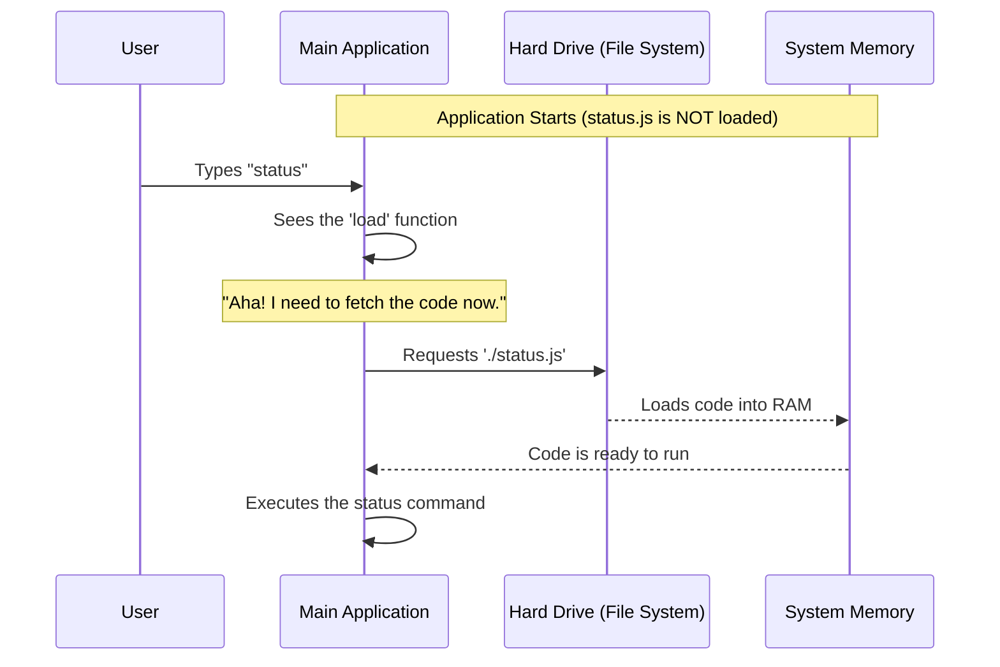

# Chapter 2: Dynamic Module Loading

Welcome back! In the previous chapter, [Command Definition](01_command_definition.md), we created the "Menu Item" for our `status` command. We gave it a name, a description, and a pointer to where the actual code lives.

In this chapter, we are going to look specifically at that pointer—the `load` property—and discover a powerful trick to make our application incredibly fast.

## The Motivation: The Overcrowded Library

To understand why we need **Dynamic Module Loading**, let's imagine a library.

### The "Static" Problem
Imagine a library that brings **every single book** it owns into the main reading room as soon as it opens in the morning.
*   **The Result:** The room is crowded. It takes hours to open the library because the librarians are busy moving millions of books. There is no space for people to sit (System Memory/RAM).
*   **The Reality:** Most patrons only want to read the top 10 most popular books. The rare "History of Ancient Staplers" book takes up space but is almost never touched.

### The "Dynamic" Solution
Now, imagine a smarter library. The reading room starts empty. The books are kept in a separate storage facility (The Hard Drive).
*   **The Process:** When a patron specifically asks for "History of Ancient Staplers," a librarian runs to the back, fetches that specific book, and brings it to the reading room.
*   **The Benefit:** The library opens instantly. There is plenty of room. Resources are only used when absolutely necessary.

This is exactly what **Dynamic Module Loading** does for our code.

## How We Implement It

In standard programming, we often see imports at the very top of a file. This is like putting books in the reading room immediately.

```typescript
// ❌ Static Import (The "Heavy" Way)
// This loads the code immediately, even if we never use it!
import { runStatus } from './status.js' 
```

To achieve our "Smart Library" system, we change how we import the file inside our command definition.

### The `load` Property

Let's look at the specific line from our `index.ts` file again.

```typescript
const status = {
  name: 'status',
  // ... other metadata ...
  
  // ✅ Dynamic Import (The "Smart" Way)
  load: () => import('./status.js'),
}
```

**Explanation:**
1.  **`() => ...`**: This is an arrow function. It wraps the command. It effectively tells the computer: *"Don't do this yet. Wait until I call you."*
2.  **`import(...)`**: This is a special function that fetches the file.

## Under the Hood: The Fetching Process

What actually happens when the user types `status`? Let's visualize the flow.



### Why is this better?
If our application has 50 different commands, and we used static imports, we would load code for all 50 commands just to start the app. By using this pattern, we start with **0 commands** loaded.

## Deep Dive: The Promise

In JavaScript, operations that take time (like fetching a book from storage) are handled by something called a **Promise**.

When we write `import('./status.js')`, the system doesn't return the code instantly. Instead, it returns a "Promise"—think of it like a claim ticket at a coat check.

```typescript
// This function doesn't return the code directly.
// It returns a "Promise" (a ticket).
load: () => import('./status.js'),
```

### Handling the Ticket
When the application decides to run the command (in [Command Execution Lifecycle](05_command_execution_lifecycle.md)), it "redeems" this ticket.

The application basically says: *"I will wait here until the file is finished loading."*

```typescript
// Simplified view of what the App does internally
async function runCommand(commandDef) {
  // 1. Call the load function to get the "ticket"
  const loadingTicket = commandDef.load();

  // 2. Wait for the ticket to turn into real code
  const realCode = await loadingTicket;

  // 3. Now we can use the code!
  // ... execute logic ...
}
```

## Solving the Use Case

Let's verify that we have solved our problem for the `status` command.

**The Goal:** Ensure the heavy logic for checking the system version and account info doesn't slow down the app startup.

**The Solution:**

1.  We created `status.js` (where the heavy logic lives).
2.  We created `index.ts` (the definition).
3.  We connected them using the dynamic loader.

**Input (User Action):**
User opens the app.
*   **Result:** App opens instantly. `status.js` is **not** in memory.

**Input (User Action):**
User types `> status`.
*   **Result:** 
    1. The app detects the command.
    2. The app calls the `load` function.
    3. `status.js` is imported.
    4. The status screen appears.

## Conclusion

You have effectively optimized your application! By using **Dynamic Module Loading**, you've ensured that your application remains lightweight and responsive, no matter how many features you add in the future.

The "librarian" only fetches the "books" when the user asks to read them.

But wait—once the librarian hands us the book (`status.js`), what's actually inside it? How do we build that visual interface that shows the system health?

We will answer that in the next chapter.

[Next Chapter: Local JSX Architecture](03_local_jsx_architecture.md)

---

Generated by [Code IQ](https://github.com/adityasoni99/Code-IQ)