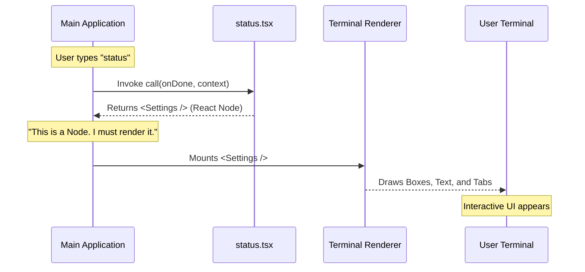

# Chapter 3: Local JSX Architecture

Welcome back! 

In the previous chapter, [Dynamic Module Loading](02_dynamic_module_loading.md), we learned how to efficiently fetch our code only when the user asks for it. 

Now, we have the code in memory. But what **is** that code? If you are coming from traditional command-line tool development, you might expect to see a lot of `console.log("System OK")`.

However, in this project, we do something radically different. We don't just print text; we render an **Interface**.

## The Motivation: From Radio to Smart TV

To understand **Local JSX Architecture**, let's look at an analogy.

### The Old Way: The Radio
Traditional command-line tools are like an AM Radio. You tune in (run a command), and you get a stream of audio (text output). 
*   It's linear.
*   If you miss something, you have to scroll back.
*   You can't "click" on anything.

### The New Way: The Smart TV
Our architecture acts like a Smart TV. When you run the `status` command, we don't just talk at you. We turn on a screen.
*   It has visual structure (tabs, boxes, colors).
*   It is interactive (you can navigate menus).
*   It is "Local" because it runs right inside your terminal, not in a web browser.

## The Concept: Returning a "Node"

In standard web development using **React**, you don't write HTML directly to the browser. Instead, you write JavaScript functions that return **JSX** (JavaScript XML). These returns are called "React Nodes."

We apply this exact same logic to our terminal application.

### The Goal
We want our `status` command to behave like this:

1.  **Input:** User types `status`.
2.  **Action:** The system calls our function.
3.  **Output:** Instead of a string, the function returns a `<Settings />` component.
4.  **Result:** The application "draws" that component in the terminal window.

## Implementing the Logic

Let's look at `status.tsx`. This is the file we imported dynamically in the last chapter.

### Step 1: The Setup
First, we need to import React. Even though we aren't in a browser, we need React's engine to understand the UI elements.

```typescript
import * as React from 'react';
// We import the specific UI component we want to show
import { Settings } from '../../components/Settings/Settings.js';
```

**Explanation:**
*   `React`: The core library that lets us define components.
*   `Settings`: This is the actual UI widget (the Smart TV screen) we want to show. We will learn how to build this in [UI Component Composition](04_ui_component_composition.md).

### Step 2: The `call` Function
Every `local-jsx` command must export a specific function named `call`. This is the entry point.

```typescript
import type { LocalJSXCommandOnDone, LocalJSXCommandContext } from '../../types/command.js';

export async function call(
  onDone: LocalJSXCommandOnDone, 
  context: LocalJSXCommandContext
) {
  // Logic goes here...
}
```

**Explanation:**
*   `onDone`: A function we can call to close the "screen" and go back to the command line.
*   `context`: Information about the app (like theme settings or user data) that we might need to pass down.

### Step 3: Returning the Interface
Here is the magic moment. Instead of performing calculations and printing text, we simply **return** a React component.

```typescript
// Inside the call function...

// We return a JSX element (looks like HTML)
return (
  <Settings 
    onClose={onDone} 
    context={context} 
    defaultTab="Status" 
  />
);
```

**Explanation:**
*   `<Settings />`: We are telling the app, "Please render the Settings screen."
*   `onClose={onDone}`: We connect the "Close" button of the Settings screen to the system's `onDone` function. When the user closes the menu, the command finishes.

## Putting It All Together

Here is the complete, simplified file for `status.tsx`.

```typescript
import * as React from 'react';
import { Settings } from '../../components/Settings/Settings.js';

export async function call(onDone, context) {
  // The architecture allows us to simply return a UI definition
  return <Settings onClose={onDone} context={context} defaultTab="Status" />;
}
```

That's it! It is shockingly simple because the **Local JSX Architecture** handles all the heavy lifting of figuring out how to draw that component to the screen.

## Under the Hood: The Rendering Flow

How does a `<Settings />` tag turn into pixels (or characters) in your terminal?

In [Command Definition](01_command_definition.md), we set `type: 'local-jsx'`. This flag tells the main application to treat the return value of this command differently.



### The Abstraction Layer
The beauty of this architecture is that `status.tsx` doesn't know *how* to draw a box in a terminal. It doesn't know about ASCII codes or cursor positioning.

It just says: *"I want a Settings component."*

The **Renderer** (conceptually similar to `ReactDOM` in web development, but for terminals) takes that request and translates it into the visual output the user sees.

## Why "Local"?
We call this "Local JSX" because:
1.  **Local:** The logic runs on the user's machine (in Node.js).
2.  **JSX:** We use the syntax of the web (React) to describe the UI.

This allows web developers to write powerful terminal tools without learning complex, low-level terminal commands.

## Conclusion

We have successfully connected our command definition to a rich user interface. 

We learned:
1.  **Local JSX Architecture** treats the CLI like a graphical app.
2.  The `call` function returns a **React Node**, not a string.
3.  We pass control functions like `onDone` into the UI so the user can exit the screen.

But we have a mystery on our hands. We keep using this `<Settings />` component. What is inside it? How do we build smaller building blocks like buttons, lists, and headers to create this full screen?

We will explore how to build the actual visible parts in the next chapter.

[Next Chapter: UI Component Composition](04_ui_component_composition.md)

---

Generated by [Code IQ](https://github.com/adityasoni99/Code-IQ)