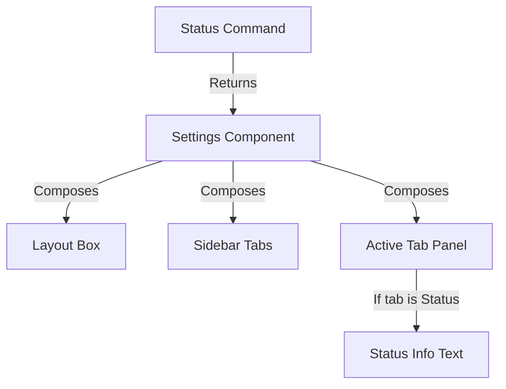
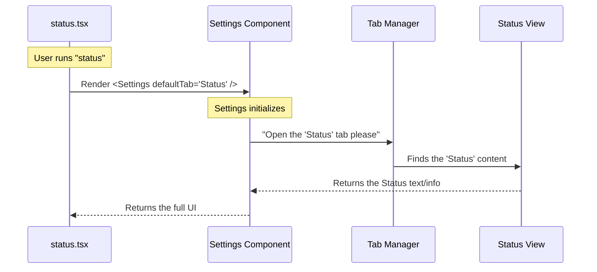

# Chapter 4: UI Component Composition

Welcome back!

In the previous chapter, [Local JSX Architecture](03_local_jsx_architecture.md), we discovered that our command logic doesn't print text; it returns a UI element. Specifically, we returned something called `<Settings />`.

But what *is* `<Settings />`? And why didn't we have to write code to draw borders, handle key presses, or create tabs from scratch?

In this chapter, we explore **UI Component Composition**—the art of building complex interfaces by snapping together pre-made blocks.

## The Motivation: The Modular Furniture Kit

Imagine you need a new desk for your office. You have two choices:

1.  **The "From Scratch" Way:** Go to a forest, chop down a tree, mill the lumber, weld some metal legs, and sand everything down.
2.  **The "Composition" Way:** Buy a modular furniture kit. You take pre-made legs and a pre-made surface, and you just assemble them.

Building user interfaces (UI) is the same. 

If we tried to draw the "Status" screen from scratch in a terminal, we would have to calculate where every single line character (`│`, `─`, `┌`) goes. It would be a nightmare.

### The Solution
Instead, our application provides a "Kit" of components. 
*   Need a container? Use `<Box />`.
*   Need text? Use `<Text />`.
*   Need a full settings menu with tabs? Use `<Settings />`.

The `status` command simply **composes** (uses) the existing `<Settings />` component to do its job.

## The Use Case: Configuring the View

Our goal is to show the "Status" information. 

The application already has a generic "Settings" screen that handles:
*   Drawing the window border.
*   Handling the "Close" button.
*   Managing a list of tabs (General, Theme, Account, etc.).

We want to reuse this screen, but with one specific tweak: **We want it to open directly to the "Status" tab.**

## How to Compose

Let's look at `status.tsx` again to see how we configure our furniture kit.

### Step 1: Importing the Block
First, we grab the pre-made component from our library.

```typescript
import * as React from 'react';

// We import the pre-built UI block "Settings"
import { Settings } from '../../components/Settings/Settings.js';
```

### Step 2: Assembling (Rendering)
When we use the component, we pass it **Props** (Properties). Think of Props as the instructions included with the furniture kit.

```typescript
// Inside our call function...
return (
  <Settings 
    onClose={onDone}       // Instruction: What to do when user quits
    context={context}      // Instruction: App data (theme, etc.)
    defaultTab="Status"    // Instruction: Which tab to open first
  />
);
```

**Explanation:**
*   `defaultTab="Status"`: This is the crucial piece of composition. We are telling the generic Settings component: *"You usually start at the top, but for this specific command, please start on the 'Status' page."*

## Under the Hood: The Hierarchy

When you return `<Settings />`, you aren't just drawing one thing. You are triggering a chain reaction of composition.

The `Settings` component is composed of smaller components, which are composed of even smaller ones.



### The Sequence of Composition

Let's visualize how the data flows when the command runs.



### Internal Implementation (Simplified)

To understand this better, let's pretend we are looking inside the `Settings.js` file (the component we are importing).

It might look something like this:

```typescript
// A simplified look INSIDE Settings.js
export function Settings({ defaultTab }) {
  // 1. Determine which tab is active based on the prop
  const currentTab = defaultTab || 'General';

  // 2. Return a composition of smaller parts
  return (
    <Box borderStyle="round">
      <Sidebar active={currentTab} />
      <Content tab={currentTab} />
    </Box>
  );
}
```

**What just happened?**
1.  Our `status` command passed `"Status"` into `defaultTab`.
2.  The `Settings` component received it.
3.  `Settings` passed that information down to `<Sidebar />` (so it highlights the right button) and `<Content />` (so it shows the right text).

## Why is this "Beginner Friendly"?

This architecture separates concerns:
1.  **The Architect (You):** You define *what* you want (`<Settings defaultTab="Status" />`). You don't care how the borders are drawn.
2.  **The Builder (The Component):** The component handles *how* to draw it.

This means you can create powerful commands in just 3-4 lines of code because you are standing on the shoulders of giants (existing components).

## Conclusion

You have now completed the code implementation for the `status` command!

*   **Chapter 1:** We defined the command name.
*   **Chapter 2:** We set up dynamic loading to keep it fast.
*   **Chapter 3:** We learned how to use React (JSX) in the terminal.
*   **Chapter 4:** We used **Component Composition** to reuse the `Settings` UI.

We have a definition, we have code, and we have a UI. But... we haven't actually pressed "Enter" yet. How does the system coordinate all of these pieces when the user actually types the command?

In the final chapter, we will watch the entire process unfold from start to finish.

[Next Chapter: Command Execution Lifecycle](05_command_execution_lifecycle.md)

---

Generated by [Code IQ](https://github.com/adityasoni99/Code-IQ)