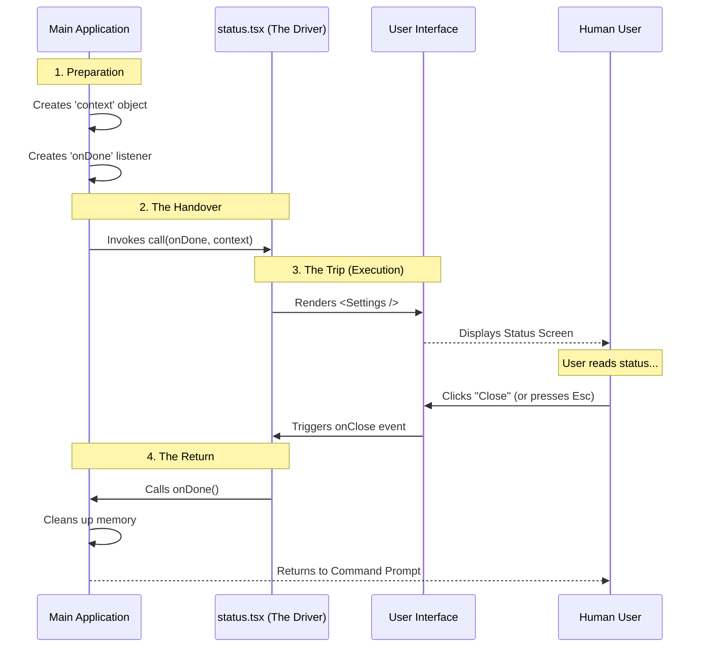

# Chapter 5: Command Execution Lifecycle

Welcome to the final chapter of our series!

In the previous chapter, [UI Component Composition](04_ui_component_composition.md), we built the visual interface for our `status` command. We have a definition, we have code, and we have a beautiful UI.

But there is one final piece of the puzzle: **Time**.

Unlike a standard script that runs from top to bottom and exits immediately, a user interface stays open. It waits for the user. It has a beginning, a middle, and an end. We call this the **Execution Lifecycle**.

## The Motivation: The Car Rental Analogy

To understand how our application manages this lifecycle, let's use a simple analogy: **Renting a Car**.

Imagine the Main Application is a **Rental Agency**, and the Command (your code) is the **Driver**.

1.  **The Handover (Context):** When you rent a car, the agency hands you the keys and the vehicle. These are the tools you need to go on your trip. You didn't build the car; the agency provided it.
2.  **The Trip (Execution):** You drive around. The agency doesn't know exactly where you are going, and they don't interfere. They just wait.
3.  **The Return (onDone):** When you are finished, you must return the car to a specific location and sign out. If you never return the car, the agency keeps the contract open forever (the app freezes).

In our code, this relationship is managed by two specific arguments passed to your command: `context` and `onDone`.

## The `context` (The Keys and Car)

The `context` object contains everything the application knows about the world that your command might need.

Instead of your command trying to figure out "What is the screen size?" or "Is the user logged in?", the application hands this data to you on a silver platter.

### Usage in Code
Let's look at our function signature in `status.tsx`:

```typescript
// We receive 'context' as the second argument
export async function call(onDone, context) {
  
  // We can pass this context down to our UI
  // The Settings component uses it to check account info
  return <Settings context={context} ... />;
}
```

**What's inside context?**
*   **Environment Variables:** API keys or configuration settings.
*   **State:** Is the user logged in? What is the current version?
*   **Theme:** Should the UI be dark mode or light mode?

## The `onDone` Callback (The Return)

This is the most critical part of the lifecycle. 

Because we are rendering a UI, the Main Application pauses. It stops processing other commands and waits for you to finish.

The `onDone` argument is a **function**. When you call it, you are signaling: *"I am finished. You can take control back now."*

### Usage in Code
We don't usually call `onDone` immediately. We wire it up to a user action, like pressing a button.

```typescript
export async function call(onDone, context) {
  return (
    <Settings 
      // When the user clicks "Close" in the UI...
      // ...we execute the onDone function.
      onClose={onDone} 
      
      context={context} 
      defaultTab="Status" 
    />
  );
}
```

If we forgot to pass `onDone` to the `<Settings />` component, the user would click "Close," but nothing would happen. The app would be stuck in the `status` screen forever!

## Under the Hood: The Sequence of Events

Let's visualize the entire lifecycle of the `status` command, from the moment the user hits Enter to the moment they return to the command prompt.



## Internal Implementation: The Promise Wrapper

How does the application actually "wait" for `onDone`? 

In JavaScript/TypeScript, we use **Promises**. The application wraps the execution of your command in a Promise that only resolves when `onDone` is called.

Here is a simplified version of what the Main Application does behind the scenes:

```typescript
// Inside the Main Application Core
async function runCommand(command) {
  // 1. Create the Promise
  return new Promise((resolve) => {
    
    // 2. Define onDone: It simply resolves the promise!
    const onDone = () => {
      resolve(); // This tells the app "We are finished"
    };

    // 3. Start the command, passing the resolver
    command.call(onDone, globalContext);
  });
}
```

**Explanation:**
1.  **The Pause:** The `await` keyword (implied by the Promise) pauses the main app.
2.  **The Trigger:** The `onDone` function is actually the `resolve` function of the Promise.
3.  **The Resume:** As soon as you call `onDone()`, the Promise completes, and the app moves to the next line of code (cleanup).

## Putting It All Together: The Complete Picture

Congratulations! You have navigated the entire architecture of the `status` command.

Let's review the full journey we have taken across these 5 chapters:

1.  **[Command Definition](01_command_definition.md):** We created the "Menu Item" so the app knows the command exists.
2.  **[Dynamic Module Loading](02_dynamic_module_loading.md):** We set up a lazy-loading system so code is only fetched when needed.
3.  **[Local JSX Architecture](03_local_jsx_architecture.md):** We learned to return visual components instead of text strings.
4.  **[UI Component Composition](04_ui_component_composition.md):** We built a complex screen by reusing the `<Settings />` component.
5.  **Command Execution Lifecycle:** We learned how `context` fuels the command and `onDone` safely shuts it down.

### The Final Code
Here is the final, fully functional `status.tsx` file one last time. It represents the culmination of all these concepts.

```typescript
import * as React from 'react';
import { Settings } from '../../components/Settings/Settings.js';

// The Lifecycle Entry Point
export async function call(onDone, context) {
  
  // Rendering the UI with Context and Lifecycle control
  return (
    <Settings 
      onClose={onDone}       // The Exit Strategy
      context={context}      // The Data/Keys
      defaultTab="Status"    // The Configuration
    />
  );
}
```

## Conclusion

You now possess the knowledge to build powerful, interactive, and efficient terminal commands using the **Status** project architecture.

By treating CLI commands like interactive graphical applications—managed by a lifecycle, composed of components, and loaded dynamically—we can create user experiences that are far superior to simple text output.

You are now ready to build your own commands. Happy coding!

---

Generated by [Code IQ](https://github.com/adityasoni99/Code-IQ)