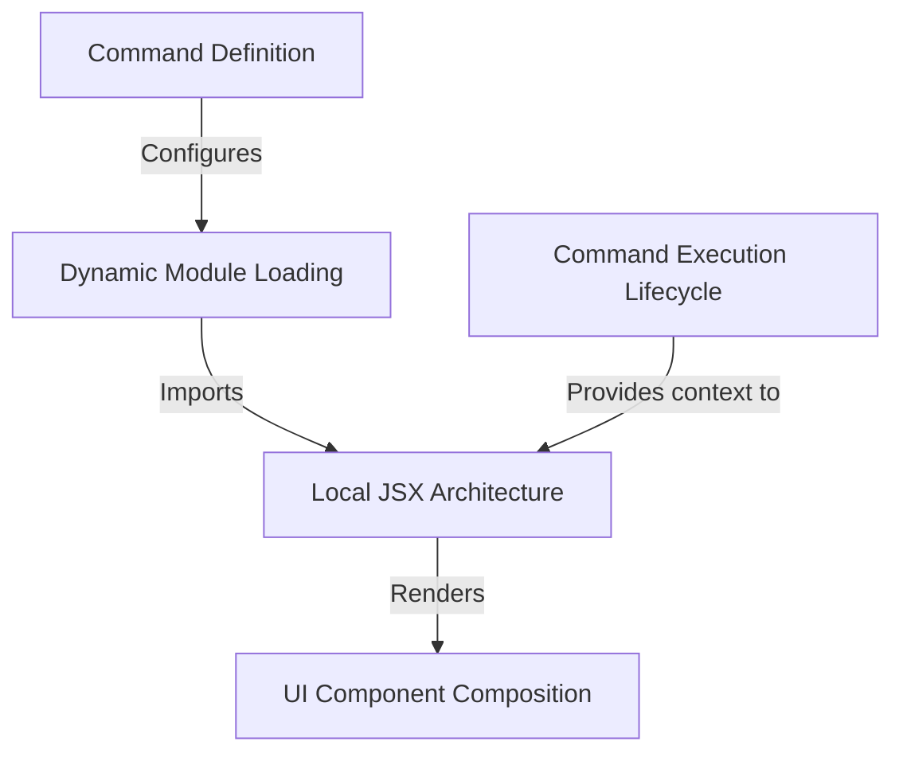

# Tutorial: status

This project implements the `status` command for the application, enabling users to view system details like version and account info. It utilizes a **Local JSX Architecture** to render interactive, React-based interfaces within the terminal. The implementation features **Dynamic Module Loading** to optimize performance by only fetching code when the command is run, and it leverages **UI Component Composition** to reuse existing visual elements.

## Chapters

1. [Command Definition](01_command_definition.md)
2. [Dynamic Module Loading](02_dynamic_module_loading.md)
3. [Local JSX Architecture](03_local_jsx_architecture.md)
4. [UI Component Composition](04_ui_component_composition.md)
5. [Command Execution Lifecycle](05_command_execution_lifecycle.md)

---

Generated by [Code IQ](https://github.com/adityasoni99/Code-IQ)