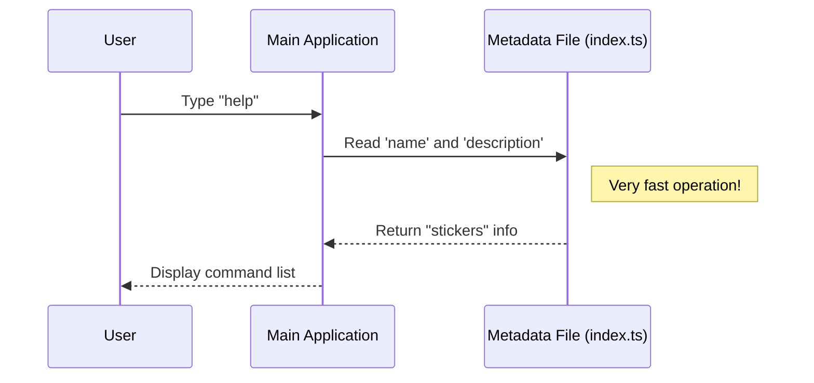

# Chapter 1: Command Metadata & Registration

Welcome to the **Stickers Project** tutorial! In this series, we will build a command that lets users order Claude Code stickers.

We are starting at the very beginning. Before we write the code that actually processes an order, we need to tell our application that this command exists. We call this **Command Metadata & Registration**.

## Why do we need this?

Imagine you are building a huge Command Line Interface (CLI) with 100 different commands. If you put all the code for every command into one big pile, your application would be massive. It would take forever to start up because the computer has to read *everything* just to show you the welcome message.

To solve this, we separate the **Identity** of the command from the **Action** of the command.

### The Restaurant Menu Analogy
Think of this concept like a **menu in a restaurant**:

1.  **The Menu (Metadata):** It lists the item ("Spaghetti Carbonara") and a description ("Pasta with eggs and cheese"). It is lightweight and easy to read.
2.  **The Kitchen (Execution Logic):** This is where the chefs, pots, pans, and ingredients are. It's heavy and busy.

The file we are writing in this chapter is the **Menu Item**. It tells the application, *"I have a command called 'stickers', and here is a brief description."* It does **not** contain the cooking instructions (the code to make the order). It just points to where the kitchen is.

## The Use Case: Registering the Command

Our goal is to create a file that introduces the `stickers` command to the main system so that when a user runs `help`, they see our command listed.

Here is the file `index.ts` that acts as our "Identity Card." Let's break it down into small pieces.

### Part 1: Defining the Identity

First, we define the basic information about our command.

```typescript
// index.ts
const stickers = {
  type: 'local', // This runs on your machine
  name: 'stickers', // The command the user types
  description: 'Order Claude Code stickers',
  supportsNonInteractive: false,
  // ... more code below
```

**What is happening here?**
*   `type`: Tells the system where this command lives (locally).
*   `name`: This is the keyword the user will type (e.g., `> claude stickers`).
*   `description`: This text appears in the help menu to explain what the command does.

### Part 2: The Pointer to the Logic

This is the most important part. We need to tell the system where to find the "heavy" code (the recipe) without actually running it yet.

```typescript
// ... inside the object
  load: () => import('./stickers.js'),
} satisfies Command

export default stickers
```

**What is happening here?**
*   `load`: This is a function. It doesn't run immediately. It only runs when the user actually chooses the sticker command.
*   `import('./stickers.js')`: This tells the system, *"If the user wants stickers, go load this file."* This concept is explored deeply in [Lazy Module Loading](02_lazy_module_loading.md).
*   `satisfies Command`: This is a safety check to ensure our "Identity Card" has all the required fields.

## Input and Output

So, what does this code actually achieve?

**The Input:**
The file `index.ts` we just wrote.

**The Output (High Level):**
When the user runs the main application help command:

```text
Usage: claude <command>

Available Commands:
  stickers    Order Claude Code stickers
  login       Log in to the system
  ...
```

Notice that the application knows **Command Name** (`stickers`) and the **Description** (`Order Claude Code stickers`) just by reading our small metadata file. It did not need to load the heavy logic code yet.

## Under the Hood: How Registration Works

To understand how the system uses this file, let's look at the flow.

1.  The CLI starts up.
2.  It scans for `index.ts` files to build its "Menu".
3.  It reads only the name and description.
4.  It waits for the user.

Here is a sequence diagram showing what happens when a user asks for help:



### Internal Implementation Details

The magic that makes this type-safe is the `Command` interface. When we wrote `satisfies Command`, we were using a blueprint.

```typescript
import type { Command } from '../../commands.js'

// This object MUST match the Command blueprint
const stickers = {
   // ... properties
} satisfies Command
```

By using this pattern, the system guarantees that every command has a "Menu Entry." If we forgot to add a `description`, the code editor would show a red error line immediately.

This separation sets the stage for the rest of the tutorial:
1.  **This file** handles the registration.
2.  The **`load` function** handles the [Lazy Module Loading](02_lazy_module_loading.md).
3.  The **file we import** (`stickers.js`) handles the [Command Execution Logic](03_command_execution_logic.md).

## Conclusion

In this chapter, we created the **Metadata** for our command. We learned that by separating configuration from logic, we keep our application fast and organized. We created a "Menu Item" that points to the "Kitchen" but doesn't cook the food itself.

Now that our command is registered, we need to understand exactly *how* the system loads the heavy code only when needed.

[Next Chapter: Lazy Module Loading](02_lazy_module_loading.md)

---

Generated by [Code IQ](https://github.com/adityasoni99/Code-IQ)