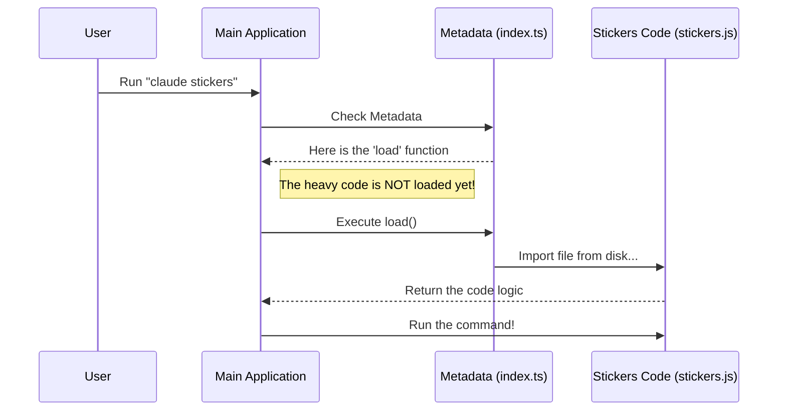

# Chapter 2: Lazy Module Loading

Welcome to the second chapter of the **Stickers Project** tutorial!

In the previous chapter, [Command Metadata & Registration](01_command_metadata___registration.md), we created the "Menu" for our application. We told the system that a command named `stickers` exists, but we didn't actually provide the code to run it yet.

In this chapter, we will learn about **Lazy Module Loading**. This is the magic trick that keeps our application lightning-fast.

## The Motivation: Why wait?

Imagine a library with thousands of books.
*   **The Main Room:** This is where the librarians work. It needs to be clean and uncrowded so people can ask questions quickly.
*   **The Warehouse:** This is a separate building where all the books are stored.

If the librarians tried to keep *every single book* on their desk "just in case" someone asked for it, there would be no room to work! The library would be messy and slow.

### The Library Analogy
**Lazy Loading** acts like the retrieval system:
1.  The Librarian (The Application) stays at the desk with empty hands (Low Memory).
2.  A patron asks for "Harry Potter" (The User runs a command).
3.  **Only then** does the Librarian send a runner to the warehouse to fetch that specific book.

If nobody asks for "Harry Potter," that book stays in the warehouse, and the Librarian never has to carry its weight.

## Key Concept: Static vs. Dynamic Imports

To achieve this in code, we need to understand the difference between two ways of importing files.

### 1. The "Heavy" Way (Static Import)
Usually, imports look like this. They happen at the very top of a file.

```typescript
// heavy-way.ts
import { heavyLogic } from './stickers.js';

// As soon as this file runs, 'stickers.js' is loaded immediately.
// Even if we don't use it yet!
```

### 2. The "Lazy" Way (Dynamic Import)
This is what we use in our project. We wrap the import inside a function.

```typescript
// lazy-way.ts
const loadStickers = () => import('./stickers.js');

// 'stickers.js' is NOT loaded yet.
// It waits until we actually call loadStickers().
```

## Solving the Use Case

In our `index.ts` file from the previous chapter, we used the **Dynamic Import** method. Let's look at that specific line again.

### The Code
```typescript
// index.ts
const stickers = {
  // ... name and description ...
  
  // This is the Lazy Loader
  load: () => import('./stickers.js'),
} satisfies Command
```

**What is happening here?**
*   `load`: This is a property of our command object.
*   `() => ...`: This is an Arrow Function. It acts like a "Pause Button." It says, "Don't run the code inside me yet. Wait until I am called."
*   `import(...)`: This is the instruction to go to the "Warehouse" (your hard drive) and read the `stickers.js` file.

### Input and Output

**The Input:**
The user types the command in the terminal:
`> claude stickers`

**The Output (System Behavior):**
1.  The system sees you want `stickers`.
2.  It looks at the `stickers` metadata object.
3.  It presses "Play" on our "Pause Button" (it executes the `load` function).
4.  The file `stickers.js` is loaded into memory.
5.  The code inside `stickers.js` is finally executed.

## Under the Hood: How it Works

Let's visualize exactly when the "heavy lifting" happens.

### Sequence Diagram

Notice how the `Stickers Code` is completely asleep until the very last moment.



### Internal Implementation Details

So, what does the application actually *do* with that `load` function?

When you use `import()` inside a function, JavaScript returns something called a **Promise**. A Promise is like a buzzer at a restaurant. It says, *"I'm going to get your file. It might take a few milliseconds. I'll buzz you when it's ready."*

Here is a simplified version of what the main CLI system does behind the scenes to handle this:

```typescript
// internal-system-runner.ts (Simplified)

async function runCommand(commandName: string) {
  // 1. Find the metadata we wrote in Chapter 1
  const cmd = registry.get(commandName); 

  // 2. Call the lazy loader function
  // The 'await' keyword waits for the Promise (the buzzer)
  const module = await cmd.load();

  // 3. Now we have the heavy code! Run it.
  module.default();
}
```

**Explanation:**
1.  **`registry.get`**: Finds our `index.ts` object.
2.  **`await cmd.load()`**: This is the critical moment. The application pauses for a split second to fetch the file. This is the **Lazy Load** happening in real-time.
3.  **`module.default()`**: Once the file is loaded, the application runs the main function inside it.

## Conclusion

In this chapter, we learned about **Lazy Module Loading**.

*   We learned that loading all code at once makes applications slow.
*   We used the **Library Analogy** to understand keeping code in a "Warehouse."
*   We used a **Dynamic Import** (`() => import(...)`) to tell the system *where* the code is, without loading it immediately.

Now that the system knows *how* to load our code, we need to actually write the code that handles the order! In the next chapter, we will open up that heavy file (`stickers.js`) and write the logic to process the user's request.

[Next Chapter: Command Execution Logic](03_command_execution_logic.md)

---

Generated by [Code IQ](https://github.com/adityasoni99/Code-IQ)