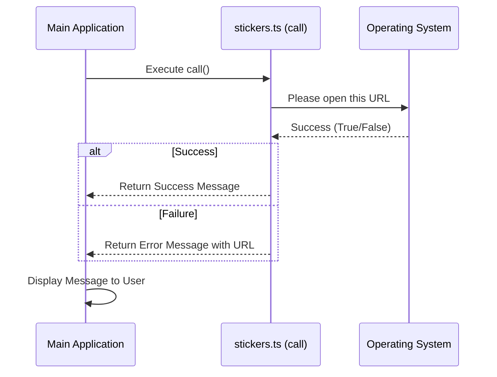

# Chapter 3: Command Execution Logic

Welcome to Chapter 3 of the **Stickers Project** tutorial!

In the previous chapters, we set up the "Menu" for our command in [Command Metadata & Registration](01_command_metadata___registration.md) and set up the "Delivery System" to fetch our code in [Lazy Module Loading](02_lazy_module_loading.md).

Now, we have finally arrived in the "Kitchen." This is where the actual cooking happens. In this chapter, we will write the **Command Execution Logic**. This is the code that runs when the user actually hits "Enter."

## The Motivation: Making it Work

Right now, if our application tried to run the `stickers` command, it would crash because the file `stickers.ts` is empty! We have a button, but it isn't connected to any wires.

**The Use Case:**
When a user types `> claude stickers`, we want the application to:
1.  Identify the correct URL for the sticker shop.
2.  Open the user's default web browser to that URL.
3.  Tell the user if it worked or if it failed.

We need a standard way to write this "Action" so the main system knows how to run it.

## The Recipe: The `call` Function

In our system, every command's logic lives inside a specific function named `call`. You can think of `call` as the "Start Button" for your specific code.

We are working in the file `stickers.ts`. Let's build it step-by-step.

### Step 1: Gathering Ingredients (Imports)

Before we cook, we need our tools. We need a specific Type to make sure we return the right data, and a utility tool to help us open the web browser.

```typescript
// stickers.ts
import type { LocalCommandResult } from '../../types/command.js'
import { openBrowser } from '../../utils/browser.js'

// We are now ready to write the logic...
```

**What is happening here?**
*   `LocalCommandResult`: This is a form (a Type) that tells us exactly what our report needs to look like when we are finished.
*   `openBrowser`: This is a helper tool (we will look at this in [System Integration Utilities](05_system_integration_utilities.md)) that handles the complex work of talking to Chrome, Safari, or Edge.

### Step 2: Defining the Action

Now we define the `call` function. This is the entry point the system looks for.

```typescript
// ... inside stickers.ts

export async function call(): Promise<LocalCommandResult> {
  // Define the destination
  const url = 'https://www.stickermule.com/claudecode'
  
  // Attempt to open the browser and wait for the result
  const success = await openBrowser(url)

  // ... code continues below
```

**What is happening here?**
*   `export`: This makes the function available to the main system (so the Lazy Loader from Chapter 2 can find it).
*   `async`: This tells the computer, "This function might take a moment (opening a browser isn't instant), so please handle it asynchronously."
*   `const success`: We store the result. Did the browser open? `true` or `false`.

### Step 3: Serving the Dish (Return Values)

Finally, we need to report back to the main system. We don't just use `console.log` here. Instead, we return an object that describes what happened.

```typescript
// ... inside the call() function

  if (success) {
    return { type: 'text', value: 'Opening sticker page in browser…' }
  } else {
    // If it fails, give the user the link manually
    return {
      type: 'text',
      value: `Failed to open browser. Visit: ${url}`,
    }
  }
}
```

**What is happening here?**
*   **Success:** If the browser opened, we return a simple success message.
*   **Failure:** If the browser blocked us (or didn't exist), we print the URL so the user can copy-paste it manually.
*   **Standardization:** Notice we are returning an object `{ type: 'text', value: ... }`. This structure is crucial for [Standardized Command Output](04_standardized_command_output.md).

## Input and Output

**The Input:**
The function `call()` is triggered with no arguments because this specific command doesn't need user text (like a search query).

**The Output (What the User Sees):**
If successful, the terminal will show:
```text
Opening sticker page in browser…
```
And their web browser will pop up with the Sticker Mule website.

## Under the Hood: The Execution Flow

How does the main application interact with this function? It treats your `call` function like a black box. It doesn't care *how* you open the browser, it only waits for you to return the result.

Here is the flow of execution:



### Internal Implementation Details

The main application runs your command inside a wrapper that handles errors and output formatting.

Here is a simplified look at how the system runs your code:

```typescript
// internal-runner.ts (Simplified)

try {
  // 1. Run your logic
  const result = await commandModule.call();

  // 2. Take the result object and print it nicely
  printToConsole(result);

} catch (error) {
  // 3. If your code crashed, handle it gracefully
  console.error("The command crashed:", error);
}
```

By forcing every command to have a `call` function that returns a `LocalCommandResult`, the system guarantees that every command behaves predictably.

## Conclusion

In this chapter, we built the **Command Execution Logic**.

1.  We created a `call` function.
2.  We used the `openBrowser` utility to perform a real system action.
3.  We returned a structured object to tell the system whether we succeeded or failed.

You might be wondering: *Why did we have to return `{ type: 'text' }`? Why couldn't we just print the text directly?*

That is an excellent question. To make a professional CLI, we need strict control over how text looks, colors, and formatting. We explore this powerful concept in the next chapter.

[Next Chapter: Standardized Command Output](04_standardized_command_output.md)

---

Generated by [Code IQ](https://github.com/adityasoni99/Code-IQ)