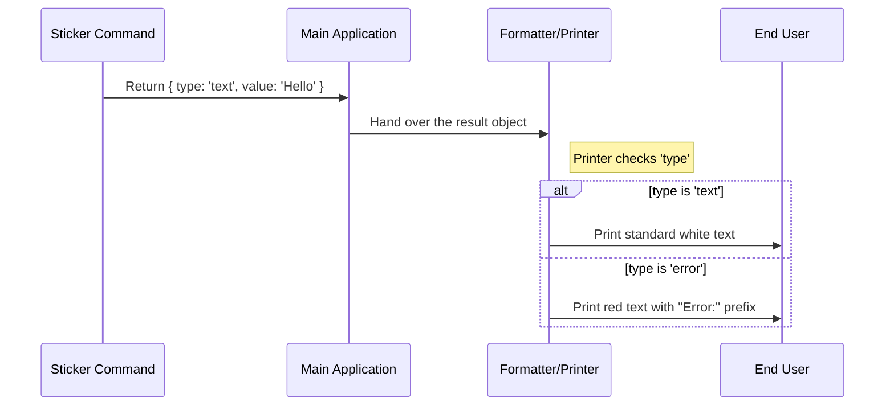

# Chapter 4: Standardized Command Output

Welcome to Chapter 4 of the **Stickers Project** tutorial!

In the previous chapter, [Command Execution Logic](03_command_execution_logic.md), we wrote the code to open the web browser. At the end of that function, instead of simply printing text to the screen, we returned a specific object.

In this chapter, we will explore **Standardized Command Output**. We will understand why we wrap our results in a specific format and how this keeps our application clean and consistent.

## The Motivation: The Shipping Manifest

Imagine you run a massive logistics company. You have trucks delivering thousands of packages every day.
*   Some packages contain **Glass** (Fragile).
*   Some packages contain **Ice Cream** (Needs refrigeration).
*   Some packages contain **Books** (Standard).

If the drivers had to open every box to figure out how to handle it, deliveries would be slow and items would break.

**The Solution:** You attach a **Standardized Manifest (Label)** to every box. The driver doesn't look inside; they just read the label:
*   **Type:** Perishable
*   **Value:** Strawberry Ice Cream

### The Application Analogy
In our CLI, the "Main System" is the driver. Your command (`stickers`) creates the package.
*   **Without Standardization:** Your command randomly prints text using `console.log`. The Main System has no idea if it succeeded, failed, or requires special formatting.
*   **With Standardization:** Your command returns a `LocalCommandResult`. The Main System reads the `type` and handles the formatting automatically.

## The Use Case: Returning the Result

Let's look at the problem we are solving. We want to tell the user that the browser is opening.

If we just used `console.log`, we would have to decide the text color and spacing inside our command. If we wanted to change the text color of *all* commands in the future, we would have to edit 100 different files.

By using an object, we delegate the "Styling" to the Main System.

### The Blueprint: `LocalCommandResult`

This is the shape (Type) of the object we must return. It acts as our contract.

```typescript
// types/command.ts (Simplified)

export type LocalCommandResult = {
  type: 'text' | 'error'; // The Category
  value: string;          // The Content
}
```

**Key Concepts:**
1.  **`type`**: This is the "Category." Is this a normal message? Is it an error? Is it a JSON data object?
2.  **`value`**: This is the actual data or message you want to convey.

## Solving the Use Case

Now, let's look at how we applied this in our `stickers.ts` file from the previous chapter.

### The Success Scenario

When the browser opens successfully, we wrap our message in a "text" label.

```typescript
// stickers.ts
// ...
if (success) {
  return { 
    type: 'text', 
    value: 'Opening sticker page in browser…' 
  }
}
```

**Explanation:**
*   We are packing the string "Opening sticker page..." into the box.
*   We label it `'text'`.
*   We hand this box back to the system.

### The Failure Scenario

If the browser fails to open, we might want to return an error (or text with a different message).

```typescript
// stickers.ts
// ...
return {
  type: 'text',
  value: `Failed to open browser. Visit: ${url}`,
}
```

**Note:** In a more complex system, we might change `type` to `'error'`. If we did that, the Main System could automatically print the text in **Red** or add a generic "X" icon, without us writing that logic here.

## Under the Hood: The Display System

How does the system process this object? It separates the **Data** (what you returned) from the **Presentation** (what the user sees).

Here is the flow of information:



### Internal Implementation Details

Let's look at a simplified version of the code that runs *after* your command finishes. This code lives in the core of the CLI framework.

It acts like a switchboard operator, routing different result types to different display functions.

```typescript
// internal/display-manager.ts (Simplified)

function displayResult(result: LocalCommandResult) {
  switch (result.type) {
    case 'text':
      // Standard formatting
      console.log(result.value); 
      break;

    case 'error':
      // Error formatting (Red text)
      console.error(`\x1b[31mError: ${result.value}\x1b[0m`);
      break;
  }
}
```

**Why is this powerful?**
1.  **Consistency:** Every 'error' looks exactly the same across the entire app.
2.  **Simplicity:** As a command writer, you don't need to know *how* to make text red. You just say `type: 'error'`.
3.  **Flexibility:** If we want to change all errors to have a ⚠️ emoji, we change it in *one* place (`display-manager.ts`), not in your sticker command.

## Conclusion

In this chapter, we learned about **Standardized Command Output**.

*   We moved away from raw `console.log` calls.
*   We adopted the **Shipping Manifest** approach using `LocalCommandResult`.
*   We learned that by returning `{ type, value }`, we allow the main system to handle formatting and error states consistently.

We have now covered how to register a command, how to load it, how to execute logic, and how to return data. There is one final piece to the puzzle: utilizing the helper tools provided by the system.

In our code, we used a function called `openBrowser`. Where did that come from? Let's explore the toolbox in the final chapter.

[Next Chapter: System Integration Utilities](05_system_integration_utilities.md)

---

Generated by [Code IQ](https://github.com/adityasoni99/Code-IQ)