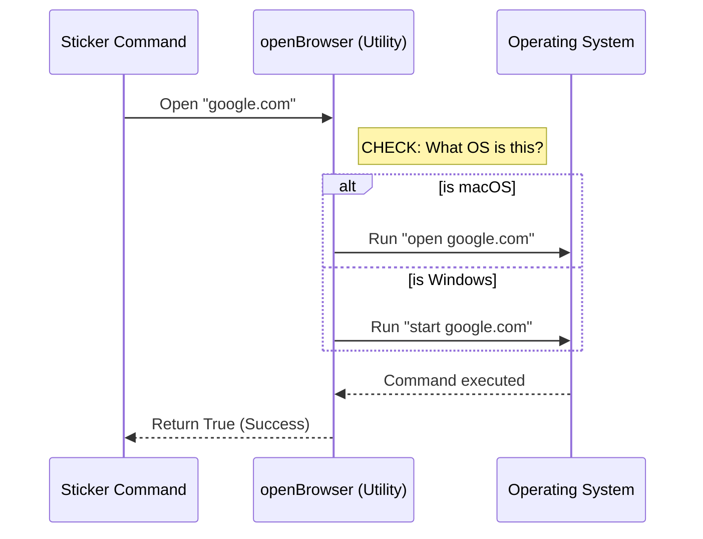

# Chapter 5: System Integration Utilities

Welcome to the final chapter of the **Stickers Project** tutorial!

In the previous chapter, [Standardized Command Output](04_standardized_command_output.md), we learned how to format our results so the user sees a clean message. Before that, in [Command Execution Logic](03_command_execution_logic.md), we wrote the code to order stickers.

In that code, we used a specific function: `openBrowser`. We treated it like magic. In this chapter, we are going to look behind the curtain to understand **System Integration Utilities**.

## The Motivation: The Universal Remote

Imagine you want to turn on a TV.
*   **TV A (Sony):** You have to press a button on the side.
*   **TV B (Samsung):** You have to use a touch panel.
*   **TV C (LG):** You have to pull a cord.

If you had to remember exactly how to turn on every single TV model in the world, you would go crazy. You just want to watch a movie!

### The Solution: Abstraction
This is where the **Universal Remote Control** comes in. You press **one button** ("Power"), and the remote handles the complicated signal for the specific TV you are pointing at.

**In programming terms:**
*   **The TV:** The Operating System (Windows, macOS, or Linux).
*   **The Remote:** The `openBrowser` utility function.
*   **The User:** You (the developer writing the command).

We create a utility so that our command doesn't need to know if the user is on a MacBook or a Windows PC.

## The Use Case: Opening a Website

Let's look at the problem we solved in our `stickers` command. We wanted to open a URL.

*   **On macOS**, the terminal command is: `open https://...`
*   **On Windows**, the terminal command is: `start https://...`
*   **On Linux**, the terminal command is: `xdg-open https://...`

If we wrote this logic inside our stickers file, it would look messy and confusing. Instead, we move that mess into a "Utility" file.

## Using the Utility

Here is how we used this tool in our code. It is designed to be as simple as pressing a button.

### Step 1: Pick up the Remote (Import)

First, we bring the tool into our file.

```typescript
// stickers.ts
import { openBrowser } from '../../utils/browser.js'
```

### Step 2: Press the Button (Call)

We simply tell the utility *what* we want to open. We don't tell it *how* to open it.

```typescript
// stickers.ts inside call() function
const url = 'https://www.stickermule.com/claudecode'

// The utility handles the rest!
const success = await openBrowser(url)
```

**What happens here?**
*   **Input:** The URL string.
*   **Output:** `true` (it worked) or `false` (it failed).
*   **Simplicity:** Our sticker command stays clean. It focuses on *stickers*, not on *operating systems*.

## Under the Hood: How it Works

Now, let's open up the "Remote Control" and see the wiring inside. How does `openBrowser` know what to do?

### The Flow

The utility acts as a translator between your code and the computer's kernel.



### Internal Implementation Details

The code inside `utils/browser.js` uses Node.js built-in tools to talk to the system.

**1. Detecting the OS**
Node.js gives us a variable called `process.platform`. This tells us where we are running.

```typescript
// utils/browser.js (Simplified)
const platform = process.platform // 'darwin', 'win32', or 'linux'

// We decide which command to use based on the platform
const command = platform === 'darwin' ? 'open' 
  : platform === 'win32' ? 'start' 
  : 'xdg-open'
```

**2. Running the Command**
To actually run this command, we use a Node.js feature called `spawn`. This is like creating a tiny, invisible terminal window just to run one line of code.

```typescript
// utils/browser.js (Simplified)
import { spawn } from 'node:child_process'

export async function openBrowser(url: string): Promise<boolean> {
  // Create a child process to run the command
  const child = spawn(command, [url])
  
  // Wait to see if it starts successfully
  return child.pid !== undefined
}
```

**Explanation:**
1.  **`spawn`**: This function says "Hey Operating System, please run this command (`open`) with this argument (`url`)."
2.  **`child`**: This represents the running browser process.
3.  **Return**: If the process has a `pid` (Process ID), it means it started successfully. We return `true`.

## Why is this "Beginner Friendly"?

You might think, *"Why not just write the `spawn` code inside the sticker command?"*

1.  **Reusability:** If you write a `login` command later, you will also need to open a browser. You can just import `openBrowser` again! You don't have to rewrite the `spawn` logic.
2.  **Maintenance:** If Windows changes its command from `start` to `launch` in 5 years, you only have to fix it in **one file** (`utils/browser.js`), and every command in your app is automatically fixed.
3.  **Readability:** The code `await openBrowser(url)` is easy to read. The code `spawn('open', [url], { stdio: 'ignore' })` is hard to read.

## Tutorial Conclusion

Congratulations! You have completed the **Stickers Project** tutorial. You have built a complete, production-ready command structure.

Let's recap what you have built:

1.  **[Command Metadata & Registration](01_command_metadata___registration.md):** You created the "Menu Item" so the CLI knows your command exists.
2.  **[Lazy Module Loading](02_lazy_module_loading.md):** You set up a system to only load code when the user asks for it, keeping the app fast.
3.  **[Command Execution Logic](03_command_execution_logic.md):** You wrote the actual "Kitchen" code to process the request.
4.  **[Standardized Command Output](04_standardized_command_output.md):** You formatted your results into "Shipping Manifests" for consistent display.
5.  **System Integration Utilities (This Chapter):** You used helper tools to handle complex OS tasks easily.

You now possess the blueprints to build not just a sticker command, but *any* command for a CLI application. Happy coding!

---

Generated by [Code IQ](https://github.com/adityasoni99/Code-IQ)