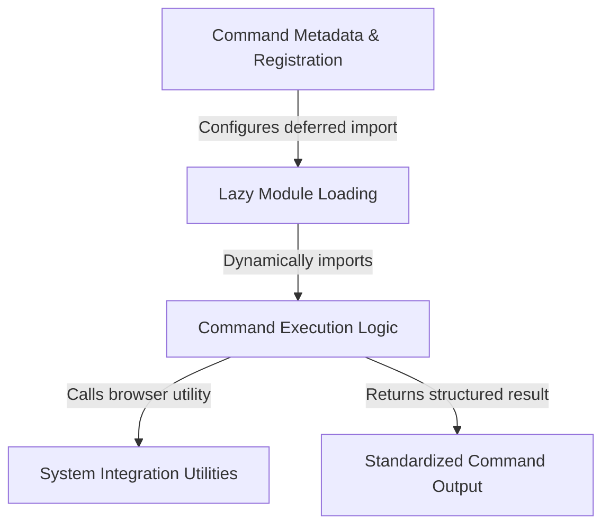

# Tutorial: stickers

This project implements a **CLI command** designed to help users order *Claude Code stickers*. It uses a modular structure where the command's **metadata** (name, description) is defined separately from its logic, allowing the system to **lazily load** the functionality to open the web browser only when the user actually runs the command.

## Chapters

1. [Command Metadata & Registration](01_command_metadata___registration.md)
2. [Lazy Module Loading](02_lazy_module_loading.md)
3. [Command Execution Logic](03_command_execution_logic.md)
4. [Standardized Command Output](04_standardized_command_output.md)
5. [System Integration Utilities](05_system_integration_utilities.md)

---

Generated by [Code IQ](https://github.com/adityasoni99/Code-IQ)