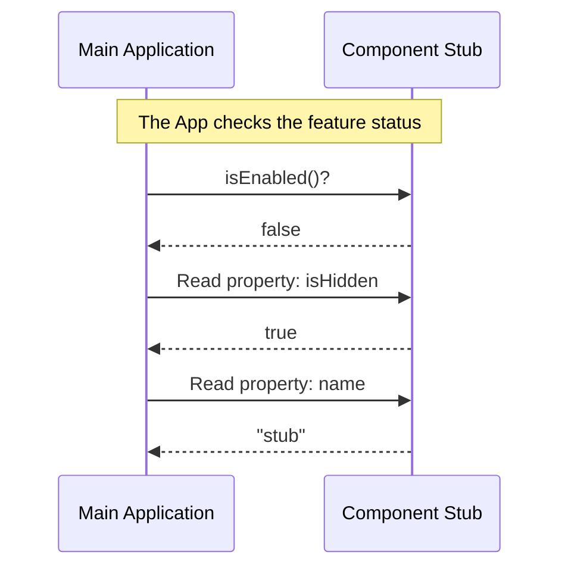

# Chapter 1: Component Stub Interface

Welcome to the first chapter of the **summary** project! We are going to start with the fundamental building block of our system.

## Why do we need a "Stub"?

Imagine you are filming a movie. You have a scene that requires a famous actor, but they haven't arrived at the set yet. You need to set up the lighting and camera angles right now. What do you do?

You use a **Stand-in** (or a prop). This stand-in holds the place where the actor will be. They don't speak lines or act, but they ensure the production doesn't stop just because the real star is missing.

In programming, we call this a **Component Stub Interface**.

### The Use Case
You are building a large application with a new "Premium Chat" feature. The logic for the chat isn't written yet, but the main menu needs to link to it, and the security system needs to check if it's enabled.

If you leave that spot empty, your app might crash with a "Reference Error." The **Component Stub** solves this by sitting in that spot, safely saying, "I am here, but I am not doing anything yet."

## Key Concepts

To make a good stand-in, our stub needs three simple things. Think of these as the ID badge the stand-in wears:

1.  **Name**: What do we call this feature? (e.g., "stub" or "premium-chat").
2.  **State (Enabled)**: Is this feature turned on and working? (Usually `false` for a stub).
3.  **Visibility**: Should users see this, or is it hidden in the background?

## How to Use It

Let's look at how we use this abstraction in our main application code. We want to check if our feature is ready to be used.

### Checking the Stub
Here is how the main system interacts with the stub. It treats it exactly like a real feature.

```javascript
import stub from './index.js';

// We ask the component: "Are you ready to work?"
const ready = stub.isEnabled();

console.log(`Is the feature ready? ${ready}`);
```

**Explanation:**
1.  We import the `stub`.
2.  We call `isEnabled()`.
3.  Since this is a stub (a placeholder), it returns `false`.
4.  The output will be: `Is the feature ready? false`.

### Checking Metadata
We can also ask the stub for its name or visibility settings without running any complex logic.

```javascript
// Check other properties
if (stub.isHidden) {
    console.log(`The component named '${stub.name}' is hidden.`);
}
```

**Explanation:**
1.  We check the `isHidden` property.
2.  For a stub, this is usually `true` (we don't want users seeing a broken feature).
3.  We log the `name` property to identify which component this is.

## Internal Implementation

Now, let's look "under the hood." How does the Stub work internally?

It is designed to be incredibly lightweight. It performs **no calculations**. It simply holds static answers.

### The Flow
When the system talks to the stub, the conversation is very short:

1.  **System:** "What is your name?" -> **Stub:** "stub".
2.  **System:** "Are you enabled?" -> **Stub:** "No" (False).
3.  **System:** "Are you hidden?" -> **Stub:** "Yes" (True).

### Visualizing the Interaction



### The Code
Here is the actual implementation of the Component Stub Interface. It is intentionally minimal.

**File:** `index.js`

```javascript
export default { 
  isEnabled: () => false, 
  isHidden: true, 
  name: 'stub' 
};
```

**Explanation:**
1.  **`export default`**: This object is the main thing this file provides.
2.  **`isEnabled: () => false`**: This is a function. When called, it immediately returns `false`. This represents that the logic is not active.
3.  **`isHidden: true`**: A simple data flag. It tells the UI to keep this invisible.
4.  **`name: 'stub'`**: A string tag so we can identify this object during debugging.

## Conclusion

You have successfully created a **Component Stub Interface**!

You now have a safe placeholder that prevents your application from crashing when a feature is missing or incomplete. It acts as a polite "Do Not Disturb" sign for parts of your code that aren't ready yet.

In the next chapter, we will learn how to take these static states (`isEnabled`, `isHidden`) and make them dynamic, so we can turn features on and off remotely.

[Next Chapter: Feature Visibility Control](02_feature_visibility_control.md)

---

Generated by [Code IQ](https://github.com/adityasoni99/Code-IQ)