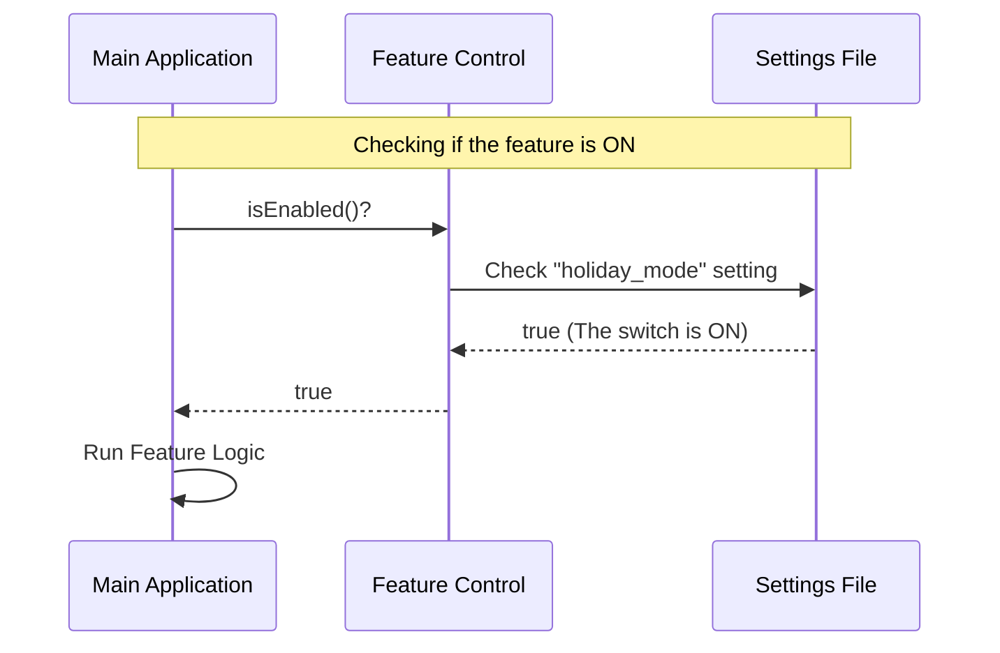

# Chapter 2: Feature Visibility Control

Welcome back!

In [Chapter 1: Component Stub Interface](01_component_stub_interface.md), we learned how to create a "Stand-in" (or Stub) for a feature that doesn't exist yet. It was a safe placeholder that always said "I'm not ready."

Now, we are going to learn how to manage a **real** feature that actually exists. We need a way to turn it on and off without deleting the code. We call this **Feature Visibility Control**.

## The Motivation: The "Fuse Box"

Imagine you are building a "Holiday Theme" for your application. You write the code in October, but you don't want users to see it until December.

You could delete the code and paste it back in December, but that is risky and messy.

Instead, we use a control mechanism. Think of this like the **Fuse Box** or **Circuit Breaker** in your house.
*   The light fixture (your code) is installed in the room.
*   However, if you flip the switch in the fuse box to **OFF**, the light won't turn on.

**Feature Visibility Control** allows your code to sit safely in the application, completely dark and inactive, until you flip the switch to **ON**.

## Key Concepts

To control our feature, we rely on two specific checks. These act as the switches in our fuse box.

1.  **`isEnabled` (The Functional Check)**:
    *   **Type**: A Function (`() => boolean`)
    *   **Question**: "Is the power on?"
    *   This logic determines if the code is *allowed* to run. It might check today's date, a user's subscription level, or a server setting.

2.  **`isHidden` (The Visual Check)**:
    *   **Type**: A Property (`boolean`)
    *   **Question**: "Should we hide the button?"
    *   This tells the visual part of your app (the UI) whether to show the menu item or keep it invisible.

## How to Use It

Let's look at how your main application uses this control panel. The code looks very similar to the Stub, but the outcome is different because now the logic is real.

### Scene: The Main Menu
Imagine your app has a menu. It needs to decide whether to show the "Holiday Theme" button.

```javascript
import feature from './holiday-theme.js';

// 1. Check if we should show the button
if (feature.isHidden) {
  console.log("Shh! This feature is invisible.");
} else {
  console.log("Displaying the Holiday Button!");
}
```

**Output:**
If `isHidden` is `false`, the output is: `Displaying the Holiday Button!`

### Scene: Running the Logic
Even if the button is visible, we perform a safety check before running the complex code.

```javascript
// 2. The user clicked the button. Can we run?
if (feature.isEnabled()) {
  console.log("Starting Holiday Music...");
  // Run the actual feature code here
} else {
  console.log("Error: Feature is currently disabled.");
}
```

**Output:**
If `isEnabled()` returns `true`, the code runs. If you flip the switch (change the return value), the code stops running immediately.

## Internal Implementation

Now, let's look inside the "Fuse Box" to see how this is implemented.

Unlike the Stub in [Chapter 1: Component Stub Interface](01_component_stub_interface.md), which always returned `false`, this implementation uses real logic (variables or configuration) to make a decision.

### The Flow

When the application checks the feature:
1.  **App:** "Can I run this?"
2.  **Feature:** It checks a configuration (the switch).
3.  **Feature:** It returns `true` or `false` based on that switch.

### Visualizing the Circuit



### The Code

Here is how we write a feature with a working control switch.

**File:** `holiday-theme.js`

```javascript
// This represents a setting on your server or config file
const globalSettings = { holidayMode: true };

export default {
  name: 'holiday-theme',
  // Static property: We want users to see this
  isHidden: false, 
  // Dynamic check: Returns the value of the setting
  isEnabled: () => globalSettings.holidayMode 
};
```

**Explanation:**
1.  **`globalSettings`**: This acts as our "master switch." In a real app, this might come from a database.
2.  **`isHidden: false`**: We explicitly set this to `false` because we *want* the button to appear.
3.  **`isEnabled`**: Notice this is a function! It doesn't just say `true`; it looks at `globalSettings.holidayMode`. If you change `holidayMode` to `false`, the feature stops working instantly without changing the code inside the export.

## Conclusion

Congratulations! You have implemented **Feature Visibility Control**.

You moved from a simple placeholder (the Stub) to a controlled environment where features can be toggled on and off like a light switch. This pattern allows you to ship code safely and activate it only when the time is right.

You now understand the two core pillars of this system:
1.  **Stub Interface**: To prevent crashes when things are missing.
2.  **Visibility Control**: To manage access when things are present.

You are now ready to build robust, toggle-friendly applications!

---

Generated by [Code IQ](https://github.com/adityasoni99/Code-IQ)