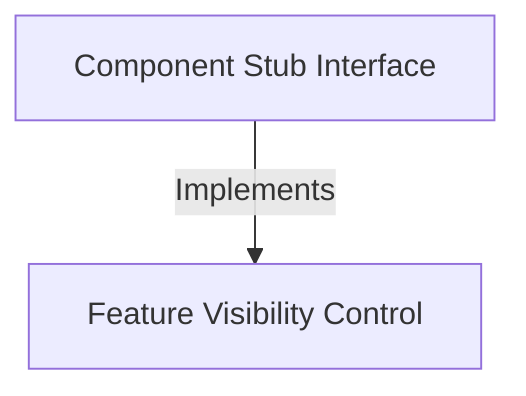

# Tutorial: summary

This project acts as a **placeholder** or "stub" for a software component that is not yet ready to be used. It establishes a structural contract that keeps the feature **inactive** and *hidden* by default, ensuring the surrounding system remains stable without running the disabled code.

## Chapters

1. [Component Stub Interface](01_component_stub_interface.md)
2. [Feature Visibility Control](02_feature_visibility_control.md)

---

Generated by [Code IQ](https://github.com/adityasoni99/Code-IQ)