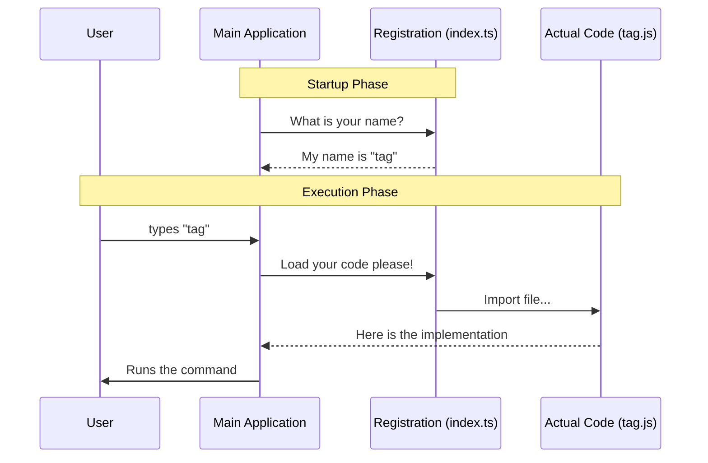

# Chapter 1: Command Registration

Welcome to the **tag** project! If you have ever wondered how a CLI (Command Line Interface) tool knows what commands are available without loading massive amounts of code instantly, you are in the right place.

In this first chapter, we will explore **Command Registration**.

## Why do we need this?

Imagine you are walking into a massive restaurant. The menu has hundreds of items.
1.  **The Menu:** Lists the name of the dish and a description.
2.  **The Kitchen:** This is where the actual cooking happens.

If the chef cooked *every single dish* on the menu the moment you walked in, the restaurant would be chaotic and slow. Instead, the kitchen waits until you actually order something.

**Command Registration** acts exactly like that **Menu**.

It tells the main application:
*   "My name is `tag`."
*   "This is what I do."
*   "Only cook me (load my code) if the user asks for me."

### The Use Case
We want to build a feature that lets a user add a "tag" to their current work session. We want this command to show up in the help menu, but we don't want to load the heavy user interface code until the user actually types `tag`.

## How to Register a Command

Let's look at the file `index.ts`. This file acts as the "Menu Entry" for our specific feature.

### Step 1: Defining Identity
First, we give our command a name and a description so the user knows what it is.

```typescript
import type { Command } from '../../commands.js'

const tag = {
  type: 'local-jsx', // Defines the rendering style
  name: 'tag',       // What the user types
  description: 'Toggle a searchable tag on the current session',
  // ... continued below
```

**Explanation:**
*   **name**: This is the keyword (e.g., `$ my-app tag`).
*   **description**: This shows up when the user runs `$ my-app --help`.
*   **type**: Hints at how the command will be rendered. We will cover the `local-jsx` type in [React-based Terminal UI](02_react_based_terminal_ui.md).

### Step 2: Defining Logic and Loading
Next, we define *when* this command is allowed and *where* the actual code lives.

```typescript
  // ... continued from above
  isEnabled: () => process.env.USER_TYPE === 'ant',
  argumentHint: '<tag-name>',
  load: () => import('./tag.js'),
} satisfies Command

export default tag
```

**Explanation:**
*   **isEnabled**: A security guard. If this function returns `false`, the command won't even appear in the menu. Here, only a user type of 'ant' can use it.
*   **load**: This is the magic "Lazy Loading." We use a dynamic `import()`. The file `./tag.js` contains the heavy code, and it is **only** imported if the user actually runs the command.

## Under the Hood

What happens when you run the CLI application? How does it use this registration file?

### The Flow
1.  **Startup:** The application starts. It does **not** load the actual feature code yet.
2.  **Scan:** It looks at `index.ts` to read the metadata (name, description).
3.  **Registry:** It adds 'tag' to its internal list of available commands.
4.  **Action:** When the user types `tag`, the application finally calls the `load()` function.

### Visualizing the Process

Here is a simple diagram showing how the Main Application talks to the Registration file before loading the actual code.



### Internal Implementation Details

While you don't need to write the "Core" code, it helps to understand how the Core uses your registration object.

The Core likely has a loop that looks something like this (simplified):

```typescript
// Inside the Main Application Core
const commands = [tagCommand, otherCommand]; // List of registrations

function findCommand(userInput: string) {
  // 1. Find the menu entry matching the name
  const cmd = commands.find(c => c.name === userInput);
  
  // 2. Check if the user is allowed to run it
  if (cmd && cmd.isEnabled()) {
    return cmd;
  }
  return null;
}
```

If the command is found and enabled, the Core executes the loader:

```typescript
async function runCommand(cmd) {
  // 3. LAZY LOAD: The 'tag.js' file is read only now!
  const module = await cmd.load();
  
  // 4. Run the feature
  module.renderUI(); 
}
```

The `.renderUI()` part will be explained in detail in [React-based Terminal UI](02_react_based_terminal_ui.md).

## Summary

In this chapter, we learned:
1.  **Command Registration** acts like a menu entry for your feature.
2.  It separates the **Metadata** (name, description) from the **Implementation** (heavy code).
3.  We use `load: () => import(...)` to ensure our CLI starts up fast and only loads code when necessary.
4.  We can hide commands using `isEnabled`.

In the next chapter, we will write the code that actually runs when this command is loaded!

[Next Chapter: React-based Terminal UI](02_react_based_terminal_ui.md)

---

Generated by [Code IQ](https://github.com/adityasoni99/Code-IQ)