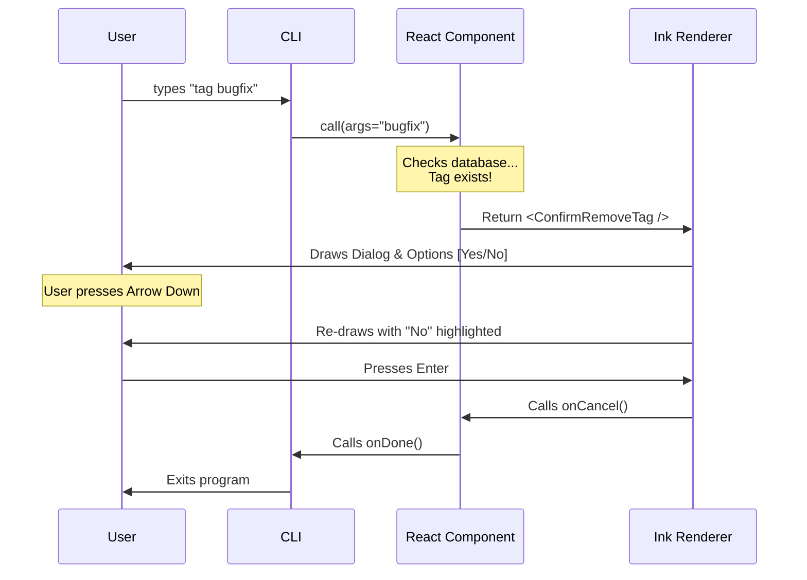

# Chapter 2: React-based Terminal UI

In the previous chapter, [Command Registration](01_command_registration.md), we set up the "menu entry" for our `tag` command. Now, it is time to cook the meal!

In this chapter, we will explore **React-based Terminal UI**.

## Why React in a Terminal?

Traditionally, Command Line Interfaces (CLIs) work like a typewriter:
1. You type a command.
2. The computer prints a wall of text.
3. The program ends.

But what if you need interactivity? What if you want to show a confirmation dialog, use arrow keys to select options, or update a progress bar without spamming the screen?

We use a library called **Ink**. It allows us to use **React**—the same technology used for modern websites—to build interactive interfaces inside the terminal.

### The Analogy
*   **Web React:** Renders HTML `<div>` and `<span>` tags to draw pixels in a browser.
*   **Terminal React (Ink):** Renders `<Box>` and `<Text>` components to draw characters in a command prompt.

## The Entry Point: `call()`

In our `tag.tsx` file, the main entry point is a function named `call`. When the user types `tag`, the CLI Core invokes this function.

Instead of just running a script, this function returns a **React Component**.

```typescript
// tag.tsx
export async function call(
  onDone: LocalJSXCommandOnDone, 
  _context: unknown, 
  args?: string
): Promise<React.ReactNode> {
  // 1. Clean up the user input
  const tagName = args?.trim() || '';

  // 2. Return a React Component to render
  return <ToggleTagAndClose tagName={tagName} onDone={onDone} />;
}
```

**Explanation:**
*   **args**: This is what the user typed (e.g., `bugfix` in `tag bugfix`).
*   **onDone**: A special function we pass down. Since this is a CLI, the program must eventually *stop*. We call this when we are finished.
*   **Return value**: We return JSX tags, just like a web app.

## Building the Logic Component

Let's look at `ToggleTagAndClose`. This component doesn't necessarily "draw" anything immediately; it decides what to do based on the application state.

It acts as a traffic controller.

```typescript
function ToggleTagAndClose({ tagName, onDone }) {
  // State to track if we need to show a confirmation dialog
  const [showConfirm, setShowConfirm] = React.useState(false);
  const [sessionId, setSessionId] = React.useState(null);

  // ... logic continues below
```

**Explanation:**
*   **useState**: We use standard React hooks.
*   **showConfirm**: If `true`, we will render a dialog asking "Are you sure?".

### The "Effect" (The Logic)

We use `useEffect` to check if the tag already exists.

```typescript
  React.useEffect(() => {
    const id = getSessionId();
    const currentTag = getCurrentSessionTag(id);

    if (currentTag === tagName) {
      // The tag already exists! Ask user to remove it.
      setShowConfirm(true); 
    } else {
      // Tag is new. Save it and exit immediately.
      saveTag(id, tagName);
      onDone(`Tagged session with #${tagName}`);
    }
  }, [tagName, onDone]);
```

*Note: The code above is simplified for clarity.*

**Explanation:**
*   If the tag is new, we save it (using helpers covered in [Session State Management](03_session_state_management.md)) and call `onDone` to close the app.
*   If the tag exists, we simply update our state (`setShowConfirm(true)`). This triggers a re-render.

## Rendering Interactive UI

If `showConfirm` becomes `true`, the component re-renders and returns a visual dialog. This is where the **Terminal UI** shines.

```typescript
  if (showConfirm) {
    return (
      <ConfirmRemoveTag 
        tagName={tagName} 
        onConfirm={() => { /* Remove tag logic */ }} 
        onCancel={() => { /* Cancel logic */ }} 
      />
    );
  }
  return null; // Render nothing if we are just processing logic
```

### The Visual Component: `ConfirmRemoveTag`

This component uses UI elements provided by our design system (`Dialog`, `Select`) which are built on top of `ink` primitives (`Box`, `Text`).

```typescript
function ConfirmRemoveTag({ tagName, onConfirm, onCancel }) {
  return (
    <Dialog title="Remove tag?" color="warning">
      <Box flexDirection="column">
        <Text>This will remove the tag.</Text>
        
        {/* Interactive Selection Menu */}
        <Select 
          onChange={(val) => val === 'yes' ? onConfirm() : onCancel()}
          options={[
            { label: 'Yes, remove tag', value: 'yes' },
            { label: 'No, keep tag', value: 'no' }
          ]} 
        />
      </Box>
    </Dialog>
  )
}
```

**Explanation:**
*   **`<Dialog>`**: Draws a border box around the content.
*   **`<Box>`**: Acts like a `<div>` (flexbox) to layout items vertically.
*   **`<Select>`**: This is a custom component that listens to **Arrow Up/Down** and **Enter** keys.

## Under the Hood

How does React run in a terminal? It doesn't have a DOM (Document Object Model).

1.  **React Reconciler**: React calculates what the UI should look like.
2.  **Ink Renderer**: Instead of creating HTML elements, Ink translates the components into **Strings**.
3.  **Output**: It sends these strings to `stdout` (Standard Output). It uses special hidden codes (ANSI escape codes) to move the cursor, change colors, and clear lines to simulate a "refresh."

### Visualizing the Flow

Here is what happens when a user tries to remove a tag:



## Internal Implementation Details

The CLI framework needs to know how to handle this specific type of command. In our previous chapter, we set `type: 'local-jsx'`.

The framework sees this type and sets up an Ink instance.

```typescript
// Framework Pseudo-code (Simplified)
import { render } from 'ink';

async function runLocalJSX(commandModule, args) {
  return new Promise((resolve) => {
    // 1. Define the 'onDone' function
    const onDone = (message) => {
      // Stop React and print final message
      app.unmount();
      console.log(message);
      resolve();
    };

    // 2. Call the module to get the React Node
    const ui = await commandModule.call(onDone, context, args);

    // 3. Start Ink Rendering
    const app = render(ui);
  });
}
```

**Explanation:**
*   The framework creates a Promise that only resolves when your component calls `onDone`.
*   It handles the `render()` function from `ink`, connecting React to your terminal window.

## Summary

In this chapter, we learned:
1.  **React-based Terminal UI** allows us to build interactive CLIs using components.
2.  The `call` function is our entry point, returning JSX.
3.  We manage logic using standard hooks like `useState` and `useEffect`.
4.  We use components like `<Box>` and `<Text>` instead of `<div>` and `<span>`.
5.  We must manually tell the CLI to stop by calling `onDone`.

Now that we know how to render the interface, we need to understand how we actually *save* and *retrieve* the tag data (like the `getSessionId` function we saw earlier).

[Next Chapter: Session State Management](03_session_state_management.md)

---

Generated by [Code IQ](https://github.com/adityasoni99/Code-IQ)