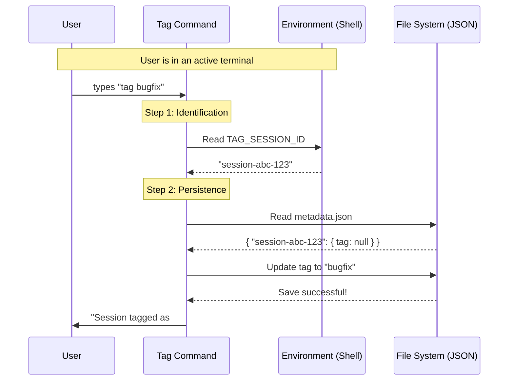

# Chapter 3: Session State Management

In the previous chapter, [React-based Terminal UI](02_react_based_terminal_ui.md), we built a beautiful, interactive interface that asks the user for confirmation. However, right now, our interface is like a shiny car with no engine. If we "save" a tag, nothing actually happens to the underlying data.

In this chapter, we will explore **Session State Management**.

## The Problem: "Who am I?"

Command Line tools are usually **stateless**. This means when you run a command like `ls` or `mkdir`, it does its job and instantly forgets everything.

But for our `tag` tool, we have a unique challenge.
1.  The user is working in a long-running shell session (typing many commands).
2.  Our tool records this history into a "transcript" log file.
3.  When the user runs `tag bugfix`, we need to attach that label to **specifically** the current session's log file.

We need a way to identify **which** session is currently active.

### The Solution: The Librarian
Think of **Session State Management** as a Librarian.
*   **Identify:** The librarian checks your library card (`getSessionId`) to see who you are.
*   **Retrieve:** They find your specific book on the shelf (`getTranscriptPath`).
*   **Update:** They stick a post-it note on the cover (`saveTag`).

## Using the State Manager

Let's look at how we use these tools inside our `tag.tsx` file. We import helper functions from our `bootstrap` and `utils` folders.

### 1. Getting the Session ID

First, we need to know the unique ID of the current window/session.

```typescript
import { getSessionId } from '../../bootstrap/state.js';

// Inside your component or logic
const id = getSessionId();

if (!id) {
  console.error("No active session found!");
  return; // Stop execution
}
```

**Explanation:**
*   **`getSessionId()`**: This function looks at the environment to find a unique code (UUID) that represents the current terminal window.
*   **Safety Check**: If we can't find an ID (maybe the tool was run outside of our specific shell wrapper), we stop. We can't tag a session that doesn't exist!

### 2. checking for Existing Tags

Before we save a new tag, we might want to see if one already exists (to warn the user).

```typescript
import { getCurrentSessionTag } from '../../utils/sessionStorage.js';

// Pass the ID we just got
const currentTag = getCurrentSessionTag(id);

if (currentTag === 'bugfix') {
  console.log("This session is already tagged as bugfix!");
}
```

**Explanation:**
*   **`getCurrentSessionTag(id)`**: This acts like a database query. It looks up the session by ID and returns the string attached to it, or `null` if there is no tag.

### 3. Saving the Tag

Finally, if the user confirms they want to add the tag, we save it.

```typescript
import { saveTag, getTranscriptPath } from '../../utils/sessionStorage.js';

// 1. Find where the log file lives on disk
const fullPath = getTranscriptPath();

// 2. Write the tag to our database
await saveTag(id, 'new-tag-name', fullPath);
```

**Explanation:**
*   **`getTranscriptPath()`**: Returns the file path (e.g., `/Users/me/.tag/logs/session-123.json`).
*   **`saveTag(...)`**: This is an **asynchronous** operation (note the `await`). It writes the tag to a persistent JSON file so that even if you restart your computer, the tag remains.

## Under the Hood

How does the application actually know "Current Session ID"?

### The Flow
1.  **Shell Wrapper:** When you open your terminal, a wrapper script generates a random ID (UUID) and stores it in an Environment Variable (e.g., `TAG_SESSION_ID`).
2.  **CLI Launch:** When you run `tag`, the CLI reads this variable.
3.  **Persistence:** The CLI reads/writes to a global `metadata.json` file that acts as a simple database.

### Visualizing the Data Flow



### Internal Implementation Details

While you mostly *use* the helpers, it is helpful to see a simplified version of how `getSessionId` is implemented internally.

```typescript
// internal/bootstrap/state.ts (Simplified)

let globalSessionId: string | null = null;

export function getSessionId() {
  // 1. If we already found it, return it (caching)
  if (globalSessionId) return globalSessionId;

  // 2. Look for the specific environment variable
  const envId = process.env.TAG_SESSION_ID;
  
  // 3. Store and return
  globalSessionId = envId || null;
  return globalSessionId;
}
```

And here is a simplified view of `saveTag`:

```typescript
// internal/utils/sessionStorage.ts (Simplified)
import fs from 'fs/promises';

export async function saveTag(id, tagName, path) {
  // 1. Load the existing database file
  const dbData = await fs.readFile(DB_PATH, 'utf-8');
  const db = JSON.parse(dbData);

  // 2. Update the record for this session
  db[id] = {
    ...db[id], // Keep existing data (like start time)
    tag: tagName,
    logPath: path
  };

  // 3. Save it back to disk
  await fs.writeFile(DB_PATH, JSON.stringify(db));
}
```

## Summary

In this chapter, we learned:
1.  **Statelessness:** CLI tools usually forget everything immediately.
2.  **Identification:** We use `getSessionId` to read environment variables and figure out which terminal window is active.
3.  **Persistence:** We use `saveTag` to write metadata to a file, linking the session ID to a user-defined label.

Now our application has a UI (Chapter 2) and a Brain (Chapter 3). But what if the user types something dangerous or messy, like `tag "Start <script>hack</script>"`? We need to clean the data before we save it.

[Next Chapter: Input Sanitization](04_input_sanitization.md)

---

Generated by [Code IQ](https://github.com/adityasoni99/Code-IQ)