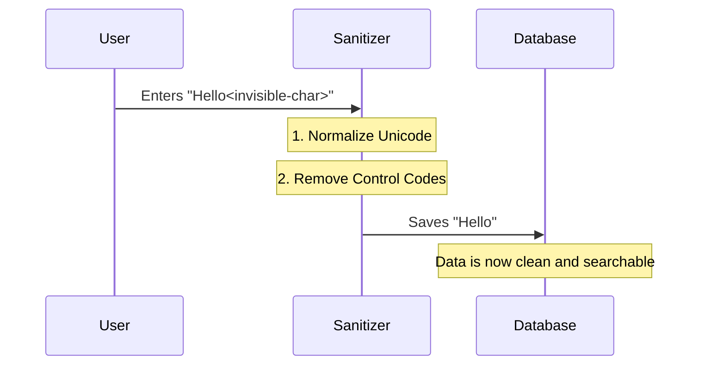

# Chapter 4: Input Sanitization

In the previous chapter, [Session State Management](03_session_state_management.md), we gave our CLI a memory. We learned how to save the "tag" to a JSON file so the computer remembers it later.

But here is the catch: **Computers are very literal.**

If a user copies and pastes a word from a website, they might accidentally paste invisible characters (like a "Zero Width Space"). To a human, `tag` and `tag` look the same. To a computer, one might be `tag` and the other `t\u200bag`. If we save the "dirty" version, our search feature will fail later because the keys don't match.

In this chapter, we explore **Input Sanitization**.

## The Water Filter Analogy

Imagine your application's database is a pristine water tank. The user input is water coming from a river. Usually, it's clean, but sometimes it contains invisible bacteria or dirt.

**Input Sanitization** is the filter system.
1.  **Input:** User types (or pastes) text.
2.  **Filter:** We strip out invisible formatting, weird control codes, and confusing symbols.
3.  **Output:** Clean, predictable text is stored in the tank.

## Using the Sanitizer

In our `tag.tsx` file, we don't just take `args` (the user input) and save it immediately. We pass it through a cleaning function first.

### Step 1: Importing the Tool
We use a utility function called `recursivelySanitizeUnicode`.

```typescript
// tag.tsx
import { recursivelySanitizeUnicode } from '../../utils/sanitization.js';
```

### Step 2: Cleaning the Input
Inside our component, before we do *anything* else (before checking if the tag exists, or asking for confirmation), we clean the input.

```typescript
function ToggleTagAndClose({ tagName, onDone }) {
  // 1. Sanitize: Remove invisible characters
  // 2. Trim: Remove spaces from start/end
  const normalizedTag = recursivelySanitizeUnicode(tagName).trim();

  // ... rest of the logic uses 'normalizedTag', NOT 'tagName'
```

**Explanation:**
*   **Input:** User enters `" bugfix "`.
*   **Sanitize:** Removes hidden Unicode junk.
*   **Trim:** Removes the spaces around the word.
*   **Result:** `"bugfix"`.

Now, whenever we save to the database or compare strings, we use `normalizedTag`.

## Under the Hood

What exactly does `recursivelySanitizeUnicode` do? It creates a safe, standard version of text.

### The Flow
1.  **Recieve:** The function takes a string (or an object containing strings).
2.  **Normalize:** It converts fancy letters (like `é` which can be written as `e` + `'`) into a single standard character.
3.  **Strip:** It uses a "Regex" (Regular Expression) to hunt down and remove characters that shouldn't be there, like "Control Codes" (invisible commands that tell a printer to beep or delete a line).

### Visualizing the Process



### Internal Implementation Details

Let's look at a simplified version of the internal code in `utils/sanitization.js`.

First, it handles **Normalization**. Unicode allows multiple ways to write the same character. We want the standard form ("NFC").

```typescript
// utils/sanitization.js (Simplified)

const sanitizeString = (str: string): string => {
  // 1. Convert to Standard Form (NFC)
  // This turns decomposed characters into single ones.
  return str.normalize('NFC')
    // 2. Remove "Control Characters" (Invisible codes 0-31)
    .replace(/[\u0000-\u001f]/g, ''); 
};
```

However, our data might not just be a string. It might be an object, like `{ id: 1, name: "tag" }`. That is why the function is **Recursive**. It digs into objects to find strings.

```typescript
export function recursivelySanitizeUnicode(value: unknown): any {
  // Case A: It's a string -> Clean it
  if (typeof value === 'string') {
    return sanitizeString(value);
  }

  // Case B: It's an array -> Clean every item
  if (Array.isArray(value)) {
    return value.map(recursivelySanitizeUnicode);
  }
  
  // Case C: It's an object -> Clean every value
  if (value && typeof value === 'object') {
     // ... logic to loop through object keys
  }
}
```

**Explanation:**
*   **Recursion:** If the input is complex (like a list of tags), the function calls itself for every item in the list until it finds the simple strings at the bottom.
*   **Result:** No matter what data structure you pass in, it comes out clean.

## Summary

In this chapter, we learned:
1.  **Trust, but Verify:** Never save user input directly to your database (or file system).
2.  **Invisible Enemies:** Users can accidentally paste invisible characters that break search functionality.
3.  **Sanitization:** We use `recursivelySanitizeUnicode` to strip out bad characters and normalize text.
4.  **Consistency:** By cleaning data *before* entering our logic, we ensure `tag === tag` is always true.

Now that our application is registered, has a UI, saves data, and cleans that data, we need to know if people are actually using it!

[Next Chapter: Event Telemetry](05_event_telemetry.md)

---

Generated by [Code IQ](https://github.com/adityasoni99/Code-IQ)