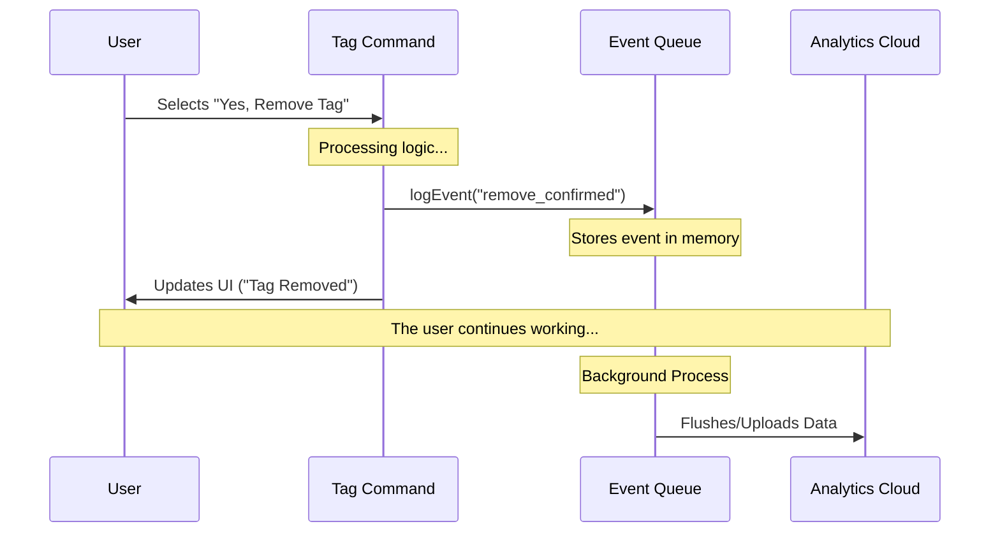

# Chapter 5: Event Telemetry

In the previous chapter, [Input Sanitization](04_input_sanitization.md), we ensured that the data entering our system was clean and safe. Our application is now fully functional: it registers commands, shows a UI, manages state, and handles data safely.

However, as a developer, you are now flying blind. You know the code *works*, but you don't know *how* people are using it.

In this final chapter, we will explore **Event Telemetry**.

## Why do we need this?

Imagine you own a coffee shop.
1.  **The Product:** You sell coffee (this is your code).
2.  **The Blind Spot:** If you stay in the kitchen all day, you don't know if customers are confused by the menu, if the line is moving slowly, or if everyone is ordering tea instead of coffee.

**Event Telemetry** is like having a manager in the lobby taking notes. It helps you answer questions like:
*   "How many people use the `tag` feature?"
*   "Do users usually add new tags or replace old ones?"
*   "Do users often click 'Cancel' when asked to remove a tag?"

By tracking these **Events**, we can make data-driven decisions to improve the tool.

## The Tool: `logEvent`

To record these interactions, we use a helper function called `logEvent`. It takes two arguments:

1.  **Event Name:** A unique string identifying the action (e.g., `command_started`).
2.  **Properties:** An object containing extra details (e.g., `{ duration: 500 }`).

### Step 1: Importing the Service

In our `tag.tsx` file, we import the logger from our analytics service.

```typescript
import { logEvent } from '../../services/analytics/index.js';
```

### Step 2: Tracking a Successful Action

When a user successfully adds a tag, we want to record it. We also want to know if they were overwriting an existing tag or creating a brand new one.

```typescript
// Inside the logic where we save the tag
const isReplacing = !!currentTag; // true if a tag already existed

// 1. Log the event name
// 2. Pass context: are they replacing an old tag?
logEvent('tengu_tag_command_add', {
  is_replacing: isReplacing
});

await saveTag(id, normalizedTag, fullPath);
```

**Explanation:**
*   **Event Name:** `tengu_tag_command_add`. This is the key we will look for in our dashboard later.
*   **Payload:** `{ is_replacing: true/false }`. This helps us understand if users are "switching" contexts often.

### Step 3: Tracking User Decisions

In [React-based Terminal UI](02_react_based_terminal_ui.md), we created a confirmation dialog. This is a critical moment in the User Experience (UX). We want to know what users choose.

**Scenario A: The User Confirms**

```typescript
// Inside the 'Yes, remove tag' callback
onConfirm: async () => {
  // Track that the user said YES
  logEvent('tengu_tag_command_remove_confirmed', {});

  await saveTag(sessionId, '', fullPath);
  onDone('Tag removed');
}
```

**Scenario B: The User Cancels**

```typescript
// Inside the 'No, keep tag' callback
onCancel: () => {
  // Track that the user said NO
  logEvent('tengu_tag_command_remove_cancelled', {});
  
  onDone('Action cancelled');
}
```

**Why track cancellation?**
If 90% of users click "Cancel", it might mean our UI is confusing or that we are triggering the confirmation dialog too aggressively!

## Under the Hood

You might be wondering: *"Does sending this data slow down my CLI?"*

Good telemetry systems are designed to be **Non-Blocking**. They work like a postbox: you drop the letter in, and you walk away immediately. You don't wait for the postman to actually drive the letter to the destination.

### The Flow
1.  **Trigger:** The code calls `logEvent`.
2.  **Queue:** The event is pushed into a local memory array (the "Outbox").
3.  **Return:** The function returns immediately so the UI stays snappy.
4.  **Flush:** In the background (or when the command finishes), the system sends the batch of events to the server.

### Visualizing the Process



### Internal Implementation Details

While the specific code for `services/analytics` isn't shown in our `tag.tsx` file, a typical implementation looks like this (simplified):

```typescript
// services/analytics/index.js (Simplified Concept)

const eventQueue = [];

export function logEvent(name, properties) {
  // 1. Add timestamp
  const event = {
    name,
    properties,
    timestamp: Date.now()
  };

  // 2. Push to local array (Fast!)
  eventQueue.push(event);
  
  // 3. We don't await the network request here!
}
```

Then, a separate "flush" function runs right before the CLI process exits to ensure the data is sent.

```typescript
// At the end of the application lifecycle
process.on('exit', () => {
    // Send whatever is in eventQueue to the server
    sendTelemetry(eventQueue);
});
```

## Summary

In this final chapter, we learned:
1.  **Visibility:** Telemetry allows developers to see how their features are used in the real world.
2.  **Granularity:** We track specific actions (Add, Confirm, Cancel) to understand user behavior.
3.  **Performance:** `logEvent` is designed to be fast and non-blocking, queuing data locally before sending it.

### Project Conclusion

Congratulations! You have completed the **tag** project tutorial. You have walked through the entire lifecycle of a modern CLI feature:

1.  **[Command Registration](01_command_registration.md):** How the app knows your command exists.
2.  **[React-based Terminal UI](02_react_based_terminal_ui.md):** How to render interactive components in a terminal.
3.  **[Session State Management](03_session_state_management.md):** How to persist data across CLI sessions.
4.  **[Input Sanitization](04_input_sanitization.md):** How to ensure data integrity and safety.
5.  **[Event Telemetry](05_event_telemetry.md):** How to track usage and improve the product.

You now possess the building blocks to create powerful, safe, and measurable command-line tools. Happy coding!

---

Generated by [Code IQ](https://github.com/adityasoni99/Code-IQ)