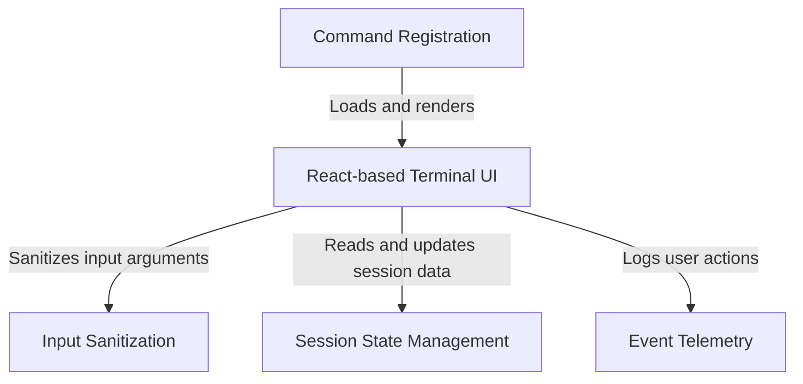

# Tutorial: tag

This project implements a CLI command called **tag** that allows users to label their current active session with a searchable keyword. It utilizes a *React-based* interface to handle user interactions—such as confirming the removal of an existing tag—and ensures data integrity by sanitizing inputs and persisting changes to the session storage.

## Chapters

1. [Command Registration](01_command_registration.md)
2. [React-based Terminal UI](02_react_based_terminal_ui.md)
3. [Session State Management](03_session_state_management.md)
4. [Input Sanitization](04_input_sanitization.md)
5. [Event Telemetry](05_event_telemetry.md)

---

Generated by [Code IQ](https://github.com/adityasoni99/Code-IQ)