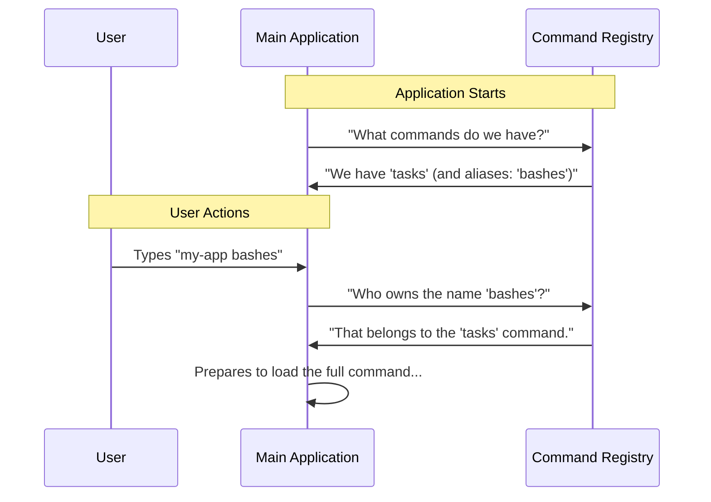

# Chapter 1: Command Definition & Registration

Welcome to the first chapter of our journey! Today, we are going to learn how to introduce a new feature to our system.

### The Motivation: The "Business Card"

Imagine you are walking into a large office building. Before you can attend a meeting or get any work done, you usually have to stop at the front desk. You give the receptionist your name, tell them why you are there, and maybe show them your ID. Once you are "registered," the building allows you to proceed.

In our project, creating a command works the same way. We want to create a **"tasks"** command. But before we can write the logic to actually *show* tasks, the main application needs to know:

1.  What is this command called?
2.  Does it have any nicknames (aliases)?
3.  What does it do (for the help menu)?

We call this **Command Definition & Registration**. It is the "business card" for your feature.

### central Use Case

We want a user to be able to open their terminal and type:

```bash
my-app tasks
```

Or, if they prefer a shortcut:

```bash
my-app bashes
```

For this to work, we need a file that tells the system: *"Hey, if you hear 'tasks' or 'bashes', I'm the one you are looking for!"*

---

### Step-by-Step Implementation

We define this identity in a file (usually `index.ts`) inside our command's folder. Let's break down the code into bite-sized pieces.

#### 1. The Setup

First, we need to import a specific type. This ensures our "business card" follows the standard format required by the system.

```typescript
// index.ts

// We import the 'Command' type definition.
// This acts like a template form we need to fill out.
import type { Command } from '../../commands.js'
```

#### 2. Defining the Identity

Now, we create the object that holds our metadata. This is the most important part!

```typescript
const tasks = {
  // 'local-jsx' means we will use React to build the UI later.
  // See Chapter 3 for details on this!
  type: 'local-jsx', 
  
  // This is the primary keyword the user types.
  name: 'tasks',
  
  // These are shortcuts. Typing 'bashes' works just like 'tasks'.
  aliases: ['bashes'],
  
  // A short text shown in the help menu (--help).
  description: 'List and manage background tasks',
```

*   **`name`**: The specific word that triggers this command.
*   **`aliases`**: Alternate words that trigger the same command.
*   **`description`**: Helpful text for users who don't know what the command does.

#### 3. Connecting the Logic

Finally, we need to tell the system *where* the actual code lives. Note that we aren't writing the logic here; we are just pointing to it.

```typescript
  // We don't load the heavy code yet! 
  // We just tell the system where to find it when needed.
  load: () => import('./tasks.js'),

} satisfies Command

export default tasks
```

The `load` function is a pointer. It essentially says: *"If the user actually runs this command, go fetch the file `./tasks.js`."* This is a crucial performance trick detailed in [Lazy Loading Architecture](02_lazy_loading_architecture.md).

---

### Understanding the Internals

How does the system use this file? Let's look at what happens under the hood when the application starts.

#### The Sequence of Events

When the main CLI (Command Line Interface) application wakes up, it doesn't load every single feature immediately. Instead, it just looks at these "business cards."



#### Simplified Internal Logic

Imagine the main system has a list (an array) where it stores these definitions. When you `export default tasks`, the system adds your object to this list.

Here is a simplified view of how the system "finds" your command:

```typescript
// Pseudo-code of the system's core logic

// 1. The registry collects all definition files
const registry = [tasks, otherCommand, anotherCommand];

function findCommand(userInput) {
  // 2. It looks through the registry
  return registry.find(cmd => {
    // 3. It checks if the input matches the name OR any alias
    return cmd.name === userInput || cmd.aliases.includes(userInput);
  });
}
```

**Explanation:**
1.  The `registry` holds the lightweight definition objects we just wrote.
2.  When the user types `bashes`, the `findCommand` function loops through the cards.
3.  It checks `cmd.aliases.includes('bashes')`. It returns `true`.
4.  The system now knows which command to launch!

---

### Why is this separation important?

You might wonder, "Why not just put all the code in this one file?"

By separating the **Definition** (metadata) from the **Implementation** (actual logic), our application starts much faster. The system can read the "business card" in milliseconds, but it doesn't have to carry the weight of the actual heavy machinery until the user specifically asks for it.

*   The **Definition** (this chapter) handles the `type: 'local-jsx'`. This hint prepares the system for the [React-based Command Handler](03_react_based_command_handler.md).
*   The **Definition** points to the file `./tasks.js`, but it doesn't open it yet. This concept is explored in [Lazy Loading Architecture](02_lazy_loading_architecture.md).

### Conclusion

In this chapter, we learned how to register a command. We created a lightweight identity file that tells the system:
1.  Our command is named `tasks`.
2.  It accepts the alias `bashes`.
3.  It has a specific description.

We have successfully introduced our feature to the system! However, right now, we only have a business card. We haven't actually delivered the code that *runs* when the command is triggered.

How do we load that code efficiently without slowing down the app?

[Next Chapter: Lazy Loading Architecture](02_lazy_loading_architecture.md)

---

Generated by [Code IQ](https://github.com/adityasoni99/Code-IQ)