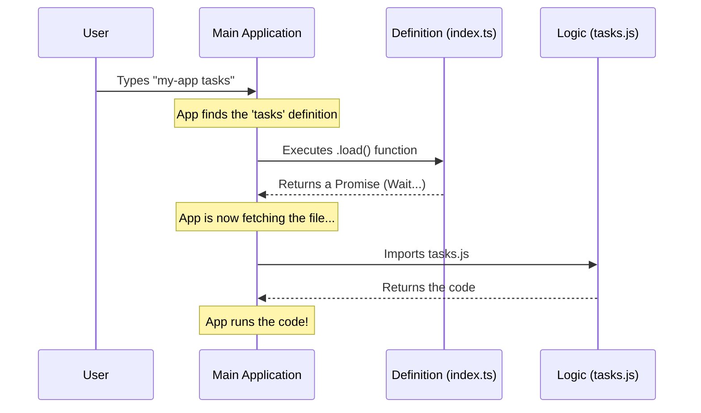

# Chapter 2: Lazy Loading Architecture

Welcome back! In [Chapter 1: Command Definition & Registration](01_command_definition___registration.md), we created the "business card" for our **tasks** command. We told the system its name, its alias (`bashes`), and its description.

However, we left one mysterious line of code unexplained at the end of that file. Today, we are going to explore the magic behind it.

### The Motivation: The Library Warehouse

Imagine a library that owns 10,000 books.
*   **The Cluttered Way:** Every morning, the librarian brings **all 10,000 books** out of storage and piles them on the front desk, just in case someone asks for one. This takes hours, and there is no room to work!
*   **The Smart Way:** The front desk is empty. When you ask for "Harry Potter," the librarian walks to the warehouse, fetches **only that one book**, and hands it to you.

In software, loading code takes memory and time. If our application has 50 different commands, we don't want to load the code for *all of them* every time you start the app. We only want to load the "tasks" logic when you actually type `my-app tasks`.

We call this **Lazy Loading Architecture**.

### Central Use Case

We want the application startup to be instant.

1.  **Scenario A:** User types `my-app --help`.
    *   **Result:** The app starts instantly. It reads the "business card" (metadata) but **does not** load the heavy "tasks" code.
2.  **Scenario B:** User types `my-app tasks`.
    *   **Result:** The app sees you want "tasks," and *only then* goes to fetch the heavy logic file.

---

### Implementing Lazy Loading

Let's look at that specific line in our `index.ts` file from the previous chapter.

#### 1. The Dynamic Import

In standard programming, you usually import files at the very top. But here, we put the import inside a function.

```typescript
// index.ts (The Definition File)

const tasks = {
  // ... name, aliases, description ...

  // This is the magic switch!
  load: () => import('./tasks.js'), 
}
```

*   **`() => ...`**: This is a function. It doesn't run immediately. It waits to be called.
*   **`import(...)`**: This is a "Dynamic Import." Unlike standard imports, this returns a **Promise**. It tells the system: *"I promise to go get this file, but only when you execute this function."*

#### 2. The Target File

Now, let's create the file we are trying to load: `tasks.js`. For now, we will keep it very simple just to prove it loaded.

```typescript
// tasks.js (The Implementation File)

// We export the actual logic here.
// In the next chapter, we will put React code here.
export default function TasksCommand() {
  console.log("I have been summoned from the warehouse!");
}
```

By separating `index.ts` (the definition) from `tasks.js` (the logic), we ensure `tasks.js` stays in the "warehouse" until needed.

---

### Understanding the Internals

How does the main application handle this? It involves a process of "waiting" for the code to arrive.

#### The Sequence of Events

Here is what happens when a user runs the command. Notice the "Fetch Code" step happens late in the process.



#### Code Walkthrough: Under the Hood

Let's look at a simplified version of the code the **Main Application** uses to run your command.

First, the app finds the definition we created in [Chapter 1](01_command_definition___registration.md).

```typescript
// internal-framework.ts

// 1. Find the command definition based on user input
const commandDef = registry.find(cmd => cmd.name === 'tasks');
```

Once it finds the definition, it sees the `load` function. It knows it needs to execute that function to get the real code.

```typescript
// 2. We check if a loader exists
if (commandDef.load) {
  
  // 3. We call the function and wait for the file to arrive
  // 'await' pauses here until the file is read from disk
  const module = await commandDef.load();

  // 4. Now 'module' holds the contents of tasks.js!
  console.log("File loaded successfully.");
}
```

Because we use `await`, the application pauses for a tiny fraction of a second to read the file. This is much better than reading *every* file at the start!

### Connecting to the UI

You might remember from the previous chapter that our command definition included this line:

```typescript
type: 'local-jsx',
```

Once the lazy loading finishes and we have the content of `tasks.js`, the system checks this `type`. It sees `local-jsx` and realizes, "Ah, the code I just loaded is a UI component!"

This is where the system hands off control to the [React-based Command Handler](03_react_based_command_handler.md) to actually draw something on the screen.

### Conclusion

In this chapter, we learned about **Lazy Loading Architecture**.

1.  We separated our command into two files: **Definition** (`index.ts`) and **Implementation** (`tasks.js`).
2.  We used a **Dynamic Import** (`() => import(...)`) to tell the system *where* the code is, without loading it immediately.
3.  We saw how the system `awaits` this import only when the user specifically asks for it.

Now that our system has successfully fetched the code from the warehouse, it's time to open the book and see what's inside. Since we marked this command as `local-jsx`, we are going to build our interface using React!

[Next Chapter: React-based Command Handler](03_react_based_command_handler.md)

---

Generated by [Code IQ](https://github.com/adityasoni99/Code-IQ)