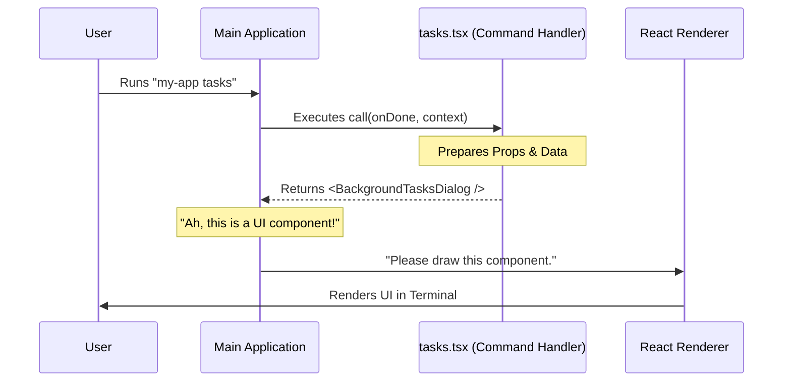

# Chapter 3: React-based Command Handler

Welcome back! In [Chapter 2: Lazy Loading Architecture](02_lazy_loading_architecture.md), we successfully fetched our code from the "warehouse" only when the user asked for it.

But now that we have the code, what does it actually *do*?

If we were writing a standard command-line tool, we might just print text to the screen. But we are building something richer. We want to show an interactive window. This chapter covers the **React-based Command Handler**, which acts as the bridge between the dark text terminal and a bright, interactive React environment.

### The Motivation: The TV Remote

Think of your command-line interface (CLI) like a TV remote.
*   **Standard Commands:** Pressing volume up/down just changes a number on the small display. It's simple text.
*   **The "Menu" Button:** When you press "Menu" or "Guide," the TV stops showing just numbers and overlays a full graphical interface with lists, settings, and colors.

The **React-based Command Handler** is that "Menu" button logic. It tells the system: *"Stop processing simple text lines. Switch to 'Graphics Mode' and render this interactive component."*

### Central Use Case

1.  **User Action:** Types `my-app tasks`.
2.  **System Action:** Instead of printing "List of tasks..." and exiting, the system clears a space in the terminal and renders a persistent, interactive dialog box where the user can click or use arrow keys.

---

### Step-by-Step Implementation

In the previous chapter, our `tasks.js` file was just a placeholder. Now, we will rename it to `tasks.tsx` (because we are using React JSX) and implement the handler.

This file is responsible for **one thing**: initializing the React environment.

#### 1. The Essential Imports

First, we need to import React and the types that describe what our application expects.

```typescript
// tasks.tsx

import * as React from 'react';

// We import the UI component we want to show (covered in Chapter 4)
import { BackgroundTasksDialog } from '../../components/tasks/BackgroundTasksDialog.js';

// We import types that help us understand the inputs
import type { LocalJSXCommandContext, LocalJSXCommandOnDone } from '../../types/command.js';
```

#### 2. The `call` Function

This is the heart of the handler. In our system, every command file *must* export a function named `call`. This is the specific signal the system looks for.

```typescript
// The system calls this function when the command triggers
export async function call(
  onDone: LocalJSXCommandOnDone,
  context: LocalJSXCommandContext,
): Promise<React.ReactNode> {
  
  // Logic goes here...
}
```

*   **`async`**: While not strictly necessary for returning UI, this allows us to fetch data (like a user profile) *before* the window opens if we wanted to.
*   **`Promise<React.ReactNode>`**: This function promises to return a React Component (a "Node") that the system can render.

#### 3. Handling the Arguments

The system passes us two very important tools when it calls our function:

1.  **`onDone`**: This is a function (a switch) that closes the app. We need to pass this to our UI so the "Exit" button actually works.
2.  **`context`**: This is a "bag of tools" containing information about the app (configuration, theme, etc.). We pass this down so our UI knows about the rest of the app.

#### 4. The Return (The Bridge)

Finally, we return the JSX. We are handing off control from the logic layer to the visual layer.

```typescript
  // Inside the call function...

  return (
    <BackgroundTasksDialog 
      toolUseContext={context} 
      onDone={onDone} 
    />
  );
}
```

We are effectively saying: *"I'm done setting things up. Please draw the `BackgroundTasksDialog` on the screen, and give it these tools to work with."*

---

### Understanding the Internals

How does a text terminal understand React? It doesn't! We need a translator.

#### The Sequence of Events

When you return `<BackgroundTasksDialog />`, you aren't drawing pixels directly. You are creating a set of instructions. The main application takes these instructions and feeds them into a specialized renderer (like `ink`, which renders React to text).



#### Code Walkthrough: Under the Hood

Let's look at a simplified version of the code *inside the main framework* that calls your handler.

```typescript
// internal-framework.ts

// 1. We load the module (as seen in Chapter 2)
const module = await commandDef.load();

// 2. We define the 'onDone' function.
// When called, this will kill the process.
const exitApp = () => process.exit(0);

// 3. We execute YOUR call function
const uiComponent = await module.call(exitApp, globalContext);

// 4. We start the specific React renderer for terminals
render(uiComponent);
```

**Explanation:**
1.  The framework creates the `exitApp` function. This is what becomes `onDone`.
2.  It executes your `call` function.
3.  It takes the result (`uiComponent`) and passes it to `render()`. This `render` function is special—it knows how to turn React components into colored text and cursor movements in the terminal.

### Why use a Handler?

You might ask, "Why not just write the React code directly in this file?"

We separate the **Handler** (`tasks.tsx`) from the **UI Component** (`BackgroundTasksDialog`) for cleanliness and scalability:

1.  **Preparation:** The Handler can do "dirty work" like checking if a user is logged in *before* showing the UI.
2.  **Delegation:** The Handler acts as a manager. It doesn't paint the walls; it hires the painter (`BackgroundTasksDialog`).

This brings us to the concept of **UI Component Delegation**. We have successfully initiated the React environment, but we haven't looked at *how* we build that dialog box yet.

### Conclusion

In this chapter, we built the bridge between the backend and the frontend.

1.  We created a `tasks.tsx` file.
2.  We implemented the `call` function.
3.  We accepted `onDone` (to close the app) and `context` (app data).
4.  We returned a React component.

Now the system is trying to render `<BackgroundTasksDialog />`, but we haven't explained what that component is! How do we structure the actual visual interface?

[Next Chapter: UI Component Delegation](04_ui_component_delegation.md)

---

Generated by [Code IQ](https://github.com/adityasoni99/Code-IQ)