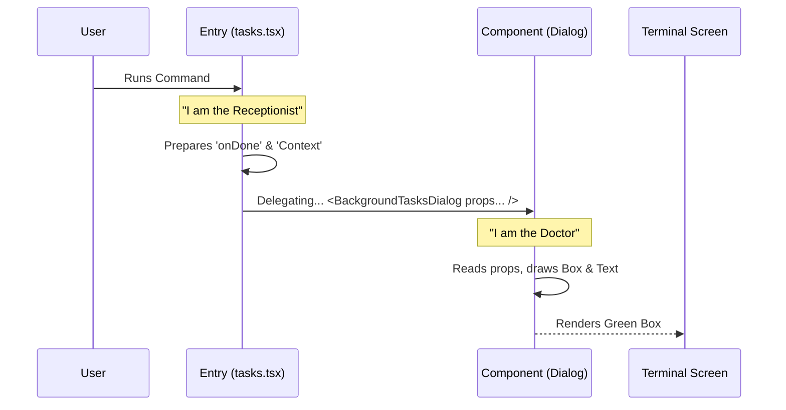

# Chapter 4: UI Component Delegation

Welcome back! In [Chapter 3: React-based Command Handler](03_react_based_command_handler.md), we set up the `call` function—the entry point for our command. However, we left off with a bit of a cliffhanger. Our handler returned a component called `<BackgroundTasksDialog />`, but we hadn't actually created it yet.

In this chapter, we will build that component. We call this concept **UI Component Delegation**.

### The Motivation: The Receptionist and the Doctor

Imagine visiting a doctor's office.
1.  **The Receptionist (`tasks.tsx`):** You walk in. The receptionist greets you, checks your ID, and makes sure you have an appointment. They don't perform surgery; they just handle the *process* of getting you in.
2.  **The Doctor (`BackgroundTasksDialog.tsx`):** The receptionist guides you to a room where the doctor handles the actual procedure. The doctor focuses entirely on your health, not on checking your ID or validating your parking.

In our code, we keep the **Entry Point** (Receptionist) separate from the **Visual Interface** (Doctor). This keeps our code clean, organized, and easier to fix if something breaks.

### Central Use Case

We want to display a "dashboard" box in the terminal that lists tasks.
*   **Input:** The system calls our command.
*   **Action:** The command hands off responsibility to the Dialog component.
*   **Output:** The user sees a green bordered box saying "Task Manager" instead of raw code or text.

---

### Step-by-Step Implementation

Let's create the "Doctor"—our dedicated UI component. We place this file in a `components` folder to keep it separate from the command logic.

#### 1. Setting up the Props

First, our component needs to know what tools it has to work with. Just like a doctor needs medical records, our component needs **Props** (properties).

We create a new file: `src/components/tasks/BackgroundTasksDialog.tsx`.

```typescript
// src/components/tasks/BackgroundTasksDialog.tsx

import * as React from 'react';
// We import types for the data we expect to receive
import type { LocalJSXCommandContext, LocalJSXCommandOnDone } from '../../types/command.js';

type Props = {
  // The 'switch' to close the application
  onDone: LocalJSXCommandOnDone;
  // The 'bag of tools' containing app data
  toolUseContext: LocalJSXCommandContext;
};
```

**Explanation:**
*   **`onDone`**: This allows the UI to tell the app "I'm finished, you can close now" (like an Exit button).
*   **`toolUseContext`**: This contains global information, like the user's current settings or theme.

#### 2. The Component Structure

Now, we define the actual component function. This is the "Doctor" ready to see the patient.

```typescript
// We export this function so the Receptionist (tasks.tsx) can find it
export function BackgroundTasksDialog({ onDone, toolUseContext }: Props) {
  
  // Logic (Hooks, state, etc.) will go here later...

  return (
    // This is the visual part
    <InternalRenderLogic /> 
  );
}
```

**Explanation:**
*   **`export function ...`**: This makes the component public so other files can use it.
*   **`{ onDone, toolUseContext }`**: We "destructure" the props to make them easy to use inside the function.

#### 3. Defining the Visuals (JSX)

Finally, let's draw something! Since we are in a terminal, we use a library called `ink` (which is like HTML for the command line).

```typescript
import { Box, Text } from 'ink';

// ... inside the BackgroundTasksDialog function ...

return (
  // <Box> is like a <div>. We give it a border.
  <Box borderStyle="round" borderColor="green" padding={1}>
    
    {/* <Text> is like a <span> or <p> */}
    <Text bold>Task Manager initialized!</Text>

  </Box>
);
```

**Explanation:**
*   **`Box`**: Creates a layout container. We added a round green border so it looks like a distinct window.
*   **`Text`**: Renders the actual words on the screen.

---

### Understanding the Internals

How does the data flow from the entry point to this new component? It uses a pattern called "Prop Drilling" or simply "Passing Props."

#### The Sequence of Events



#### Code Walkthrough: The Handoff

Let's look at how the connection is made. This is the "Delegation" in action.

**1. The Handover (In `tasks.tsx`)**
This code (from the previous chapter) is where the delegation happens.

```typescript
// tasks.tsx (The Receptionist)

// calling the component is like calling a function
return (
  <BackgroundTasksDialog 
    toolUseContext={context} // Passing the tools
    onDone={onDone}          // Passing the exit switch
  />
);
```

**2. The Reception (In `BackgroundTasksDialog.tsx`)**
The component receives the data instantly.

```typescript
// BackgroundTasksDialog.tsx (The Doctor)

export function BackgroundTasksDialog(props: Props) {
  // props.onDone is now available here!
  // props.toolUseContext is now available here!
  
  // We can use them to draw the UI
  return <Box>...</Box>;
}
```

### Why Delegate?

You might wonder, "Why not just put that `<Box>` code inside `tasks.tsx`?"

1.  **Focus:** `tasks.tsx` focuses on *launching*. `BackgroundTasksDialog.tsx` focuses on *drawing*.
2.  **Complexity:** As our app grows, the UI file will become hundreds of lines long (handling key presses, lists, colors). We don't want that cluttering our simple entry file.
3.  **Reusability:** If we later want to show this "Task Dialog" inside a different part of our app, we can just import it again because it is a standalone component!

### Conclusion

In this chapter, we learned about **UI Component Delegation**.

1.  We created a dedicated "Doctor" component (`BackgroundTasksDialog`) to handle the visuals.
2.  We defined an interface (`Props`) to ensure the component receives the tools it needs.
3.  We used `ink` components (`Box`, `Text`) to draw a simple interface.
4.  We connected the "Receptionist" (`tasks.tsx`) to the "Doctor" by passing props.

We now have a working box on the screen! But... it doesn't *do* anything yet. It has the `toolUseContext`, but it isn't using it. How do we access the data inside that context to actually list our tasks?

[Next Chapter: Context & Lifecycle Injection](05_context___lifecycle_injection.md)

---

Generated by [Code IQ](https://github.com/adityasoni99/Code-IQ)