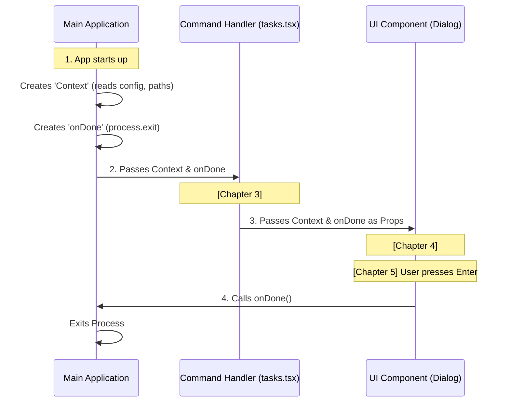

# Chapter 5: Context & Lifecycle Injection

Welcome to the final chapter of this series! 

In the previous chapter, [UI Component Delegation](04_ui_component_delegation.md), we built a nice looking "Green Box" in our terminal. However, right now, it is just a pretty picture. It doesn't know anything about our application, and worse, if you run it, you might notice you can't actually *exit* it without pressing `Ctrl+C`.

Today, we are going to breathe life into our component using **Context & Lifecycle Injection**.

### The Motivation: The Contractor and the Manager

Imagine you hire a contractor to renovate your kitchen.
1.  **Context (The Blueprint):** You can't just say "build." You need to give them the blueprints, the address, and the budget. In our code, this is the `context`—data the command needs to know to do its job (like "Who is the user?" or "Where are we running?").
2.  **Lifecycle (The Radio):** You leave the house while they work. You give them a radio and say, "Call me when you are done so I can lock up." In our code, this is `onDone`—a specific signal the command sends to say "I am finished, take control back."

Without **Context**, the command is blind. Without **Lifecycle** (the radio), the command is stuck running forever.

### Central Use Case

We want to upgrade our "Task Manager" box from Chapter 4 to do two things:
1.  **Context:** Display the folder where the command is running (the "Current Working Directory").
2.  **Lifecycle:** Close the application cleanly when the user presses the `Enter` key.

---

### Step-by-Step Implementation

We are going back to our `BackgroundTasksDialog.tsx` file. We previously accepted `onDone` and `toolUseContext` as props, but we didn't use them. Let's wire them up.

#### 1. Listening for Input (The Lifecycle)

To use the "Radio" (`onDone`), we need a trigger. In a graphical interface, this would be a "Close" button. In a terminal, it's usually a keyboard press.

We use a hook called `useInput` from the `ink` library.

```typescript
// src/components/tasks/BackgroundTasksDialog.tsx
import { useInput } from 'ink';

// Inside the component...
useInput((input, key) => {
  // If the user presses 'Enter' (return)
  if (key.return) {
    // Call the "Radio" to signal we are finished!
    onDone(); 
  }
});
```

**Explanation:**
*   **`useInput`**: This sets up a listener for keyboard events.
*   **`key.return`**: Checks if the specific key pressed was "Enter."
*   **`onDone()`**: This executes the function passed down from the main app. It tells the system "Exit now."

#### 2. Reading the Data (The Context)

Now let's look at the Blueprint (`toolUseContext`). This object holds helpful global data. For this tutorial, we will display the `cwd` (Current Working Directory).

```typescript
// Inside the component...

// We extract the 'cwd' (current folder path) from the context
const currentFolder = toolUseContext.cwd;
```

**Explanation:**
*   **`toolUseContext`**: We received this as a prop in the previous chapter.
*   **`.cwd`**: This is a piece of data automatically provided by the framework. It tells us where the user triggered the command.

#### 3. Putting it together

Let's update our render function to show this information.

```typescript
return (
  <Box borderStyle="round" borderColor="green" flexDirection="column">
    <Text bold>Task Manager</Text>
    
    {/* Displaying context data */}
    <Text>Folder: {currentFolder}</Text>
    
    <Text color="gray">Press Enter to exit</Text>
  </Box>
);
```

**Explanation:**
*   We added `flexDirection="column"` to stack the text lines vertically.
*   We display the `{currentFolder}` variable we pulled from the context.
*   We added a helper text telling the user they can press Enter to use the `onDone` logic we wrote.

---

### Understanding the Internals

How does this "Injection" actually work? How does the `cwd` get into the `context`, and how does `onDone` actually kill the program?

Think of it like a Relay Race.

#### The Sequence of Events

The baton (Context & Lifecycle) is passed from the very top of the application down to your specific component.



#### Code Walkthrough: Under the Hood

Let's look at the code inside the **Main Application** (the framework) that starts this chain reaction.

**1. Creating the Lifecycle (`onDone`)**

At the very root of the application, there is a function that wraps Node.js's native exit command.

```typescript
// internal-framework/lifecycle.ts

// This is the implementation of 'onDone'
const handleCompletion = (result?: any) => {
  // Clean up any temporary files...
  cleanup();
  
  // Kill the process successfully (code 0)
  process.exit(0);
};
```

**2. Creating the Context**

Before loading your command, the app gathers information about the environment.

```typescript
// internal-framework/context.ts

const globalContext = {
  // Node.js command to get current folder
  cwd: process.cwd(), 
  
  // Reading a config file from the disk
  config: readConfigFile('my-app.json'),
  
  // Checking environment variables
  isDebug: process.env.DEBUG === 'true',
};
```

**3. The Injection**

Finally, the framework calls the `call` function we wrote in [React-based Command Handler](03_react_based_command_handler.md) and "injects" these two objects.

```typescript
// internal-framework/runner.ts

// This calls the code you wrote in Chapter 3!
await tasksCommand.call(handleCompletion, globalContext);
```

By the time the data reaches your Green Box component, it has traveled through three layers of abstraction!

### Why is this powerful?

1.  **Safety:** Your component doesn't need to know *how* to exit the app (which might involve complex cleanup). It just calls the function it was given.
2.  **Testing:** If you want to test your UI, you can pass a fake `context` and a fake `onDone` function. You don't need to run the whole real application to check if the box looks right.
3.  **Consistency:** Every command in the system receives the exact same `context`, ensuring all tools behave the same way.

### Conclusion

Congratulations! You have completed the basic tutorial for the `tasks` project.

Let's review what we built across these five chapters:
1.  **[Command Definition](01_command_definition___registration.md):** We gave our command a name (`tasks`) and a "business card."
2.  **[Lazy Loading](02_lazy_loading_architecture.md):** We ensured the code only loads when needed to keep the app fast.
3.  **[Command Handler](03_react_based_command_handler.md):** We set up the bridge between the system and React.
4.  **[UI Delegation](04_ui_component_delegation.md):** We created a beautiful, visual component ("The Doctor").
5.  **[Context & Lifecycle](05_context___lifecycle_injection.md):** We connected that component to the real world, allowing it to read data and close the application.

You now have a fully functional, interactive CLI tool that follows best practices for performance and architecture. You are ready to start building your own features!

---

Generated by [Code IQ](https://github.com/adityasoni99/Code-IQ)