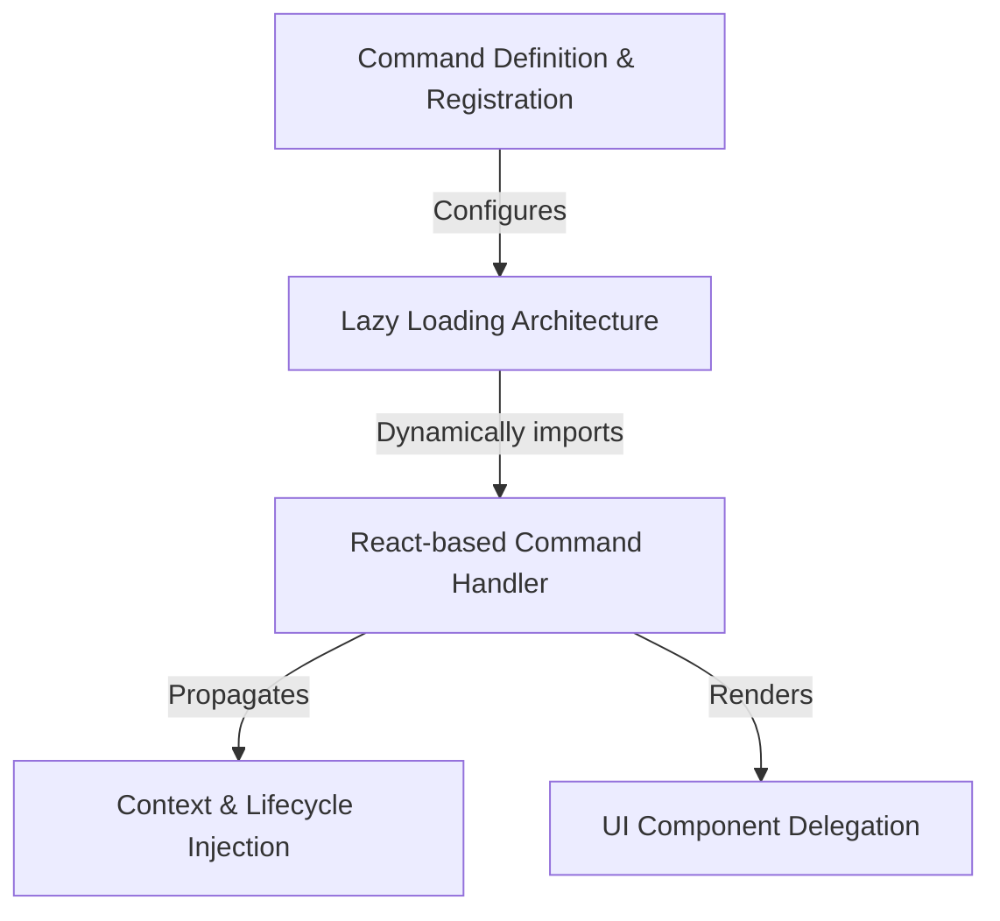

# Tutorial: tasks

This project creates a **command** named `tasks` (or `bashes`) that allows users to view and manage background processes. Instead of loading everything at once, it uses a **lazy loading** strategy to fetch the necessary code only when requested, seamlessly launching an interactive **React-based interface** to handle the user's actions.

## Chapters

1. [Command Definition & Registration](01_command_definition___registration.md)
2. [Lazy Loading Architecture](02_lazy_loading_architecture.md)
3. [React-based Command Handler](03_react_based_command_handler.md)
4. [UI Component Delegation](04_ui_component_delegation.md)
5. [Context & Lifecycle Injection](05_context___lifecycle_injection.md)

---

Generated by [Code IQ](https://github.com/adityasoni99/Code-IQ)