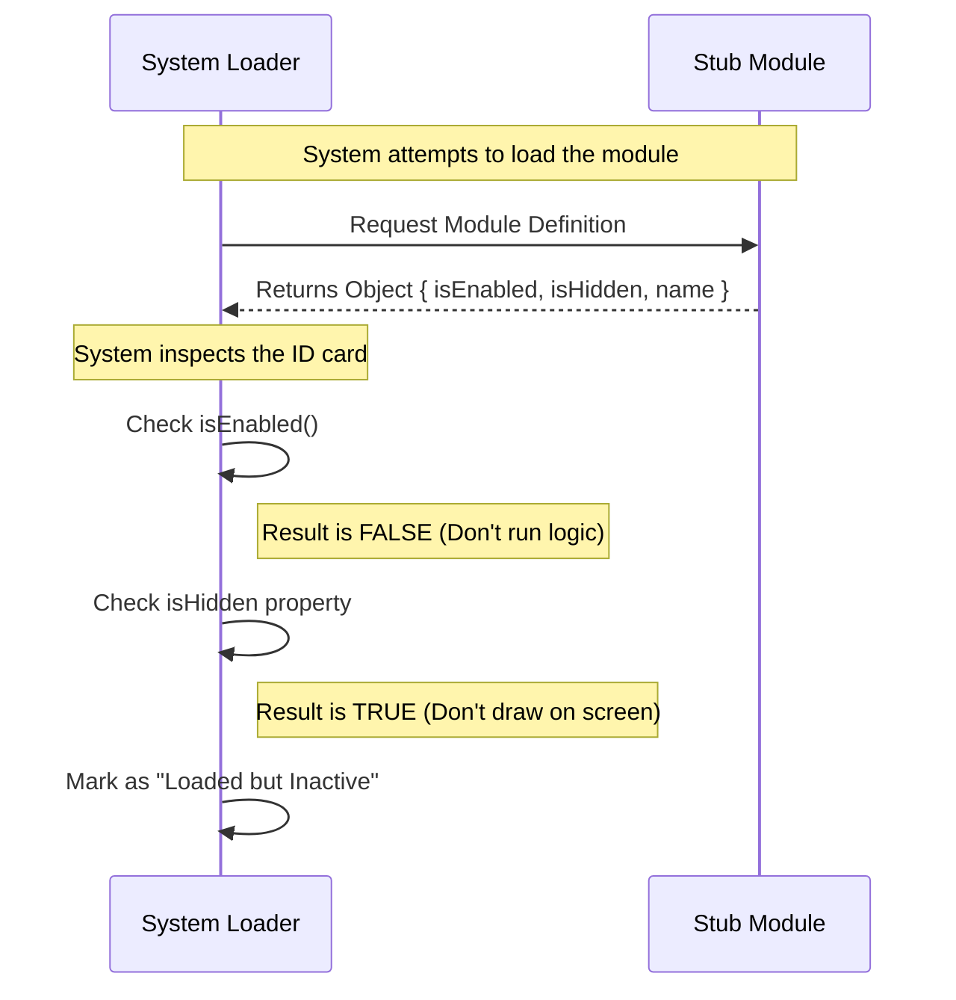

# Chapter 1: Module Definition

Welcome to the `teleport` project! This is the very first step in our journey.

## Why do we need this?

Imagine you are building a house. Even if you haven't bought the fancy front door yet, the builder needs to frame the doorway. They might put up a piece of plywood just to close the hole for now.

In programming, we face a similar situation. Sometimes, our system expects a specific component (like a button, a widget, or a tool) to exist. If that component is missing entirely, the whole system might crash or throw an error because it's looking for something that isn't there.

This is where the **Module Definition** comes in.

### The Central Use Case: The "Stub"

The most basic use case for a Module Definition is creating a **Stub**. A stub is like a prop on a movie set. It looks like a real object from the outside, but it doesn't actually do anything.

We use stubs to satisfy the system's requirements. The system asks, "Do you have a module here?" and the stub answers, "Yes, I am a module!" (even though it has no real logic yet). This keeps the application running smoothly while we build the real features later.

## How to Solve It

To create this "prop" or "stub," we need to write a small piece of code that acts as an ID card. This ID card tells the system three things:
1.  **Who am I?** (Identity)
2.  **Am I working?** (Status)
3.  **Can users see me?** (Visibility)

Here is how we define a basic stub module.

### The Code

```javascript
// --- File: index.js ---

export default {
  isEnabled: () => false, // 1. The feature switch
  isHidden: true,         // 2. Visibility control
  name: 'stub'            // 3. The ID tag
};
```

### What is happening here?

1.  **`export default { ... }`**: This is how we package our code. Think of this as putting our ID card into an envelope so the system can pick it up.
2.  **`isEnabled: () => false`**: This is a function that returns `false`. It tells the system, "I exist, but I am currently turned off."
3.  **`isHidden: true`**: This tells the user interface, "Don't show me on the screen."
4.  **`name: 'stub'`**: This is the name tag.

**Output:** When the system loads this file, it receives a Javascript object. It sees that the module is named "stub" and that it is disabled. The system will then happily skip over it without crashing.

## Internal Implementation: Under the Hood

Let's look at what happens inside the `teleport` system when it encounters our Module Definition.

### The Process (Step-by-Step)

Imagine a security guard (The System) checking people (Modules) at the entrance of a club.

1.  **Presentation**: The System asks the Module for its definition (the ID card).
2.  **Verification**: The Module hands over the object we wrote above.
3.  **Check Status**: The System checks `isEnabled`. Since it is `false`, the System knows not to try and run any complex code from this module.
4.  **Check Visibility**: The System checks `isHidden`. Since it is `true`, the System knows not to render any pixels on the screen for this module.

### Sequence Diagram

Here is a visual representation of that conversation:



### Deep Dive into the Code

Let's look closer at the specific properties inside our `index.js` file.

```javascript
// Checking the Identity
name: 'stub'
```
The `name` property is crucial. It acts as the unique fingerprint for this module. In the next chapter, [Component Identification](02_component_identification.md), we will discuss how to choose these names and why they matter for avoiding conflicts.

```javascript
// Checking the Logic Switch
isEnabled: () => false
```
The `isEnabled` property is a function. This allows for dynamic checking (e.g., checking if a user is an admin). For a stub, we just return `false`. We will explore how to make this smarter in [Feature Gating](03_feature_gating.md).

```javascript
// Checking Visibility
isHidden: true
```
The `isHidden` property controls the visual layer. Even if a module is enabled logic-wise, we might want to hide it from the menu. We will cover this in detail in [Visibility Control](04_visibility_control.md).

## Conclusion

In this chapter, we learned that a **Module Definition** is a contract—a standard Javascript object that every part of our system must provide. We created a "stub," which acts as a safe placeholder to prevent our application from crashing when a feature isn't ready yet.

We defined:
1.  **Identity** (Name)
2.  **Behavior** (Enabled/Disabled)
3.  **Visibility** (Hidden/Shown)

Now that we have our basic object, we need to understand how the system keeps track of it among hundreds of other modules.

[Next Chapter: Component Identification](02_component_identification.md)

---

Generated by [Code IQ](https://github.com/adityasoni99/Code-IQ)