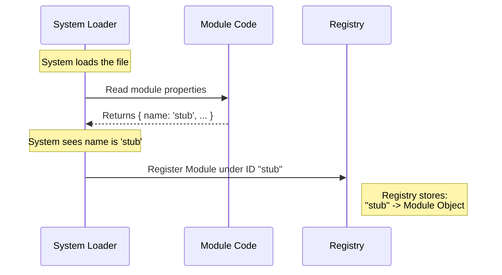

# Chapter 2: Component Identification

Welcome back! In [Chapter 1: Module Definition](01_module_definition.md), we created a "stub"—a placeholder module that acts like a prop on a movie set. It exists, but it doesn't do anything yet.

## Why do we need this?

Imagine you are in a crowded room full of people. If you want to get the attention of one specific person, you don't just yell "Hey, Person!" because everyone might turn around (or no one will). You yell their specific name, like "Hey, Alice!"

In our `teleport` project, the system will eventually load many different modules. To manage them effectively, the system needs to know **who is who**.

### The Central Use Case: The Registry

We need a way for the main system to keep a list of all available modules. This list is often called a **Registry** (think of it like a phone book).

When the system starts up, it picks up our code and asks, "What should I call you?" If our module doesn't have a name, the system can't file it away for later use. We need to provide a unique identifier so the system can find our module again later to check its status or display it.

## How to Solve It

The solution is the `name` property. This is a simple text string that acts as a unique serial number or nametag for your code.

### The Code

We are going to update the file we created in the previous chapter.

```javascript
// --- File: index.js ---

export default {
  // ... (other properties like isEnabled) ...

  // This is the Component Identification
  name: 'stub'
};
```

### What is happening here?

1.  **`name: 'stub'`**: We assigned a string value to the `name` property.
2.  **Uniqueness**: By calling it `'stub'`, we are claiming this word. No other module in the system should be named `'stub'`.
3.  **Decoupling**: This is a fancy word for "separation." The file could be named `index.js`, `my-code.js`, or `temp.js`. The system doesn't care about the filename; it only cares that the module *inside* calls itself `'stub'`.

**Output:** When the system processes this, it reads the string `'stub'`. It can now log messages like "Loading module: stub" or errors like "Error in module: stub," making it much easier for humans to understand what is happening.

## Internal Implementation: Under the Hood

How does `teleport` actually use this string? Let's visualize the "Registration" process.

### The Process (Step-by-Step)

1.  **Discovery**: The System finds the code file.
2.  **Identification**: The System looks specifically for the `name` property.
3.  **Registration**: The System takes the entire module object and saves it into a global list (the Registry), using the `name` as the key (or label).
4.  **Lookup**: Later, if the application needs the 'stub' module, it simply asks the Registry, "Give me 'stub'."

### Sequence Diagram



### Deep Dive into the Code

Let's imagine how the `teleport` system (the code running behind the scenes) handles this registration.

```javascript
// --- Internal System Code (Simplified) ---

const registry = {}; // 1. The phone book

function register(module) {
  const id = module.name; // 2. Extract the name tag
  registry[id] = module;  // 3. File it away
  console.log(`Successfully registered: ${id}`);
}
```

**Explanation:**
1.  **`const registry = {}`**: This is an empty object. It acts as our storage box.
2.  **`module.name`**: The system extracts the string `'stub'` from our module.
3.  **`registry[id] = module`**: The system saves the module. Now, `registry['stub']` points to our code.

Because we have this name, we can now perform specific checks. For example, in the next chapter, we might want to check if the 'stub' module specifically is enabled.

## Conclusion

In this chapter, we learned that **Component Identification** is simply giving our module a name tag.

1.  We added the `name` property (`'stub'`).
2.  This allows the system to register the module in a central list.
3.  It allows us to talk *about* the module using a human-readable word.

Now that our module has an identity, we can start making decisions based on that identity. For instance, what if we want to turn the module 'stub' on for some users but off for others?

We will explore this in [Chapter 3: Feature Gating](03_feature_gating.md).

[Next Chapter: Feature Gating](03_feature_gating.md)

---

Generated by [Code IQ](https://github.com/adityasoni99/Code-IQ)