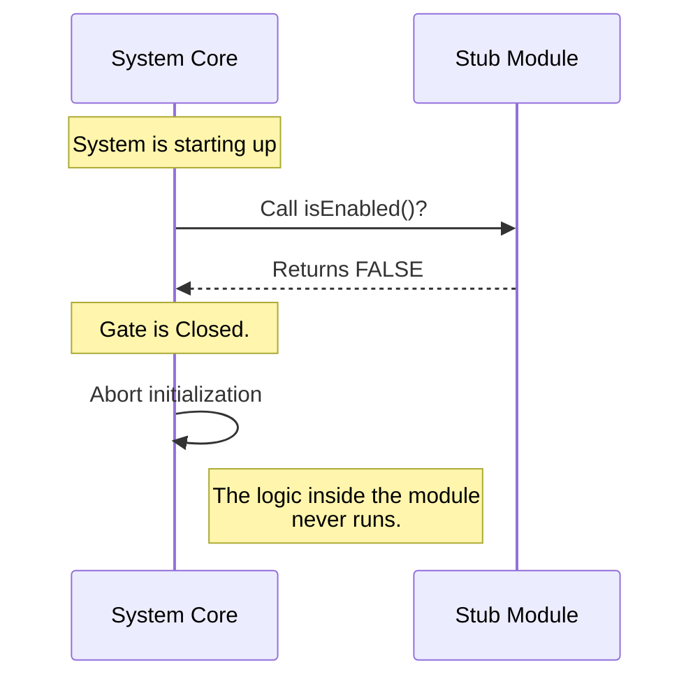

# Chapter 3: Feature Gating

Welcome back! In [Chapter 2: Component Identification](02_component_identification.md), we gave our module a name tag (`'stub'`) so the system could find it in the registry.

Now that the system knows **who** the module is, we need to decide **what state** it is in. Just because a module is present doesn't mean it should be running.

## Why do we need this?

Imagine you are wiring a new room in your house. You install the outlets and the lights, but you aren't finished yet. You wouldn't want the electricity running to those wires while you are still working on them, right?

You go to the basement and flip the **Circuit Breaker** to "OFF". The wires are there, the hardware is installed, but the power is cut. It is safe.

In programming, this is called **Feature Gating**. We often write code that isn't fully tested or is only meant for specific users. We need a way to "install" the code but keep the "power" off so it doesn't break the rest of the app.

### The Central Use Case: The Safety Switch

The primary goal of Feature Gating is to prevent incomplete or risky code from executing.

Even if the `teleport` system loads your file, we want a guarantee that the machinery inside won't start turning unless we explicitly say "Go." This allows us to safely deploy "Works in Progress" to production without users ever noticing.

## How to Solve It

To create this safety switch, we use the `isEnabled` property.

In [Chapter 1: Module Definition](01_module_definition.md), we saw this property briefly. Now, we will understand why it is a **function** and not just a simple `true/false` value.

### The Code

Let's look at our `stub` module again.

```javascript
// --- File: index.js ---

export default {
  // The Feature Gate
  isEnabled: () => false,

  name: 'stub',
  isHidden: true
};
```

### What is happening here?

1.  **`isEnabled`**: This is the name of our gate.
2.  **`() =>`**: This syntax means it is a **function**. It calculates the answer right when the system asks for it.
3.  **`false`**: Currently, this function returns `false`.

**The Effect:** This acts like a master "OFF" switch. When the system sees `false`, it essentially ignores all the functional logic of this module. It treats the module as if it is "sleeping."

### Why a function?

You might ask, "Why not just write `enabled: false`?"

By using a function `() => ...`, we can make the switch **smart** in the future. Instead of a hard `false`, we could write logic like:
*   "Is today Tuesday?"
*   "Is the user an Admin?"
*   "Are we in 'Test Mode'?"

But for our beginner "stub," returning `false` is the safest, simplest way to ensure our placeholder doesn't cause errors.

## Internal Implementation: Under the Hood

How does the `teleport` system respect this switch? Let's visualize the decision-making process.

### The Process (Step-by-Step)

1.  **Retrieval**: The System looks up the module (using the name we defined in [Chapter 2: Component Identification](02_component_identification.md)).
2.  **The Question**: Before running *any* setup code or logic, the System calls the `isEnabled()` function.
3.  **The Gate**:
    *   If the result is `false`: The System **stops immediately**. It abandons the module.
    *   If the result is `true`: The System continues to initialize the module.

### Sequence Diagram



### Deep Dive into the Code

Let's look at a simplified version of the code running inside the `teleport` core engine to see how it enforces this gate.

```javascript
// --- Internal System Code ---

function initializeModule(module) {
  // 1. Check the Gate immediately
  if (module.isEnabled() === false) {
    console.log(`Skipping ${module.name}: Module is disabled.`);
    return; // STOP! Go no further.
  }

  // 2. If we are here, the switch was ON.
  // ... Execute complex logic ...
}
```

**Explanation:**
1.  **`if (module.isEnabled() === false)`**: This is the guard at the door. It executes your function.
2.  **`return;`**: This is the most important line. In Javascript, `return` inside a function ends that function immediately.
3.  **Safety**: Because of that `return`, the code below it never runs. If your module had broken code or incomplete logic further down, it wouldn't matter, because the system never got there.

## Conclusion

In this chapter, we learned about **Feature Gating**.

1.  We use `isEnabled` as a master circuit breaker.
2.  By returning `false`, we ensure our code remains dormant and safe, even if it is loaded into memory.
3.  This allows us to ship incomplete work ("stubs") without crashing the application.

However, even if a module is **Enabled** (the logic is running), we might not want the user to *see* it on their screen yet. Maybe it's a background process, or maybe the design isn't finished.

How do we control whether the module appears in the user interface? We will cover that in the next chapter.

[Next Chapter: Visibility Control](04_visibility_control.md)

---

Generated by [Code IQ](https://github.com/adityasoni99/Code-IQ)