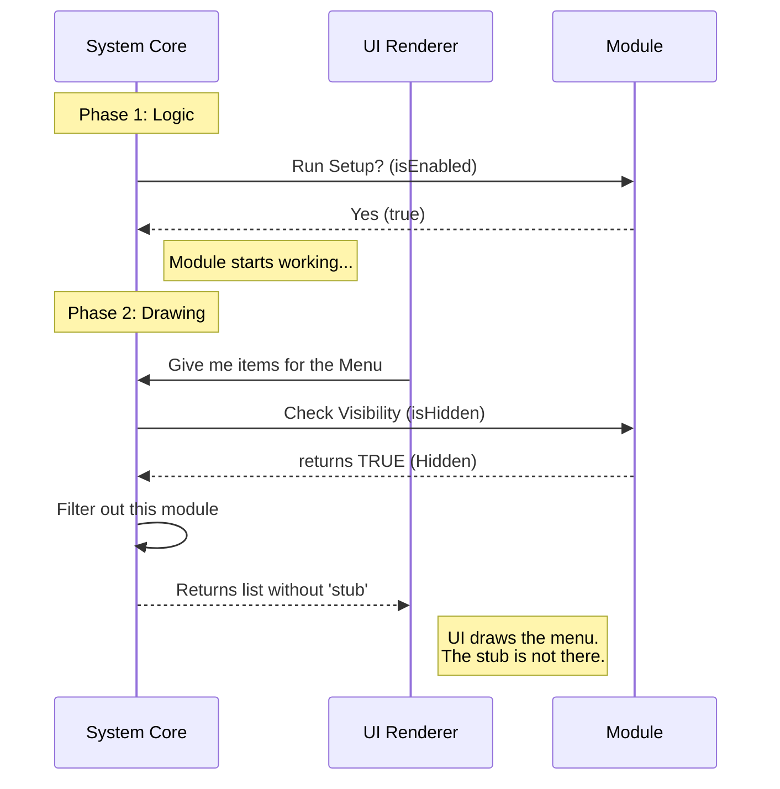

# Chapter 4: Visibility Control

Welcome to the final chapter of our beginner tutorial!

In [Chapter 3: Feature Gating](03_feature_gating.md), we learned how to use the "Circuit Breaker" (`isEnabled`) to cut the power to a module so it doesn't run dangerous logic.

But what if the module **is** working perfectly, but we just don't want it to appear on the screen?

## Why do we need this?

Imagine you are at a fancy restaurant. The kitchen is bustling with activity—chefs are cooking, dishwashers are cleaning. The "logic" of the restaurant is running at full speed. However, as a customer in the dining room, you don't see the kitchen. It is **hidden** behind a door.

If the kitchen were right next to your table, it would be chaotic. We need a way to separate the **operation** (doing the work) from the **presentation** (what the user sees).

### The Central Use Case: The Background Service

In software, we often build "Background Services." These are modules that do important work but don't need a button in the navigation menu.

For example:
*   A module that auto-saves your work every 5 minutes.
*   A module that checks for new notifications.
*   A "stub" (our placeholder) that isn't ready to be shown to customers yet.

We need a way to tell the User Interface (UI): "This module exists, but **Do Not Draw** it."

## How to Solve It

We solve this using the `isHidden` property. This is our "Invisibility Cloak."

While `isEnabled` stops the code from running, `isHidden` simply stops the pixels from appearing on the screen.

### The Code

Let's finalize our `stub` module.

```javascript
// --- File: index.js ---

export default {
  // Logic: The engine is running
  isEnabled: () => true,

  // Presentation: But it is invisible
  isHidden: true,

  name: 'stub'
};
```

### What is happening here?

1.  **`isEnabled: () => true`**: We have turned the switch ON. The system will load this module and execute its setup code.
2.  **`isHidden: true`**: We set this flag to `true`. This acts as a filter.
3.  **`name: 'stub'`**: The system still tracks it by this name ([Chapter 2: Component Identification](02_component_identification.md)).

**Output:**
*   **System Logic:** The module is alive. If it had code to print "Hello" to the console, you would see "Hello".
*   **User Interface:** The user looks at the menu bar or the dashboard, and they see... nothing. The space where the module would have been is empty or filled by the next item.

## Internal Implementation: Under the Hood

How does `teleport` distinguish between running code and showing code? It usually separates these tasks into two different steps.

### The Process (Step-by-Step)

1.  **Initialization**: The System loads the module. It checks `isEnabled`. Since it is `true`, the System registers the module and lets it run.
2.  **Rendering**: Later, the **UI Renderer** (the part responsible for drawing buttons and windows) asks for a list of things to draw.
3.  **Filtering**: The System looks at the list of running modules. It checks the `isHidden` property.
4.  **Exclusion**: Because `isHidden` is `true`, the System removes the module from the list intended for the screen.

### Sequence Diagram



### Deep Dive into the Code

Let's look at a simplified version of the code that draws the navigation menu to understand how it uses `isHidden`.

```javascript
// --- Internal UI System Code ---

function drawMenu(allModules) {
  // 1. filter() loops through every module
  const visibleItems = allModules.filter(module => {
    
    // 2. If isHidden is true, exclude it!
    if (module.isHidden === true) {
      return false; 
    }
    
    // 3. Otherwise, keep it in the list
    return true;
  });

  // 4. Only draw what remains
  renderOnScreen(visibleItems);
}
```

**Explanation:**
1.  **`allModules.filter(...)`**: This is a standard Javascript tool. Imagine sifting flour; the `filter` holds back the lumps (hidden items) and lets the fine flour (visible items) pass through.
2.  **`if (module.isHidden === true)`**: This is the check. If the "Do Not Disturb" sign is up, the renderer simply skips it.
3.  **`renderOnScreen`**: This function eventually draws the buttons. It never even receives our `stub` module, so it doesn't know it exists!

## Summary of the Series

Congratulations! You have successfully defined a complete module using the `teleport` architecture. Let's recap the four pillars we have built:

1.  **[Module Definition](01_module_definition.md)**: We created the object acting as the contract.
2.  **[Component Identification](02_component_identification.md)**: We gave it a unique `name` so the registry could track it.
3.  **[Feature Gating](03_feature_gating.md)**: We used `isEnabled` to safely control whether the code runs.
4.  **Visibility Control**: We used `isHidden` to control whether the user can see the module.

By combining these four concepts, you can create "Stubs"—placeholders that allow you to ship code safely, keep your application stable, and hide unfinished features from your users until they are ready to shine.

**End of Tutorial.**

---

Generated by [Code IQ](https://github.com/adityasoni99/Code-IQ)