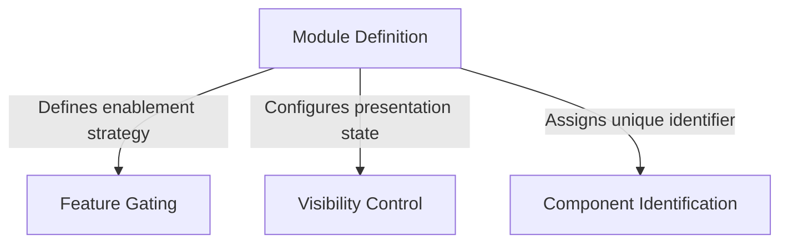

# Tutorial: teleport

This component represents a **stub module**, which serves as a *placeholder* in the system to satisfy architectural dependencies without performing actual work. It explicitly configures itself to be **disabled** and **hidden**, allowing the application to reference the module by name while ensuring it remains inactive and invisible to the user.

## Chapters

1. [Module Definition](01_module_definition.md)
2. [Component Identification](02_component_identification.md)
3. [Feature Gating](03_feature_gating.md)
4. [Visibility Control](04_visibility_control.md)

---

Generated by [Code IQ](https://github.com/adityasoni99/Code-IQ)