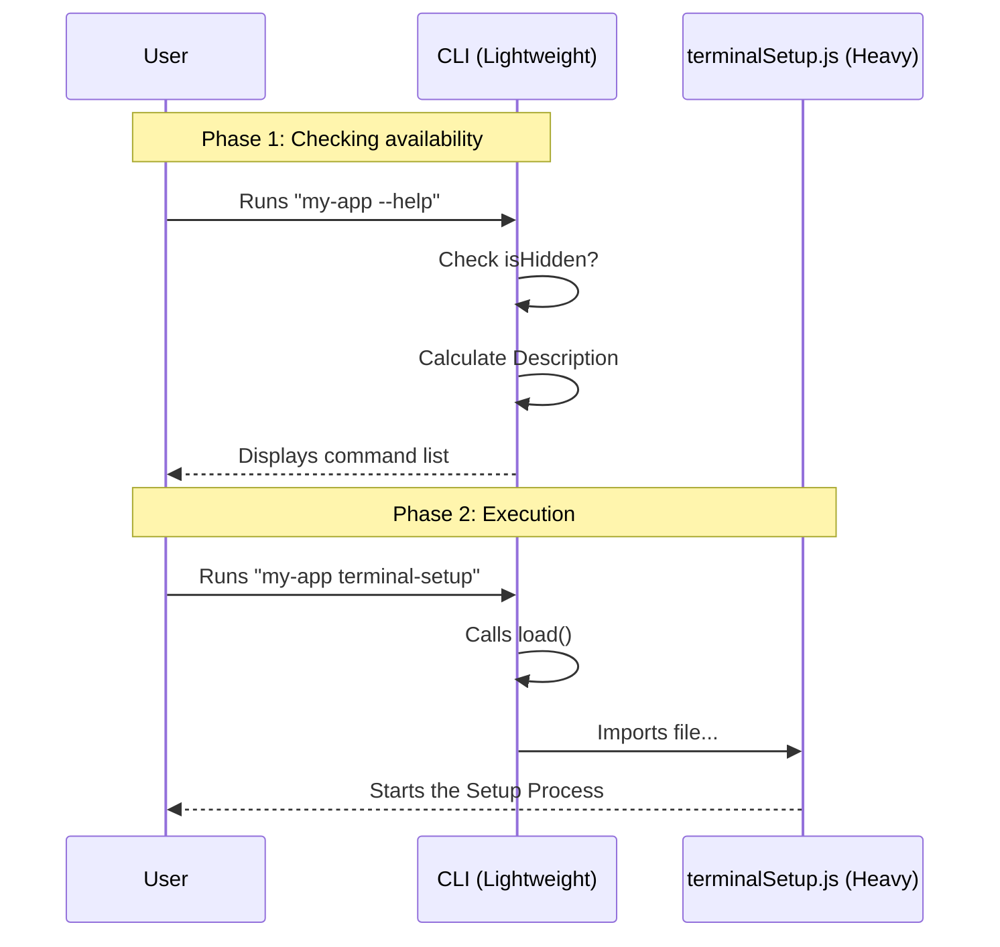

# Chapter 1: Command Definition & Lazy Loading

Welcome to the **terminalSetup** project! In this tutorial series, we are going to build a smart tool that automatically fixes keyboard shortcuts for different terminals (like making sure `Shift+Enter` actually creates a newline).

This is **Chapter 1**, where we start at the very beginning: **Defining the Command**.

## The Problem: The Heavy Backpack

Imagine you are going to a restaurant. You sit down and look at the menu.
1.  **The Menu** tells you the name of the dish and a short description.
2.  **The Kitchen** is where all the heavy work happens—chopping, cooking, and plating.

You wouldn't want the kitchen to cook *every single dish* on the menu as soon as you walk in the door. That would waste food and energy! Instead, the kitchen waits until you actually **order** a specific dish before they start cooking it.

In programming, we face a similar problem. Our "Kitchen" (the code that actually fixes the terminal settings) is heavy. It imports many files and does complex logic. We don't want to load all that code just because the user typed `--help` to see the menu.

**We need a way to:**
1.  Show the command on the "Menu" (lightweight).
2.  Only load the "Kitchen" logic when the user actually runs the command (Lazy Loading).
3.  Hide the item from the menu if the user doesn't need it (Visibility).

## Core Concepts

### 1. The Command Metadata (The Menu Item)
This includes the command's **name** and **description**. In our tool, we want the description to be smart. If you are on a Mac using Apple Terminal, the description should mention "Option+Enter". If you are elsewhere, it should say "Shift+Enter".

### 2. Visibility Rules (The Secret Menu)
Some terminals (like *Kitty* or *Ghostty*) already handle keyboard shortcuts perfectly. If a user is using one of these, they don't need our tool. We should hide this command so we don't confuse them.

### 3. Lazy Loading (Cooking on Demand)
This is the magic trick. Instead of importing the code immediately, we provide a function that imports the code *later*.

---

## Implementing the Command

Let's look at how we define this in `index.ts`. We will break this down step-by-step.

### Step 1: Knowing the Environment
First, we need to know what terminal the user is using. We also define a list of terminals that are "too cool" for us (they don't need our help).

```typescript
import type { Command } from '../../commands.js'
import { env } from '../../utils/env.js'

// Terminals that natively support CSI u / Kitty keyboard protocol
const NATIVE_CSIU_TERMINALS: Record<string, string> = {
  ghostty: 'Ghostty',
  kitty: 'Kitty',
  'iTerm.app': 'iTerm2',
  WezTerm: 'WezTerm',
}
```
*   **What's happening:** We import `env` (which we will learn more about in [Terminal Capability Detection](02_terminal_capability_detection.md)). We also list terminals like Ghostty and Kitty that handle inputs natively.

### Step 2: Defining the Metadata
Now we create the command object. Look at how the `description` changes based on the environment!

```typescript
const terminalSetup = {
  type: 'local-jsx',
  name: 'terminal-setup',
  description:
    env.terminal === 'Apple_Terminal'
      ? 'Enable Option+Enter key binding for newlines and visual bell'
      : 'Install Shift+Enter key binding for newlines',
  // ... more code coming
```
*   **What's happening:**
    *   `name`: This is what the user types (e.g., `my-app terminal-setup`).
    *   `description`: We use a ternary operator (`? :`). If `env.terminal` is 'Apple_Terminal', we show a specific message. Otherwise, we show a generic one.

### Step 3: Controlling Visibility
Next, we decide if this command should even appear in the help list.

```typescript
  // ... inside terminalSetup object
  isHidden: env.terminal !== null && env.terminal in NATIVE_CSIU_TERMINALS,
  // ... more code coming
```
*   **What's happening:**
    *   `isHidden` is a boolean (true/false).
    *   If the current terminal is found in our `NATIVE_CSIU_TERMINALS` list, `isHidden` becomes `true`.
    *   This keeps our CLI clean. A Kitty user won't even see this command exists, preventing them from breaking their setup.

### Step 4: The Lazy Load
Finally, we connect the "Kitchen". We tell the CLI where to find the implementation code, but we don't import it yet.

```typescript
  // ... inside terminalSetup object
  load: () => import('./terminalSetup.js'),
} satisfies Command

export default terminalSetup
```
*   **What's happening:**
    *   `load`: This is a function. It returns a Promise that imports `./terminalSetup.js`.
    *   The file `./terminalSetup.js` contains the heavy logic (the Strategy Dispatcher and patching code).
    *   This file is **not read** until `load()` is actually called.

---

## Under the Hood: The Execution Flow

To visualize how this works, let's trace what happens when a user runs the application.

1.  **Start:** The CLI starts up.
2.  **Menu Check:** It reads `index.ts`. It checks `isHidden`.
3.  **Wait:** It waits for user input. It has **not** loaded the heavy code yet.
4.  **Action:** The user types `terminal-setup`.
5.  **Load:** The CLI calls the `load()` function.
6.  **Run:** Now (and only now), the heavy code is imported and executed.

Here is a diagram showing the difference between checking the menu and ordering the meal:



## Internal Implementation Deep Dive

The code we wrote in this chapter (`index.ts`) is essentially a **Router** or a **configuration entry**. It doesn't do the work; it points to the worker.

When `load()` is called, it imports `./terminalSetup.js`. That file is where the real action happens. That file will eventually coordinate:
1.  [Setup Strategy Dispatcher](03_setup_strategy_dispatcher.md) (deciding *how* to fix the terminal).
2.  [Configuration File Patching](04_configuration_file_patching.md) (editing shell profiles).
3.  [Apple Terminal Plist Management](05_apple_terminal_plist_management.md) (editing Mac settings).

By using `import('./terminalSetup.js')` inside a function, we are utilizing a feature called **Dynamic Imports**. This is standard JavaScript behavior that allows for code splitting—keeping your startup time fast!

## Conclusion

In this chapter, we learned how to define a command that is **smart** and **efficient**.
*   It's **Smart** because it changes its description and visibility based on the user's terminal.
*   It's **Efficient** because it uses Lazy Loading to save resources.

But wait... our command relies heavily on `env.terminal` to make these decisions. How does the application actually know if we are using Apple Terminal, Ghostty, or VS Code?

Find out in the next chapter!

[Next Chapter: Terminal Capability Detection](02_terminal_capability_detection.md)

---

Generated by [Code IQ](https://github.com/adityasoni99/Code-IQ)