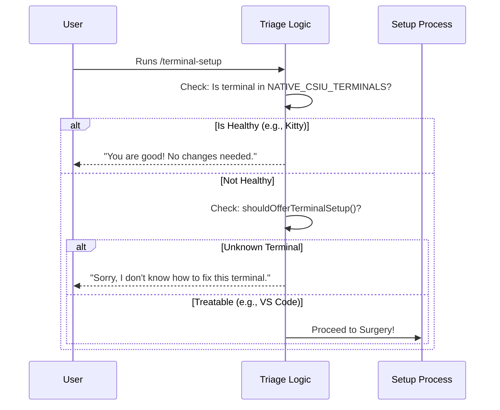

# Chapter 2: Terminal Capability Detection

In the previous chapter, [Command Definition & Lazy Loading](01_command_definition___lazy_loading.md), we learned how to define a command and show it on the menu.

Now, we face a critical question: **Does the user actually need our help?**

This brings us to **Chapter 2: Terminal Capability Detection**.

## The "Triage Nurse" Analogy

Imagine you walk into a hospital. Before you see a surgeon, you see a **Triage Nurse**.
1.  **Assessment:** The nurse checks your vitals.
2.  **Decision:**
    *   If you are already healthy, they send you home (No treatment needed).
    *   If you have a specific injury they know how to fix, they send you to a specialist.
    *   If you have an unknown condition, they might give you general advice but won't operate.

In our project, the **Terminal** is the patient.
*   **Healthy:** Terminals like *Kitty* or *Ghostty* already handle keyboard shortcuts perfectly (native support).
*   **Needs Surgery:** Terminals like *VS Code* or *Apple Terminal* need configuration changes (patches).

We need logic to sort these out so we don't accidentally "operate" on a healthy terminal!

## Core Concepts

### 1. The "Healthy" Registry
We maintain a list of terminals that are already modern and support advanced protocols (like CSI u) out of the box. We call this `NATIVE_CSIU_TERMINALS`.

### 2. The Identity Sensor (`env.terminal`)
Our application has a sensor (imported as `env`) that tells us the name of the current terminal. It might say `'vscode'`, `'Apple_Terminal'`, or `'ghostty'`.

### 3. The Supported Patient List
We also have a logic check called `shouldOfferTerminalSetup`. This is a list of terminals we *know* how to fix. If you aren't on this list, we can't perform the surgery.

---

## The Code: How It Works

Let's look at `terminalSetup.tsx`. This is where the triage logic lives.

### Step 1: Defining the "Healthy" List
First, we create a record (a dictionary) of terminals that don't need our help.

```typescript
// terminalSetup.tsx
const NATIVE_CSIU_TERMINALS: Record<string, string> = {
  ghostty: 'Ghostty',
  kitty: 'Kitty',
  'iTerm.app': 'iTerm2',
  WezTerm: 'WezTerm',
  WarpTerminal: 'Warp'
};
```
*   **Key (Left):** The internal ID we detect from the environment.
*   **Value (Right):** The readable name we show the user.

### Step 2: The Triage Check
When the command runs (inside the `call` function), the very first thing we do is check if the terminal is in that list.

```typescript
// Inside the call() function
if (env.terminal && env.terminal in NATIVE_CSIU_TERMINALS) {
  const name = NATIVE_CSIU_TERMINALS[env.terminal];
  const message = `Shift+Enter is natively supported in ${name}.

No configuration needed.`;
  
  onDone(message);
  return null; // Stop here!
}
```
*   **Explanation:**
    *   We check `env.terminal` (Who are you?).
    *   We check if that name exists inside `NATIVE_CSIU_TERMINALS`.
    *   If **Yes**: We print a success message and `return null`. The function stops. No surgery happens.

### Step 3: Checking for Treatable Conditions
If the patient isn't "perfectly healthy," we check if they are on our list of treatable terminals using `shouldOfferTerminalSetup()`.

```typescript
export function shouldOfferTerminalSetup(): boolean {
  return (
    (platform() === 'darwin' && env.terminal === 'Apple_Terminal') ||
    env.terminal === 'vscode' ||
    env.terminal === 'cursor' || 
    env.terminal === 'alacritty'
    // ... others
  );
}
```
*   **Explanation:** This function returns `true` only if we have written specific code to fix this terminal.

### Step 4: Rejection
If the terminal is neither "Healthy" nor "Treatable" (e.g., the user is running a rare Linux terminal we don't know), we reject the setup to prevent errors.

```typescript
// Inside the call() function
if (!shouldOfferTerminalSetup()) {
  const message = `Terminal setup cannot be run from your current terminal.
  
  Please run this in VSCode, Apple Terminal, or Alacritty.`;
  
  onDone(message);
  return null; // Stop here!
}
```

---

## Visualizing the Logic

Here is how the "Triage Nurse" makes decisions:



## Internal Implementation Deep Dive

The code snippets above come from `terminalSetup.tsx`. Let's look at how the main execution function `call` orchestrates this.

It uses a "Guard Clause" pattern. Instead of a giant `if/else` block, it checks for failure conditions first and exits early.

1.  **Guard 1 (Native Support):**
    ```typescript
    // If native, exit immediately
    if (env.terminal && env.terminal in NATIVE_CSIU_TERMINALS) {
       // ... send message ...
       return null; 
    }
    ```

2.  **Guard 2 (Unsupported):**
    ```typescript
    // If we don't know how to fix it, exit immediately
    if (!shouldOfferTerminalSetup()) {
       // ... send help message ...
       return null;
    }
    ```

3.  **Success Path:**
    If we pass both guards, we finally move to the actual work:
    ```typescript
    // If we are here, we are ready to operate!
    const result = await setupTerminal(context.options.theme);
    onDone(result);
    ```

## Conclusion

In this chapter, we learned how to protect the user and the system by implementing **Capability Detection**. We ensure that we only attempt to configure terminals that actually need it and that we know how to handle.

Now that we have identified a patient that needs treatment (like VS Code or Apple Terminal), how do we know *which* specific procedure to perform? VS Code needs a JSON file edit, but Apple Terminal needs a Plist command.

We need a way to route the request to the right specialist.

[Next Chapter: Setup Strategy Dispatcher](03_setup_strategy_dispatcher.md)

---

Generated by [Code IQ](https://github.com/adityasoni99/Code-IQ)