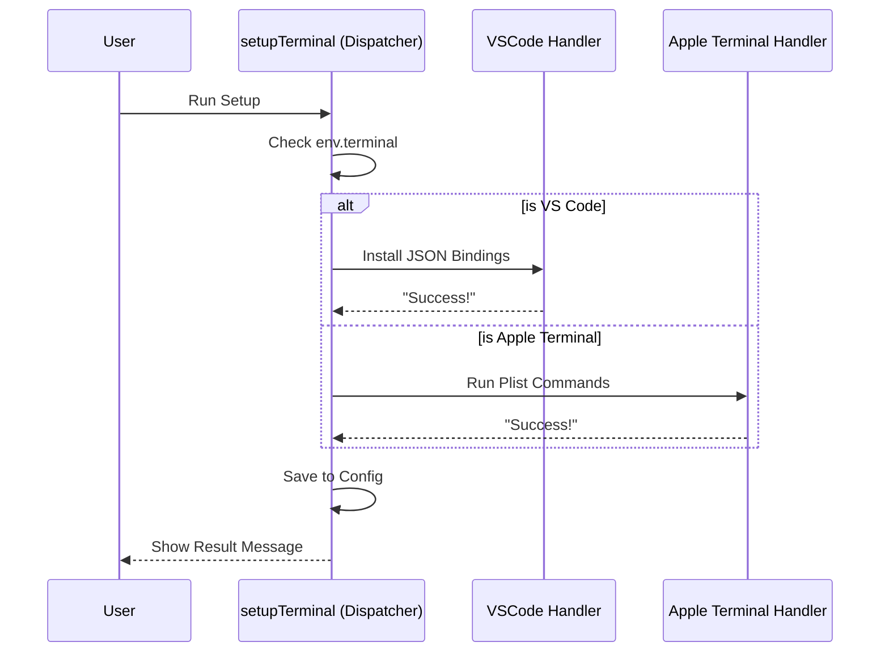

# Chapter 3: Setup Strategy Dispatcher

In the previous chapter, [Terminal Capability Detection](02_terminal_capability_detection.md), we acted like a **Triage Nurse**. We identified which terminals needed help (like VS Code or Apple Terminal) and sent home the ones that were already healthy (like Kitty).

Now that we have a patient who needs treatment, we need to decide **which specialist** to call.

This brings us to **Chapter 3: Setup Strategy Dispatcher**.

## The General Contractor Analogy

Imagine you are a **General Contractor** managing a home renovation. A client tells you, "Fix the house."

You don't just start swinging a hammer randomly. You assess the specific problem:
*   **Leaky pipe?** You call the **Plumber**.
*   **Flickering lights?** You call the **Electrician**.
*   **Broken window?** You call the **Carpenter**.

If you sent the Plumber to fix the electrical wiring, disaster would strike!

In our code, `setupTerminal` is the **General Contractor**.
*   **VS Code** stores settings in a JSON file. It needs a "JSON Specialist."
*   **Apple Terminal** stores settings in a Plist file. It needs a "Shell Command Specialist."

We use a design pattern called the **Strategy Pattern** to dispatch the right worker for the job.

## The Core Concept: The Switch Statement

The heart of this chapter is a standard programming structure called a `switch` statement. Think of it like a railway switch track. It looks at a value (the terminal name) and switches the train onto the correct track (the handler function).

## Implementing the Dispatcher

Let's look at the `setupTerminal` function in `terminalSetup.tsx`. We will break it down into three small parts.

### Step 1: Receiving the Order
The function accepts a `theme` (so output messages look pretty) and returns a `Promise` (because file operations take time).

```typescript
// terminalSetup.tsx
export async function setupTerminal(theme: ThemeName): Promise<string> {
  let result = '';
  
  // logic continues below...
}
```

### Step 2: Routing the Traffic
This is the most important part. We look at `env.terminal` (which we discovered in Chapter 2) and route the execution.

```typescript
  // Inside setupTerminal...
  switch (env.terminal) {
    case 'Apple_Terminal':
      // The Plist Specialist
      result = await enableOptionAsMetaForTerminal(theme);
      break;
    
    case 'vscode':
    case 'cursor':
      // The JSON Specialist
      result = await installBindingsForVSCodeTerminal('VSCode', theme);
      break;

    // ... other cases
  }
```

*   **`switch (env.terminal)`**: This asks, "Who are we working with?"
*   **`case 'vscode'`**: If it's VS Code, we run `installBindingsForVSCodeTerminal`.
*   **`break`**: This tells the code to stop checking other cases. We found our match.

### Step 3: Recording the Success
After the specialist finishes the job, the General Contractor makes a note in the permanent records (Global Config) that the job is done.

```typescript
  // After the switch statement...
  saveGlobalConfig(current => {
    return {
      ...current,
      // Mark that we successfully installed the key binding
      shiftEnterKeyBindingInstalled: true
    };
  });

  return result;
```

## Visualizing the Dispatch

Here is how the General Contractor routes the work:



## Internal Implementation Deep Dive

The beauty of this approach is **Isolation**.

If we want to add support for a new terminal tomorrow—let's call it "FutureTerm"—we don't need to rewrite the whole application.

1.  We write a new function: `installBindingsForFutureTerm()`.
2.  We add **one line** to the switch statement:
    ```typescript
    case 'FutureTerm':
       result = await installBindingsForFutureTerm(theme);
       break;
    ```

This keeps our code clean. The `setupTerminal` function doesn't need to know *how* to fix VS Code or Apple Terminal; it only needs to know *who* to ask.

### The Specialist Functions
In the code snippet above, we called two specific functions. These are the "Strategy Implementations":

1.  `installBindingsForVSCodeTerminal`: This deals with reading, parsing, and writing JSON files.
2.  `enableOptionAsMetaForTerminal`: This executes shell commands (`defaults write ...`).

By separating these, the code that handles JSON errors never interferes with the code that handles Mac shell commands.

## Conclusion

In this chapter, we built the central nervous system of our setup tool. We learned how to use a **Dispatcher** to route execution to specific handler functions based on the environment.

However, dispatching the work is only half the battle. If we send the "JSON Specialist" to VS Code, what exactly do they do? How do we safely edit a configuration file without deleting the user's existing settings?

We will learn strictly about safely editing files in the next chapter.

[Next Chapter: Configuration File Patching](04_configuration_file_patching.md)

---

Generated by [Code IQ](https://github.com/adityasoni99/Code-IQ)