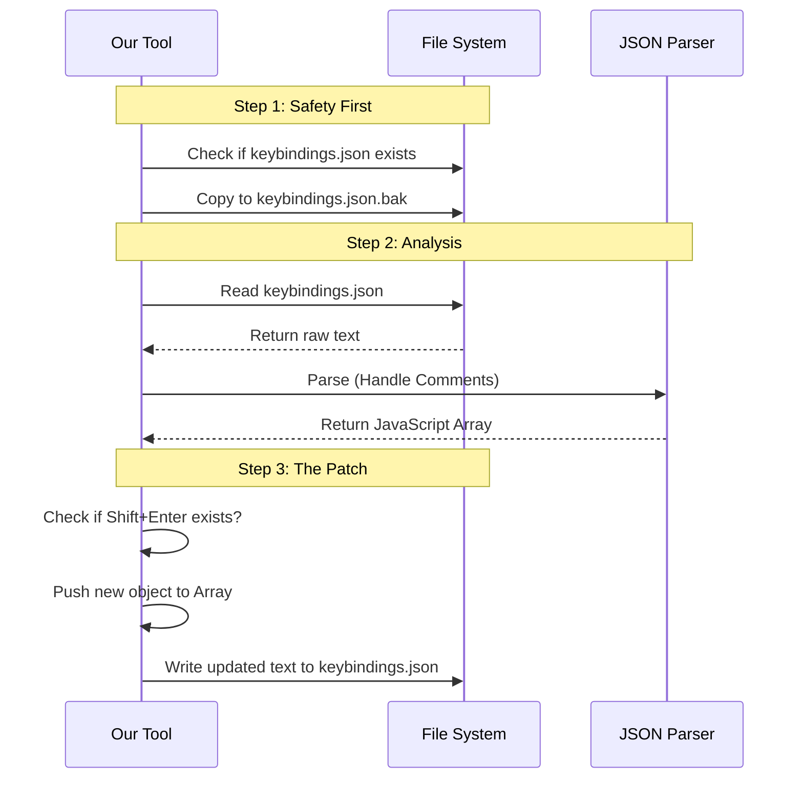

# Chapter 4: Configuration File Patching

In the previous chapter, [Setup Strategy Dispatcher](03_setup_strategy_dispatcher.md), we acted like a **General Contractor**. We figured out which specialist to hire for the job (e.g., the "JSON Specialist" for VS Code).

Now, we are going to watch that specialist work. We will learn **how** to safely edit a user's configuration file without breaking their existing settings.

This is **Chapter 4: Configuration File Patching**.

## The Problem: "Do No Harm"

Imagine you have a notebook where you write down your favorite recipes. You hand it to a friend to add a cookie recipe.
*   **Bad Friend:** Rips out all your pages, writes the cookie recipe, and hands you back a notebook with *only* cookies.
*   **Good Friend:** Finds a blank page, writes the cookie recipe, and leaves your lasagna recipe alone.

When our tool edits a configuration file (like VS Code's `keybindings.json`), it must be the **Good Friend**. We cannot simply overwrite the file; we must **patch** it.

## The "Careful Editor" Protocol

To ensure we never lose user data, we follow a strict 4-step safety protocol, much like a careful editor revising a manuscript.

1.  **Locate:** Find the correct file path (which changes based on whether you use Windows or Mac).
2.  **Backup:** Make a photocopy of the original file *before* touching it.
3.  **Read & Parse:** Read the file and understand its structure (JSON, TOML, etc.).
4.  **Inject:** Add our specific keybinding only if it's missing, then save.

## Step-by-Step Implementation

Let's walk through how this works in `terminalSetup.tsx`, focusing on the **VS Code** implementation (`installBindingsForVSCodeTerminal`).

### Step 1: Locating the File
First, we need to know where the user keeps their settings. This location is different on every operating system.

```typescript
// Inside installBindingsForVSCodeTerminal...
const userDirPath = join(
  homedir(),
  platform() === 'win32'
    ? join('AppData', 'Roaming', 'Code', 'User') // Windows path
    : join('Library', 'Application Support', 'Code', 'User') // Mac path
);
const keybindingsPath = join(userDirPath, 'keybindings.json');
```
*   **What's happening:** We build the path dynamically. We rely on `platform()` to decide if we look in `AppData` (Windows) or `Library` (Mac).

### Step 2: The Safety Backup
Before we even *read* the file, we create a backup. If our code crashes or bugs out, the user can simply restore this file.

```typescript
// Generate a random ID for the backup (e.g., .a1b2.bak)
const randomSha = randomBytes(4).toString('hex');
const backupPath = `${keybindingsPath}.${randomSha}.bak`;

try {
  // Copy the original file to the backup location
  await copyFile(keybindingsPath, backupPath);
} catch {
  return 'Error backing up file. Bailing out.';
}
```
*   **What's happening:** We use `copyFile`. If this fails (maybe due to permissions), we stop immediately. We never touch the original file if we can't back it up first.

### Step 3: Parsing with Care (JSONC)
VS Code uses a format called **JSONC** (JSON with Comments). Standard JSON parsers choke if they see `// comments`. We use a special utility to read it safely.

```typescript
// Read the text from the hard drive
content = await readFile(keybindingsPath, { encoding: 'utf-8' });

// Parse it safely, ignoring comments
// If the file is broken or empty, default to an empty array []
keybindings = safeParseJSONC(content) ?? [];
```

### Step 4: The Injection
Now we check if the keybinding exists. If not, we add it.

```typescript
// Define the new rule we want to add
const newKeybinding = {
  key: 'shift+enter',
  command: 'workbench.action.terminal.sendSequence',
  args: { text: '\u001b\r' }, // The code for a newline
  when: 'terminalFocus',
};

// Add to the list and convert back to text
const updatedContent = addItemToJSONCArray(content, newKeybinding);

// Save to disk
await writeFile(keybindingsPath, updatedContent, 'utf-8');
```
*   **Note:** We use `addItemToJSONCArray` instead of standard `JSON.stringify`. This ensures we keep the user's existing comments and formatting intact!

## Visualizing the Flow

Here is the lifecycle of a file patch:



## Internal Deep Dive: Handling Different Formats

While the example above focused on **JSON** (for VS Code), our strategy handles other formats too.

### The Alacritty Approach (TOML)
For the **Alacritty** terminal, the settings are stored in a `.toml` file. The logic in `installBindingsForAlacritty` is almost identical to VS Code, but the "Injection" step is simpler because TOML allows us to just append text to the end of the file.

```typescript
// installBindingsForAlacritty
const ALACRITTY_KEYBINDING = `
[[keyboard.bindings]]
key = "Return"
mods = "Shift"
chars = "\\u001B\\r"`;

// ... verify backup ...

// Simply append the string to the end!
updatedContent += '\n' + ALACRITTY_KEYBINDING + '\n';
await writeFile(configPath, updatedContent, 'utf-8');
```

## Conclusion

In this chapter, we learned the importance of being a "Careful Editor."
1.  We calculate paths dynamically based on the OS.
2.  We **always** create a backup before writing.
3.  We parse files intelligently (handling comments in JSON).
4.  We inject only what is needed.

This approach works perfectly for files that live on the hard drive (like JSON or TOML).

**But what if the settings aren't in a file?**
On macOS, Apple Terminal stores its settings in a system database called a **Plist**, managed by a background process. You can't just open it with a text editor.

To fix Apple Terminal, we need a different set of tools.

[Next Chapter: Apple Terminal Plist Management](05_apple_terminal_plist_management.md)

---

Generated by [Code IQ](https://github.com/adityasoni99/Code-IQ)