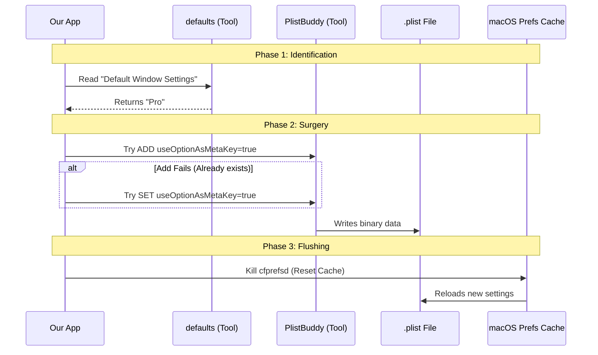

# Chapter 5: Apple Terminal Plist Management

Welcome to the final chapter of the **terminalSetup** project tutorial!

In the previous chapter, [Configuration File Patching](04_configuration_file_patching.md), we acted like "Careful Editors," gently modifying text-based configuration files (like JSON or TOML) for VS Code and Alacritty.

But **Apple Terminal** is different. It doesn't store settings in a simple text file you can open and edit. It stores them in a **Property List (Plist)** database.

This brings us to **Chapter 5: Apple Terminal Plist Management**.

## The Problem: The Sealed Engine

Imagine VS Code's settings are like a **notebook**. If you want to change a setting, you open the notebook, write a new line, and close it. Easy.

Apple Terminal's settings are like a **modern car engine** sealed under a plastic cover.
1.  **No Direct Access:** You can't just "open" the binary file with a text editor. It looks like gibberish.
2.  **Cached:** Even if you managed to change the file, the operating system keeps a copy in its memory (RAM). If you change the file on the disk, the OS might ignore you—or worse, overwrite your changes with its memory copy.

To fix this, we can't use a text editor. We need **Specialized Manufacturer Tools**.

## The Tools: `defaults` and `PlistBuddy`

macOS provides command-line tools that act as our "mechanic's wrench" to safely interact with these settings.

1.  **`defaults`**: A high-level tool. Good for reading general settings.
2.  **`PlistBuddy`**: A surgical tool. It allows us to drill down deep into complex structures (like nested profiles) and change specific boolean values (True/False).

## The Goal

We want to change a specific setting called **"Use Option as Meta key"**.
*   **Why?** By default, the `Option` key on Mac types special characters (like `©` or `†`). We want it to act like a modifier key so we can create keyboard shortcuts like `Option+Enter`.

## Step-by-Step Implementation

We will look at `terminalSetup.tsx`. Specifically, we need to locate the user's active profile (e.g., "Basic", "Pro", or "Man Page") and inject our setting.

### Step 1: Identifying the Profile
First, we ask the `defaults` tool: "Which profile is this user actually using?"

```typescript
// Ask macOS for the name of the Default Window Settings
const { stdout: defaultProfile } = await execFileNoThrow(
  'defaults', 
  ['read', 'com.apple.Terminal', 'Default Window Settings']
);

const profileName = defaultProfile.trim(); // e.g., "Basic"
```
*   **What's happening:** We execute a system command. We aren't reading a file; we are asking the OS a question.

### Step 2: The Surgical Strike (Add)
Now that we know the profile name (e.g., "Basic"), we use `PlistBuddy` to try and **Add** the setting.

```typescript
// terminalSetup.tsx
// Try to ADD the setting 'useOptionAsMetaKey' = true
const { code: addCode } = await execFileNoThrow(
  '/usr/libexec/PlistBuddy', 
  [
    '-c', 
    `Add :'Window Settings':'${profileName}':useOptionAsMetaKey bool true`, 
    getTerminalPlistPath() // Path to the .plist file
  ]
);
```
*   **Why Add?** If the user has never touched this setting, it doesn't exist in the file yet. We have to create it.

### Step 3: The Fallback (Set)
If `Add` fails, it usually means the setting *already exists*. So, we try to **Set** it instead.

```typescript
// If ADD failed (code is not 0), try to SET it instead
if (addCode !== 0) {
  const { code: setCode } = await execFileNoThrow(
    '/usr/libexec/PlistBuddy', 
    [
      '-c', 
      `Set :'Window Settings':'${profileName}':useOptionAsMetaKey true`, 
      getTerminalPlistPath()
    ]
  );
}
```
*   **Logic:** This "Try Add, then Try Set" pattern ensures our code is **robust**. It works whether the setting is missing OR if it is currently set to `false`.

### Step 4: Flushing the Cache
Remember how we said the OS keeps settings in memory? If we stop now, the OS might not notice our change. We need to tell the "Preferences Daemon" (`cfprefsd`) to restart or reload.

```typescript
// Force macOS to reload preferences from the disk
await execFileNoThrow('killall', ['cfprefsd']);
```
*   **Analogy:** This is like turning the car off and on again to clear the dashboard warning lights.

## Visualizing the Process

Here is how our tool interacts with the operating system to change a single boolean value.



## Internal Deep Dive: `execFileNoThrow`

You noticed we use `execFileNoThrow` a lot. Standard Node.js command execution throws an error (crashes) if a command fails.

In our case, **failure is expected**.
*   If we try to `Add` a key that exists, `PlistBuddy` returns an error code.
*   We don't want our app to crash; we just want to know it failed so we can try `Set`.

This wrapper function allows us to control the flow safely:

```typescript
// utils/execFileNoThrow.js (Simplified)
export async function execFileNoThrow(command, args) {
  try {
    const { stdout } = await execFile(command, args);
    return { code: 0, stdout }; // Success
  } catch (error) {
    return { code: error.code, stdout: '' }; // Failure, but safe!
  }
}
```

## Summary of the Series

Congratulations! You have navigated the entire architecture of the **terminalSetup** tool.

1.  **[Command Definition](01_command_definition___lazy_loading.md):** We created a menu item that lazy-loads code only when needed.
2.  **[Capability Detection](02_terminal_capability_detection.md):** We acted as a Triage Nurse to decide if the user's terminal needed fixing.
3.  **[Strategy Dispatcher](03_setup_strategy_dispatcher.md):** We routed the request to the correct specialist (JSON vs. Plist).
4.  **[Configuration File Patching](04_configuration_file_patching.md):** We safely edited text files for VS Code using backups and parsers.
5.  **Apple Terminal Plist Management:** We used system tools to surgically alter binary settings on macOS.

By understanding these five chapters, you now understand how to build robust CLI tools that interact safely with complex user environments!

---

Generated by [Code IQ](https://github.com/adityasoni99/Code-IQ)