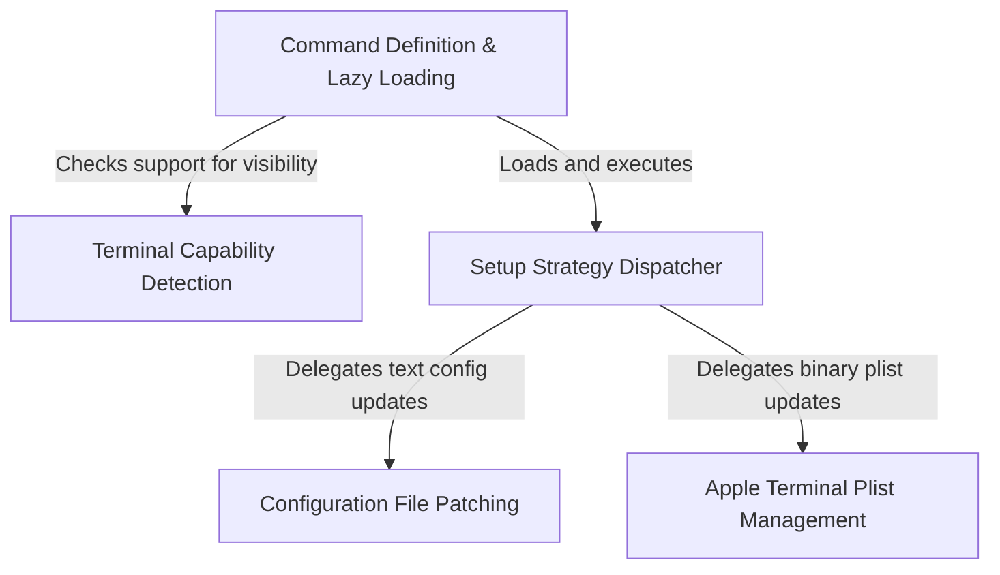

# Tutorial: terminalSetup

This project automatically configures advanced keybindings (specifically **Shift+Enter**) across various terminal environments. It uses a **lazy-loaded command** to detect the current terminal's capabilities and employs a **strategy pattern** to apply fixes: either by safely **patching configuration files** for modern text-based editors or by modifying binary **system property lists** for the macOS Terminal.

## Chapters

1. [Command Definition & Lazy Loading](01_command_definition___lazy_loading.md)
2. [Terminal Capability Detection](02_terminal_capability_detection.md)
3. [Setup Strategy Dispatcher](03_setup_strategy_dispatcher.md)
4. [Configuration File Patching](04_configuration_file_patching.md)
5. [Apple Terminal Plist Management](05_apple_terminal_plist_management.md)

---

Generated by [Code IQ](https://github.com/adityasoni99/Code-IQ)