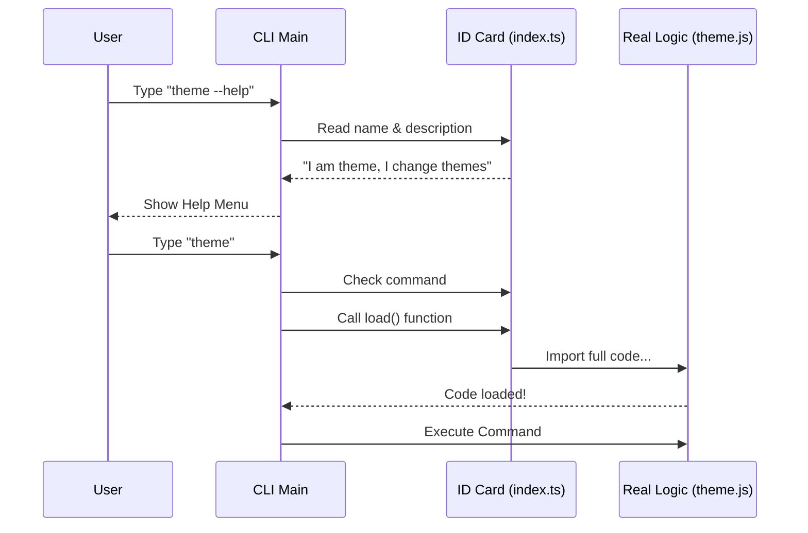

# Chapter 1: Command Registration Pattern

Welcome to the first chapter of the **theme** project tutorial!

Imagine you are walking into a library. To find a book, you don't walk through every aisle reading every single page of every book. Instead, you look at the **card catalog** (or the computer search). The catalog tells you the title, author, and location of the book without you needing to hold the physical book yet.

In our application, the **Command Registration Pattern** acts exactly like that card catalog.

### The Problem: Too Heavy to Carry
When you build a Command Line Interface (CLI) tool, you might eventually have dozens of commands (like `login`, `deploy`, `theme`, `logout`).

If the application loads **all the code** for every single command just to show a help menu, it will start very slowly. We want the application to know *about* a command, without carrying the weight of the command's logic until the user actually asks for it.

### The Solution: The ID Card
We solve this by creating a lightweight "ID Card" for our feature. This ID card tells the main application:
1.  **Name:** What user types to run it (e.g., `theme`).
2.  **Description:** What it does (for the help menu).
3.  **Type:** What kind of command it is.
4.  **Location:** How to load the real code when needed.

---

## Implementing the Registration
Let's look at how we define the command for the `theme` feature. This code lives in a file that the main application scans quickly.

### Step 1: Defining the Metadata
First, we define the basic details. This is just data—no heavy logic is running here.

```typescript
// index.ts
import type { Command } from '../../commands.js'

const theme = {
  type: 'local-jsx',
  name: 'theme',
  description: 'Change the theme',
  // ... loading logic comes next
} satisfies Command
```

**Explanation:**
*   We create a simple JavaScript object named `theme`.
*   We give it a `name` ("theme") and a `description`.
*   The `type: 'local-jsx'` tells the CLI how to handle the interface (we will cover this in [Local JSX Execution Interface](04_local_jsx_execution_interface.md)).

### Step 2: The "Lazy" Loader
This is the most important part. We add a function that tells the CLI how to find the rest of the code *later*.

```typescript
// index.ts (continued inside the object)
  load: () => import('./theme.js'),
} satisfies Command

export default theme
```

**Explanation:**
*   `load` is a function.
*   `import('./theme.js')` is a **dynamic import**. It means "only go get this file when this function is actually executed."
*   We export this object so the main CLI can read it.

---

## Under the Hood: How it Works

How does the CLI use this ID card? Let's visualize the process.

1.  **Startup:** The CLI reads only this registration file. It's fast.
2.  **Help Menu:** If the user types `--help`, the CLI prints the `description` from the ID card.
3.  **Execution:** Only when the user types `theme` does the CLI trigger the `load()` function.



### Internal Implementation Logic
The code inside the main CLI (which consumes our registration) looks something like this. It iterates through a list of these registration objects.

```typescript
// Mock example of the Main CLI runner
async function runCommand(input: string, commandList: Command[]) {
  // Find the ID card that matches the user input
  const match = commandList.find(cmd => cmd.name === input);

  if (match) {
    // FOUND IT! Now we finally load the heavy code.
    const fullModule = await match.load();
    
    // Run the logic inside the loaded module
    fullModule.run();
  }
}
```

**Explanation:**
*   The CLI loops through the lightweight objects.
*   It matches the string `input` (e.g., "theme") against `cmd.name`.
*   **Crucially**, it calls `await match.load()` inside the `if` block. This ensures that if the user typed "login", we never load the code for "theme".

This pattern relies heavily on the concepts we will discuss in [Dynamic Loading Strategy](05_dynamic_loading_strategy.md).

---

## Conclusion

You have successfully defined the entry point for the **theme** feature! By using the **Command Registration Pattern**, you've ensured that the application stays fast and lightweight, only loading code when it is strictly necessary.

Now that the application knows *how* to load the command, the next step is to define the data that the command will actually change.

👉 **Next Chapter:** [Global Theme State](02_global_theme_state.md)

---

Generated by [Code IQ](https://github.com/adityasoni99/Code-IQ)