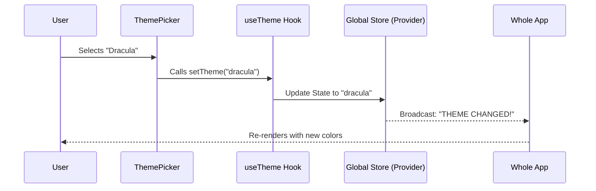

# Chapter 2: Global Theme State

Welcome to the second chapter!

In the previous chapter, [Command Registration Pattern](01_command_registration_pattern.md), we created the "ID card" for our command. We told the application **where** to find our code.

Now, we need to talk about **memory**.

### The Problem: The "Whisper" Game
Imagine you want to change the color of your application from "Light Mode" to "Dark Mode."

In a standard application, you might have a structure like this:
`App -> Layout -> Sidebar -> Settings -> ColorButton`

If `ColorButton` wants to change the color of the `App`, it usually has to pass that message all the way back up the chain. Or, if `App` changes the color, it has to whisper it down to every single component individually. This is messy and slow.

### The Solution: The "Smart Home" Hub
The **Global Theme State** acts like a Smart Home Hub.
1.  **The Hub:** Lives at the top of your house (application).
2.  **The Remote:** Any component, anywhere, can pick up a "remote" (the `useTheme` hook) to talk directly to the Hub.

If you press "Dark Mode" in the basement, the Hub instantly tells the lights in the attic to turn off.

---

## The Tool: `useTheme`

To access this global state, we use a special function called a **Hook**: `useTheme`.

It works exactly like a remote control with two features:
1.  **Read:** Check what the current theme is.
2.  **Write:** Change the theme for everyone.

### Basic Usage
Here is how you use it inside a component.

```typescript
import { useTheme } from '../../ink.js';

function MyComponent() {
  // syntax: [currentValue, updateFunction]
  const [theme, setTheme] = useTheme();

  return (
    // We can read the 'theme' variable here
    <Text>The current theme is: {theme}</Text>
  );
}
```

**Explanation:**
*   `const [theme, setTheme] = useTheme()`: This connects your component to the global hub.
*   `theme`: This variable holds the current data (e.g., `'default'` or `'dracula'`).
*   `setTheme`: This is a function (a button). If you call `setTheme('dracula')`, the whole app updates.

---

## Implementing the Logic

Let's look at how our `theme` command uses this. We want to show a picker, and when the user selects a color, we update the global state.

We will look at the code inside `theme.tsx` (the file we loaded dynamically in Chapter 1).

### Step 1: Grabbing the Controller
We only want to *change* the theme, we don't necessarily need to read it right now.

```typescript
function ThemePickerCommand({ onDone }) {
  // We ignore the first item (current theme)
  // We only grab 'setTheme'
  const [, setTheme] = useTheme(); 
  
  // ... rest of component
}
```

**Explanation:**
*   We use a comma `[, setTheme]` to skip the first variable. We just want the tool to change the settings.

### Step 2: Using the Controller
Now we connect that `setTheme` function to our user interface.

```typescript
// Inside ThemePickerCommand...
return (
  <Pane color="permission">
    <ThemePicker 
      onThemeSelect={(setting) => {
        // 1. Update global state
        setTheme(setting); 
        // 2. Tell the CLI we are finished
        onDone(`Theme set to ${setting}`);
      }}
    />
  </Pane>
);
```

**Explanation:**
*   `<ThemePicker />`: This is a UI component (we'll cover UI in [Interactive UI Composition](03_interactive_ui_composition.md)).
*   `onThemeSelect`: When the user presses Enter on a color, this function runs.
*   `setTheme(setting)`: **This is the magic moment.** The specific component sends a signal to the Global State to change the color for the entire CLI.

---

## Under the Hood: How it Works

What happens when you call `setTheme`? It uses a concept called **Context**.

Imagine a radio tower.
1.  **The Provider (Tower):** wraps the entire application. It holds the state.
2.  **The Consumer (Radio):** is any component calling `useTheme`.



### Internal Implementation Logic
The `useTheme` hook is actually a wrapper around React's `useContext`. Here is a simplified version of what exists in `../../ink.js`.

```typescript
import React, { useContext } from 'react';

// 1. Create the "Radio Frequency"
const ThemeContext = React.createContext(['default', () => {}]);

// 2. Create the "Remote Control" (The Hook)
export const useTheme = () => {
  return useContext(ThemeContext);
};
```

**Explanation:**
*   `createContext`: This creates the invisible channel that data flows through.
*   `useContext`: This tunes your component into that channel.

When you use `useTheme` in your command, you are "tuning in" to the application's main configuration channel.

---

## Conclusion

You have successfully connected your command to the application's brain!

1.  We avoided "whispering" data through layers of components.
2.  We used `useTheme` to get a direct line to the global settings.
3.  We learned how to trigger a global update using `setTheme`.

Now that we have the logic to change the state, we need to build the visual menu that the user actually sees.

👉 **Next Chapter:** [Interactive UI Composition](03_interactive_ui_composition.md)

---

Generated by [Code IQ](https://github.com/adityasoni99/Code-IQ)